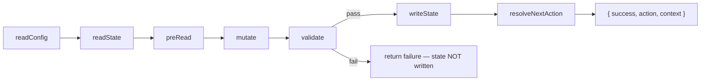
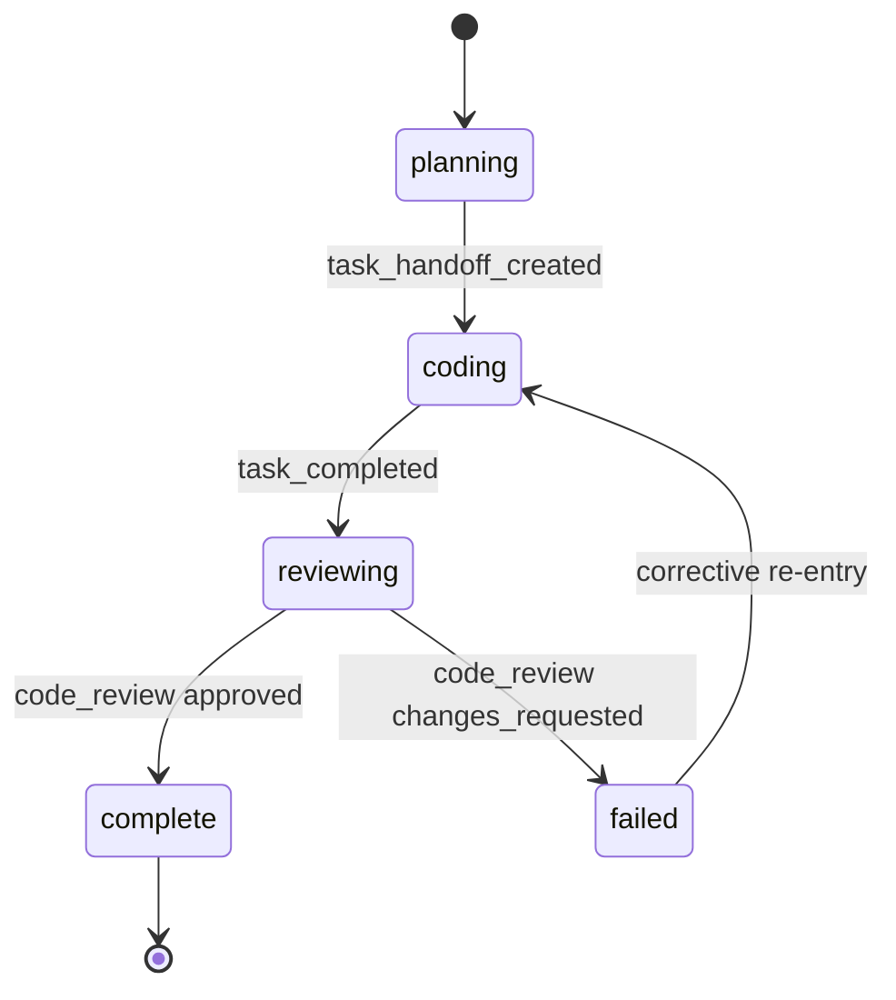
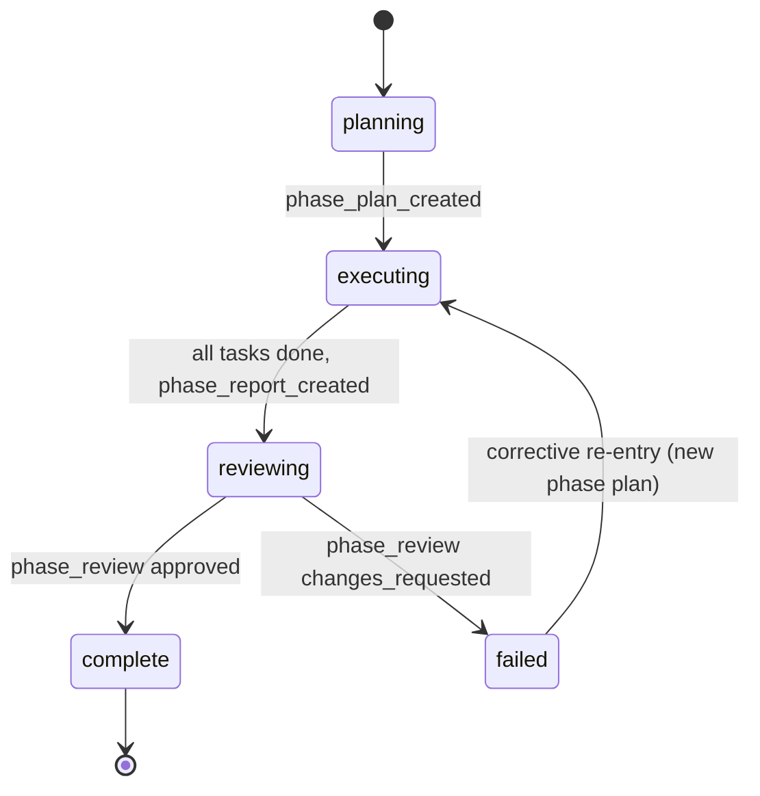

# Pipeline Internals

How the pipeline engine works. Read this before modifying any pipeline module.

## Module Map

All pipeline engine code lives under `.claude/skills/rad-orchestration/scripts/`.

| Module | File | Responsibility |
|--------|------|----------------|
| CLI entry point | `pipeline.js` | Argument parsing, JSON stdout contract, exit codes |
| Engine | `lib/pipeline-engine.js` | Processing recipe orchestration, state scaffolding, cold start |
| Mutations | `lib/mutations.js` | Event handlers (see MUTATIONS registry), decision tables |
| Resolver | `lib/resolver.js` | Post-mutation state → exactly one next action (see NEXT_ACTIONS enum) |
| Validator | `lib/validator.js` | Invariant checks, transition map enforcement |
| Pre-reads | `lib/pre-reads.js` | Document frontmatter validation before mutations run |
| Constants | `lib/constants.js` | Frozen enums, status/stage values, transition maps, naming |
| State I/O | `lib/state-io.js` | Read/write state.json, deep clone, path resolution |
| Schema | `schemas/state-v4.schema.json` | JSON Schema for state validation |

## Runtime Data Flow

Every event follows this exact linear recipe. No exceptions.

Note: `parseArgs` (CLI flags → structured context) runs in `pipeline.js` before `processEvent()` is called.

- **readConfig** — Load `orchestration.yml`; fall back to defaults
- **readState** — Load `state.json` from project dir; `null` if new project
- **preRead** — Validate document frontmatter for events that need it (opt-in — check `PRE_READ_HANDLERS` for the current list)
- **mutate** — `getMutation(event)(deepClone(state), context, config)` → proposed state + mutations list
- **validate** — `validateTransition(current, proposed, config)` → errors or empty array
- **writeState** — Write only on validation pass; auto-advance `project.updated` timestamp (+1ms on collision)
- **resolveNextAction** — Map post-mutation state to exactly one action

Special paths bypass the recipe:
- `start` event + no state → `scaffoldInitialState()` → `handleInit()`
- `start` event + existing state → `handleColdStart()` (skip mutation, resolve from current state)

## Task Stage Lifecycle

The resolver routes on **stage**, not status. `stage` is the precise work focus; `status` is the coarse completion gate.

**Status** (`not_started → in_progress → complete|failed|halted`) controls tier advancement.
**Stage** (`planning → coding → reviewing → complete|failed`) controls resolver routing.

## Phase Stage Lifecycle

Corrective re-entry clears stale review fields (`docs.phase_report`, `docs.phase_review`, `review.verdict`, `review.action`) and resets stage to `executing`.
