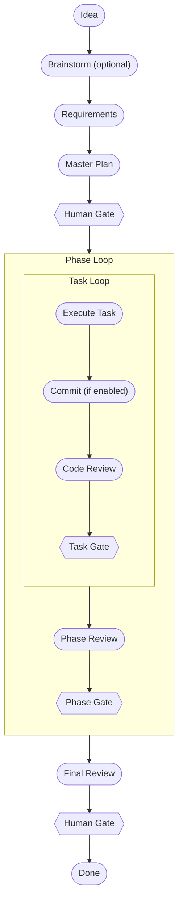

# Rad Orchestration System

A document-driven agent orchestration system that takes software projects from idea through planning, execution, and review on top of native AI coding-assistant primitives plus a small Node.js pipeline.

- Adapts to your repository's existing skills — the Planner picks up downstream skills authored in your repo without further configuration.
- Customizable process templates — `default` for mission-critical or large projects, `quick` for smaller changes or bug fixes — selected at planning time.
- Coder agents follow a strict RED-GREEN TDD cycle on code tasks: write a failing test, watch it fail, implement the minimum to pass.
- Documents are the inter-agent API — every step writes a structured markdown artifact, so the trail from idea to merged code is fully auditable.
- Human gates are first-class — humans approve the plan before any code is written and approve the final result before the project closes.

## How It Flows



## Supported Harnesses

| Harness | Install / entry point | Status |
|---------|-----------------------|--------|
| Claude Code | `radorch` installer wires the project's `.claude/` agents and skills | Supported |
| Copilot VS Code | Custom agents, skills, prompt files, and instruction files via the Copilot extension | Supported |
| Copilot CLI | Same agent and skill definitions consumed by the Copilot CLI | Supported |

More coming soon — see [harnesses.md](docs/harnesses.md) for per-harness detail.

## Monitoring Dashboard

A real-time Next.js dashboard visualizes project state, pipeline progress, documents, and configuration by reading the `state.json` in each project — no service to run, no database to wire up.


[Learn more about the dashboard →](docs/dashboard.md)

## Documentation

| Page | Description |
|------|-------------|
| [Getting Started](docs/getting-started.md) | Install the system, walk through your first project, learn the common commands. |
| [Pipeline](docs/pipeline.md) | The planning and execution flow, human gates, corrective cycles, error handling. |
| [Agents](docs/agents.md) | Each agent's role, tool access, write permissions, and where it sits in the flow. |
| [Skills](docs/skills.md) | The six user-invoked slash commands — what each does, when to use it, and what it produces. |
| [Configuration](docs/configuration.md) | The `orchestration.yml` reference — every option explained with sensible defaults. |
| [Project Structure](docs/project-structure.md) | File layout, naming conventions, document types, and state management. |
| [Monitoring Dashboard](docs/dashboard.md) | Dashboard startup, features, data sources, and real-time update behavior. |
| [Harnesses](docs/harnesses.md) | Per-harness install detail, entry points, and current support status. |

## Design Principles

1. **Documents as interfaces** — Agents never share memory. Every interaction is mediated by a structured markdown document.
2. **Sole-writer policy** — Every document type has exactly one agent that may write it.
3. **Self-contained handoffs** — The Coder reads only its task handoff. Everything it needs is inlined.
4. **Deterministic where possible** — Routing, triage, and validation are pure functions; LLMs handle judgment work.
5. **Human in the loop** — Critical gates are enforced. Humans approve plans and final results.
6. **Continuous verification** — Every task is reviewed against the plan before it is committed.
7. **Zero dependencies** — Node.js built-ins only for the pipeline itself; no `npm install` required to run it.

## Development

Contributors working on this repo should enable the pre-commit hook so the
orchestration TypeScript stays type-clean before each commit. The hook file
is already committed at `.githooks/pre-commit` — point git at it once after
cloning:

```bash
git config core.hooksPath .githooks
```

(Equivalent: `node .claude/skills/rad-orchestration/scripts/setup-hooks.js`.)

This is dev-only setup. End users installing via the `radorch` installer
do **not** get the pre-commit hook configured.

## License

See LICENSE for details.
