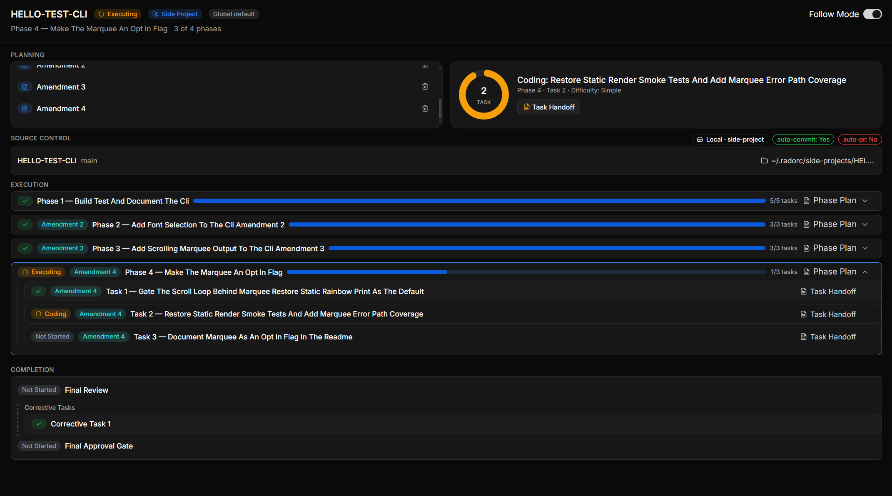

# Amendments

You can change a Master Plan freely right up until you run it. Read the plan, tell the agent what's
wrong, and the agent rewrites the plan and regenerates the phase and task documents.
[You can still change it](planning.md#you-can-still-change-it) covers that window, and while you're
still in it, you don't need this page.

Running the plan is what locks the plan down. Once agents start working through the phases and
tasks, a task has commits attached to it and a review written about it, so the plan can't just be
edited any more.

Projects still grow after that point. A reviewer finds something nobody scoped. A teammate comments
on the PR a week after the run finished. An **amendment** is how you change a locked plan: you add a
phase or a task, rewrite a phase or task that hasn't run yet, or drop one you don't need.

```
/rad-amend SEARCH-FILTERS
```

It works mid-run, and it works on a project you've already completed.

## What you can and can't change

One rule covers every case:

> A phase or task that has already run, or that a reviewer has already judged, is frozen — no
> amendment can change it. A phase or task that hasn't started yet can be rewritten or dropped.

Task by task:

| The task | What an amendment can do |
|---|---|
| Hasn't started | Rewrite the task, or drop it |
| Ran, and the result is fine | Leave the task alone |
| Ran, and the result is wrong | Add a new task that fixes the problem. The original task can't be edited or deleted |

That last row surprises people. A task that shipped code has commits pointing at it and a review
report written about it, and rewriting the task would make the commits and the report both wrong. So
you add a task that fixes the problem instead.

Every phase and task that already finished comes through an amendment untouched — the same bytes, in
the Master Plan and in the run's state.

## When you'd use one

**Mid-run.** The plan is executing and you realize the plan is missing something. Any phase or task
that hasn't started yet is still open, so you can add a task to a phase that hasn't run, or to the
phase you're currently three tasks into. The run picks the new task up when the run reaches it.

**After the run finished.** This is the main case. You approved the final review, then found a gap —
too small to be its own project, too real to leave alone. An amendment reopens the finished project,
and the new work gets reviewed and lands on the same PR as everything else.

**To clear a halt at the final gate.** If you turned down a final review and the project is sitting
**Halted**, an amendment clears the halt and gets the run moving again. Amendments only clear halts
at the final gate. A task that ran out of retries mid-run is a different problem — see
[When a run halts](pipeline.md#when-a-run-halts).

One case that is *not* on this list: changing your mind about the plan before you've run it. That's
a plan edit, and the first paragraph of this page covers it.

## What actually happens

Compact or clear your session first if that session is the one that's been running the project.
Amendment work needs a lot of context, and `/rad-amend` will tell you to compact rather than let you
burn tokens on grounding you're about to throw away. The skill also holds the pipeline while the two
of you are talking, so a new task doesn't start under you mid-decision.

Then:

1. **`/rad-amend` tells you where the project stands** — what the project delivered against what it
   owed, and which amendments have already landed. You're working from the real picture instead of
   from memory.
2. **It tells you what your change costs** before you commit to the change: how much finished work
   the change contradicts, and how much of the plan has to reopen. A small change gets called small
   and you move on.
3. **You agree on what the amendment will do**, and whether the amendment gets an audit pass — the
   same independent review the Master Plan can get. `Auto` is a fine default. A task added to a phase
   that hasn't run rarely needs an audit; a whole new phase usually does.
4. **You get a report of exactly what would land**: what's added, what reopens, what gets
   renumbered. Read the report in the dashboard next to the plan.
5. **You approve the amendment, or you don't.** Nothing gets written or applied until you say so.

Then `/rad-execute` picks the run back up.

## What reopens

New work has to be judged by something, so an amendment reopens whichever reviews would otherwise be
signing off on work they never saw.

- **Final review runs again**, over the whole delivery.
- **An open PR refreshes.** You don't get a second PR — the new commits go on the same branch.
- **A phase you added a task to gets re-reviewed**, since "done" for that phase means something
  different now.

`/rad-amend` tells you which of the three apply to your change before you approve it.

## Amendment, corrective, or a new project

Three things can happen when work falls short, and you only ever pick between two of them.

At the final approval gate you get two choices: approve, or ask for changes. If you ask for changes,
you describe the problem in your own words. The agent works out whether your objection is a
**corrective** — another round against the review that's already open — or an **amendment**, meaning
the plan itself was missing something. You don't pick between corrective and amendment, because the
difference is about how the work gets routed rather than about what you want. For a corrective, the
agent looks into what you raised, writes up a short summary that keeps your own words intact, and
shows it to you to confirm before anything is signalled — a synthesized summary is never assumed
correct without your say-so. See [Asking for changes](pipeline.md#asking-for-changes).

Mid-run there's no fork at all. Anything you ask for while a plan is running is an amendment.

**The third option is a follow-up project**, and a follow-up is often the right call. The question
isn't how big the change is, it's whether the change belongs to this project:

| Use | When |
|---|---|
| An **amendment** | The project didn't finish what it set out to do, or the scope grew but stayed inside what the project was for |
| A **follow-up project** | The change is the next thing — a new capability, a different problem, something that deserves its own requirements and its own review |

Review intensity and task size were locked in when you planned the project, and an amendment
inherits both. So if you want the change reviewed differently, or sized differently, that change is
a follow-up. See [Follow-up projects](planning.md#follow-up-projects).

## What an amendment won't touch

- **Your original requirements.** They stay as written. An amendment appends its own record to the
  Requirements doc instead of editing what's above it, which is how the final reviewer picks up the
  wider scope without anyone rewiring the review.
- **Review intensity and task size.** Locked at plan time, as above. An amendment sizes its new
  tasks to match the tasks already in the plan, so the result reads like one project rather than a
  bolted-on second one.
- **Repos you haven't registered.** An amendment can reach a repo the project didn't originally
  touch, but that repo has to be in the registry first. See
  [Repository Registry](repo-registry.md).

## On disk and on the dashboard

Each amendment is its own document in the project folder: `{NAME}-AMENDMENT-01.md`, then `-02`, and
so on. Amendments pile up and none is ever overwritten, so together they're the record of how the
project's scope changed and why. See [Amendment](document-types.md#amendment).

On the dashboard, a phase or task an amendment introduced gets an **Amendment 1** badge, and a
corrective you asked for at the gate gets an **Operator** badge. Both badges look different from a
failed review on purpose — an amendment means the work was added later, not that something went
wrong.



That project was amended four times. Phase 1 came from the original plan and carries no badge; every
phase below it arrived later and names the amendment that brought it. Read down the badges and you
have the project's history.

---

**Read Next:** [Execution Pipeline](pipeline.md) · [Planning](planning.md) ·
[Document Types](document-types.md) · [Projects](projects.md) · [Dashboard](dashboard.md) ·
[Docs Viewer](docs-viewer.md)
