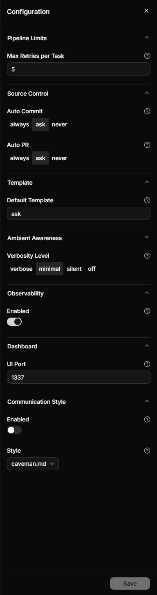

# Configuration

Most people never open this page, and that's by design — Rad Orc ships with defaults that work. But
sooner or later you'll want commits to stop asking, or the session banner to quiet down, or more
retries before a stuck task gives up.

There are **nine settings**. All of them live in one file, and you shouldn't have to touch that file.

## Change it in the dashboard

Click the gear in the top-right corner of the dashboard. Everything is in one panel, grouped, with a
short explanation behind the `?` next to each field.



Change what you want and hit **Save** — it stays greyed out until something actually changes, so you
can't save by accident. The panel writes the file for you, which is the point: no YAML, no typos, no
wondering whether `ask` needed quotes.

> **One thing to know if you've hand-edited the file.** Saving from the panel rewrites the whole
> thing, so any comments you added yourself are lost. Your settings all survive — including the ones
> the panel doesn't display — but the notes you left next to them don't.

## What you can set

| Setting | Default | What it does |
|---|---|---|
| **Max Retries per Task** | `5` | How many times a task can be reworked before the run stops and asks for help. [Below](#limitsmax_retries_per_task) |
| **Auto Commit** | `ask` | Whether finished work gets committed automatically. [Below](#source_controlauto_commit) |
| **Auto PR** | `ask` | Whether a draft pull request opens when the run finishes. [Below](#source_controlauto_pr) |
| **Default Template** | `ask` | How much review a new project gets. `ask` means you pick during planning. See [Review intensity](pipeline.md#review-intensity) |
| **Verbosity Level** | `minimal` | How much of the session-start briefing you see. See [Setting the level](ambient-awareness.md#setting-the-level) |
| **Observability · Enabled** | `on` | Records what your agents cost, locally. See [Observability](observability.md) |
| **UI Port** | `1337` | Where the dashboard listens. See [Running it](dashboard.md#running-it) |
| **Communication Style · Enabled** | `off` | Whether a style shapes how your agent talks. See [Trying one](communication-styles.md#trying-one-and-keeping-it) |
| **Communication Style · Style** | `high-level` | Which style, once enabled. |

Six of those are the front door to a feature with its own page. The three below have no page of their
own, so this is where they're explained.

### limits.max_retries_per_task

When a review asks for changes, the pipeline sends the work back to a coder to fix. This is the budget
for that loop — how many corrective attempts it gets before the run halts and waits for you.

The default of `5` is generous on purpose. A task that can't get past review in five attempts usually
has a problem no sixth attempt will fix: a requirement that contradicts itself, or a test that was
wrong to begin with. Halting puts it in front of you while the context is still fresh.

Raise it if your work is genuinely fiddly and you'd rather the agent keep grinding. Lower it to `2`
or `3` if you'd rather be interrupted early than pay for attempts that were never going to land.

### source_control.auto_commit

Whether each finished task gets committed as it completes.

| Value | What happens |
|---|---|
| `always` | Commits as it goes, no prompting |
| `ask` | Asks once when the run starts, then follows that answer for the rest of the run |
| `never` | Nothing is committed; the work piles up in your working tree |

**Leave this on.** Commits aren't just bookkeeping here — they're what gives each review something to
look at. Task review reads the commits from that task, phase review reads the phase, final review
reads the whole project. With `never`, all three reviews fall back to whatever is sitting in the
working tree, so they all end up reading the same undifferentiated pile and the distinction between
them collapses.

See [Commits](source-control.md#commits) for what the commits themselves look like.

### source_control.auto_pr

Same three values, for opening a pull request when the project finishes. Pull requests are always
opened as drafts, and always on GitHub. See [Pull requests](source-control.md#pull-requests).

## When a change takes effect

Mostly: immediately. The pipeline re-reads your settings at every step, so a change you make now
applies to the very next thing that happens — including in a project that's already running. That's
useful when a run is halfway through and you want to raise the retry budget rather than start over.

Two things behave differently, and both are deliberate:

- **`auto_commit` and `auto_pr` set to `ask`** get resolved once, when the run starts. You answer the
  question, and that answer holds for the rest of the run. Changing the setting mid-run won't move
  a run that already asked you. See [Set your commit and PR preference once](pipeline.md#set-your-commit-and-pr-preference-once).
- **The review template** is copied into the project when you plan it, and that copy is what the
  project uses for the rest of its life. Changing `default_template` — or even upgrading Rad Orc —
  can't reach a project that's already been planned. See [Review intensity](pipeline.md#review-intensity).

## Editing the file directly

The file is `~/.radorc/orchestration.yml`, and this is all of it:

```yaml
version: "1.0"
default_template: ask
limits:
  max_retries_per_task: 5
human_gates:
  after_planning: true
  execution_mode: autonomous
  after_final_review: true
source_control:
  auto_commit: ask
  auto_pr: ask
telemetry:
  enabled: true
ambient_awareness:
  verbosity: minimal
ui:
  port: 1337
communication_style:
  enabled: false
  selected: high-level.md
```

Two blocks appear here that the gear panel doesn't show, and neither is something you need:

- **`version`** is the format version of the file itself. Leave it alone.
- **`human_gates`** controls where the pipeline stops to ask for your approval. The shipped values
  produce the behavior described in [Execution Pipeline](pipeline.md) — you approve the plan by
  running it, and you sign off at the end. Leave these alone too; the gates are explained where you
  encounter them, not here.

Changes are picked up on the next pipeline step, so there's nothing to restart — except the
dashboard, if you changed its port.

---

**Read Next:** [Execution Pipeline](pipeline.md) · [Dashboard](dashboard.md) ·
[Getting Started](getting-started.md) · [Docs Viewer](docs-viewer.md)
