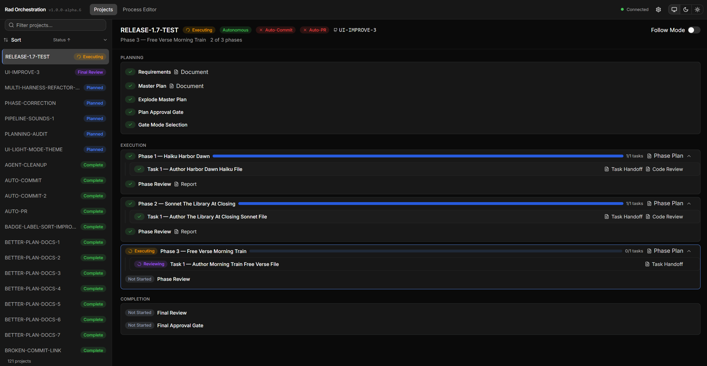

# Dashboard

The dashboard is a Next.js web app that reads each project's `state.json` and renders current pipeline state in a browser. 

It is aimed at developers who want a live view of what agents are doing across every project in the workspace.  It's a good way to get a good pulse on what is going on without digging through chat logs or project docs.  

The dashboard is a great way to manage all your planned work or read information about prior documents.  The idea here is that this is your command center to keep your fast-paced agenting engineering and make it much easier to manage multiple projects in parallel.



## Run the Dashboard

The dashboard lives under `ui/` as a standalone Next.js app. From that directory:

```bash
cd ui
npm install   # first run only
npm run start # Runs at: http://localhost:3000
```

If you need to rebuild first for whatever reason, use `npm run build-and-start` instead. The app reads `.env.local` (created by the `radorch` installer) for `WORKSPACE_ROOT` and `ORCH_ROOT`, which point it at your projects and orchestration root.

## Features

### Project Overview

The sidebar lists every project detected in the workspace alongside its current status. Select a project to see phase progress, task breakdown, and key metrics in the main panel. Each entry shows the active pipeline stage so you can tell at a glance which projects are in planning, execution, review, or complete.

### Pipeline Progress

The dashboard visualizes progress through the planning and execution stages of the pipeline. Planning steps appear as a checklist — brainstorm (optional) → requirements → master\_plan → explode\_master\_plan — showing which steps are complete, in progress, or not yet started. Execution phases display task completion with progress indicators. Expandable task cards link to the corresponding handoff, report, and review documents.

### Source Control Status

Each project displays its current branch, commit history, and pull request status at a glance. During active execution a per-task commit trail shows exactly which changes each task introduced. Auto-commit and auto-PR settings are visible alongside branch information. Click the branch name to open a full diff. When execution completes, a direct link to the opened PR appears for easy access.

### Configuration

Open the configuration viewer from the gear icon in the header to review and edit system settings. Settings cover project paths, pipeline limits, human gates, and git strategy. See [Configuration](configuration.md) for details on available options.

### Real-Time Updates

The dashboard updates automatically as the pipeline advances. When state changes — tasks completing, phases progressing, or projects being added — the interface refreshes without any manual action. Connection status is visible in the header so you always know the view is current.

### Launch projects from the dashboard

The dashboard provides buttons to start brainstorming, start planning, and execute the plan for any project. Each button opens a Claude Code session pre-configured with the appropriate action so you do not have to remember what to run. The session launches in your terminal with the correct context already loaded.

This launch surface is currently Claude-Code-specific. Parity for Copilot VS Code and Copilot CLI is coming soon — see [harnesses.md](harnesses.md) for current per-harness coverage.

## Next Steps

- [Getting Started](getting-started.md) — installation and setup
- [Configuration](configuration.md) — configure system behavior
