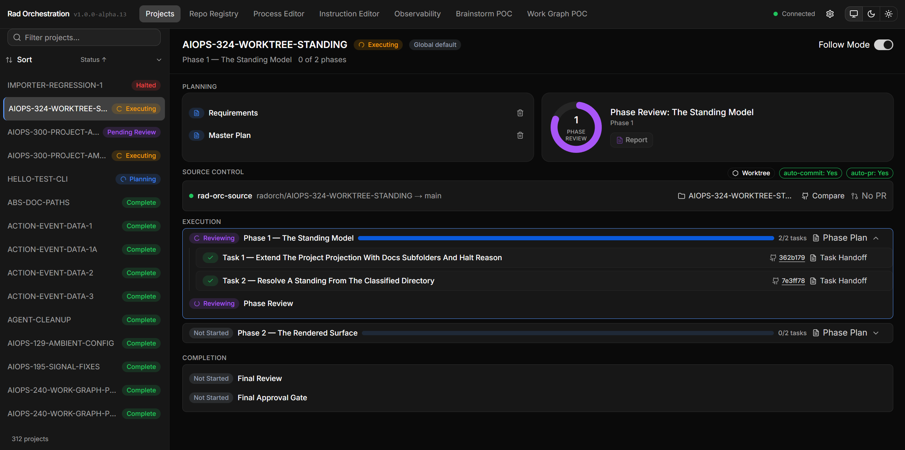

# Dashboard

Two projects running at once is two transcripts, both scrolling, neither of which you can read while
the other one moves. Add a third and you aren't supervising anymore — you're triaging from memory.

The real tax on parallel agent work isn't tokens. It's holding four half-finished runs in your head
and remembering which one was waiting on you. The dashboard takes that off you.

```
/rad-ui-start
```

It opens in your browser and hands back the URL — usually `localhost:1337`.



## One list instead of five terminals

The sidebar is every project you have, each showing the state it's in. You read your status off a list
rather than reconstructing it from what you remember of a session.

The state is the useful part, because each one tells you what to do about it:

- **`Executing`** — leave it alone
- **`Pending Review`** — waiting on you
- **`Halted`** — needs a decision

Filter by name when the list gets long, and sort to put what you care about on top. See
[Project states](projects.md#project-states) for all eight.

> The list outlives your sessions. Close every terminal you have open and the projects are still here,
> in the state you left them — which is what makes it safe to put one down for a week.

## Read the work, not the transcript

Open a project and you get the run: planning documents, then every phase and task in order, then the
final review. Each row links to what it produced, and clicking opens it in a reader without leaving
the page.

- **Every document, in place** — Requirements, Phase Plans, Task Handoffs, review reports. See
  [Document Types](document-types.md).
- **Live as it's written** — watch a plan being scribed rather than waiting for it to land.
- **Diagrams and mockups too** — see [Visual Docs](visual-docs.md).
- **Follow Mode** — the active task expands, finished ones fold away, and the view moves along with
  the run, so a long project stays one screen.
- **Every past session, one click from resuming** — the project's Overview lists its whole
  [journey](sessions.md), with a button that reopens any of them exactly where you left off.

When a review sends work back, you read the reviewer's findings in the report instead of hunting a
transcript for the verdict.

## Commits and pull requests as they land

Each task's commit appears on its row as a short hash, linked to that commit on GitHub — *what did
that task change* is one click rather than a `git log` in the right worktree.

A **Source Control** panel carries a row per repository:

- The branch it's working on, and the branch it came from
- **Compare** — everything the run has changed so far
- The **draft pull request**, once the final review opens it
- A link into the [registry](repo-registry.md), and a shortcut to the folder on disk

See [Source Control](source-control.md).

## Sign off without opening a session

When the final review lands, the project waits for you — and that wait ends with a button on the
project page. **Approve Final Review** confirms against the review document by name, so you read the
thing and approve it in the same place.

For parallel work that matters more than it sounds. Closing out a finished project doesn't mean
finding the right terminal, starting one, or picking up a thread you put down last week — it's a click
from the same list you were already scanning. See
[Finishing the run](pipeline.md#finishing-the-run).

The button only approves. If the review turns up something you want changed, ask an agent instead —
requesting changes starts with you describing the problem in your own words, which is not something
a button can take. See [Asking for changes](pipeline.md#asking-for-changes).

And if a run halts instead of finishing, the page says so at the top and gives you the reason. See
[When a run halts](pipeline.md#when-a-run-halts).

## Everything you'd otherwise ask your agent

Every question you put to an agent costs tokens and costs context — the window you'd rather be
spending on the work. A good number of them have an answer on screen instead, for free.

The gear icon holds your settings: commit and PR behavior, retry limits, the default review tier,
ambient awareness, communication style, observability, and the port. Change one and it saves. See
[Configuration](configuration.md).

The rest of the nav is the same bargain.

| Surface | What it's for |
|---|---|
| **Repo Registry** | Register a repository, fix a description, group repos by domain. See [Repository Registry](repo-registry.md). |
| **Instruction Editor** | Add your own prose to any step of the pipeline, and preview what the orchestrator will read. See [Custom Instructions](custom-instructions.md). |
| **Observability** | Where your tokens and your time went, session by session. See [Observability](observability.md). |
| **Process Editor** | A drawn map of each review tier. Read-only, despite the name. See [Review intensity](pipeline.md#review-intensity). |
| **Docs Viewer** | The whole corpus, rendered in-app — click the question-mark icon in the header to open it. See [Docs Viewer](docs-viewer.md). |
| **Brainstorm POC** · **Work Graph POC** | Experimental. Brainstorming in the browser, and a picture of how your projects relate — see [Seeing the graph](projects.md#seeing-the-graph). |

## Running it

| What you type | What it does |
|---|---|
| `/rad-ui-start` | Starts it and hands back the URL. Run it again and you get the same one, not a second copy. |
| `/rad-ui-status` | Says whether it's running, and where. |
| `/rad-ui-stop` | Shuts it down. |

It asks for port **1337** and takes the next one free up to 1347 if something already holds it — so
trust the URL it gives you over the one written in these docs. Change the starting port under **UI**
in the gear panel.

>Contributing to Rad Orc? Where the dashboard's data comes from, what it's allowed to write, and how
>it stays live without polling is covered in [Dashboard Internals](internals/dashboard.md).

---

**Read Next:** [Execution Pipeline](pipeline.md) · [Projects](projects.md) ·
[Source Control](source-control.md) · [Observability](observability.md) ·
[Sessions](sessions.md) · [Configuration](configuration.md) · [Docs Viewer](docs-viewer.md)
