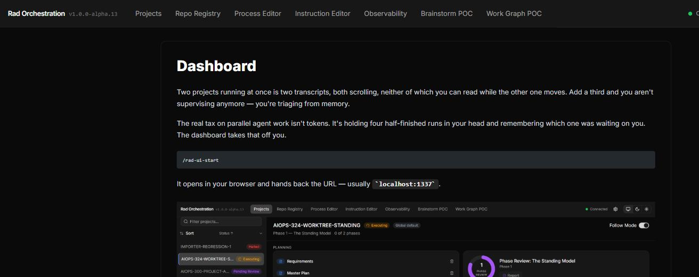

# Docs Viewer

Looking something up usually means leaving the tool that raised the question — a browser tab, a
search, a page that may not even match the version you have installed. Rad Orc keeps the answer
where the question came from: the whole documentation set renders right inside the dashboard, read
straight off the files that shipped with your install.

Click the question-mark icon in the header, from any page.

## A page of its own, not a panel

Opening it takes over the screen rather than sliding in a drawer — no project-list sidebar, full
width, because it isn't a project view. Landing on `/docs` shows the index; every other page sits
one level under it — use your browser's back button, or a doc-to-doc link, to move around.

## Links resolve where you'd expect

A link to another page opens that page in place instead of leaving the dashboard, and a link to a
`#section` scrolls straight to it — including across your browser's own back and forward buttons.
Diagrams and screenshots render inline the same way they do here. See
[Visual Docs](visual-docs.md).

## Always the copy you installed

There's nothing to fetch and nothing to fall out of sync — the page on screen is read from the same
docs that shipped with your install, so it matches the commands and screens in front of you rather
than whatever's newest on a website somewhere.

---

**Read Next:** [Dashboard](dashboard.md) · [Skills](skills.md) · [Getting Started](getting-started.md)
