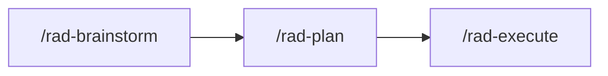

# Getting Started

By the end of this guide you'll have the orchestration system installed locally and a working mental model of the operator loop: brainstorm a project, plan it, approve the plan, and execute it — with optional automation for hands-off runs.

## Prerequisites

- **Node.js v18+**

## Install

```bash
npx rad-orchestration
```

## Per-Harness Entry Points

For per-harness install and launch entry points (Claude Code, Copilot VS Code, Copilot CLI), see [harnesses.md](harnesses.md). The rest of this guide is harness-agnostic.

## Recommended Workflow



1. **Brainstorm first.** Run `/rad-brainstorm` to align on goals, decide whether the work warrants a project series, and pull in any extra context — other documents, images, related links — that the planners can use downstream.
2. **Plan the project.** Once goals are locked, run `/rad-plan <PROJECT-NAME>`. Skills you've already authored in your own repo are picked up by the Planner during this step — no extra configuration.
3. **Review the planning output before approving.** The planner produces `{NAME}-REQUIREMENTS.md`, the phase plans under `phases/`, and the per-task handoff files under `tasks/`. This is the moment to course-correct. See [project-structure.md](project-structure.md) for what each document is.
> Recommended: Use the UI make review more comfortable, but you can also review in your code editor if you prefer.  See [dashboard.md](dashboard.md) for how the dashboard surfaces planning output.
4. **Execute.** Run `/rad-execute <PROJECT-NAME>` for in-place execution, or `/rad-execute-parallel <PROJECT-NAME>` for an isolated worktree + branch (recommended when you want `main` untouched, or when you want multiple projects in flight simultaneously).

5. **Lean into automation.** Enabling `auto_commit` and `auto_pr` lets the pipeline run hands-off through commits and pull requests; see [configuration.md](configuration.md).
> Recommended: At the very least, use `auto_commit` to let the agent commit directly to your branch as it executes. This will enable the code-reviewer to more clearly review against the code diff for the given task.

## Approve & Execute

After the plan is presented, choose a gate mode — `ask`, `phase`, `task`, or `autonomous` — to control when the pipeline pauses for your input; see [pipeline.md](pipeline.md) for depth.

## Pro Tips!
### Monitoring UI
The Monitoring UI will really help a lot as you learn the system and your velocity starts to skyrocket -- especially if you're running multiple projects in parallel. It'll help you stay organized and sane, trust me. ;)

It is also great for validating your plans.  Much easier than reviewing files.

For more information: [dashboard.md](dashboard.md)

### Steer your Orchestrator
While the project is executing, feel to talk to the Orchestrator.  Doing so will not harm your project run.  In fact, it can be of great utility!  The Orchestrator is happy to be steered and help make adjustments to the project run.  It is also useful for gaining insight about the project execution.

### Resuming Projects 
If you need to pause a project run, or your computer crashes.  Do not worry!  Your project is tracked and will easily resume from any point in time.  Type `/rad-execute <PROJECT-NAME>` and your project will reliably resume exactly where it left off.  

### Orchestrator Context Window Compacted?  No Problem!
The orchestration system uses a state machine to keep track of exactly where you are in the project.  So don't worry about compaction.  In fact, a purposeful compaction could actually save you tokens if the context window starts to grow a lot in a long running project.

## Brainstorming & Project Series

The brainstormer is optional but recommended. `/rad-plan` will accept planning context directly if you'd rather skip ahead, but a short brainstorming session usually pays for itself with better planning output.

When you do brainstorm, the agent produces a `{NAME}-BRAINSTORMING.md` document in your project folder. `/rad-plan` picks that file up automatically — it's the formal handoff into planning, and whatever you capture there is what the Planner reads when it authors `{NAME}-REQUIREMENTS.md`.

The brainstormer is also a BYO-context surface. It helps you build a doc that links to existing PRDs, design docs, RFCs, screenshots, or any other artifacts the planner should be aware of — so the planning agents start grounded in your reality, not a blank page.

For larger ideas, consider a **project series**: a numbered `{STEM}-N` sequence (for example `MY-FEATURE-1`, `MY-FEATURE-2`, `MY-FEATURE-3`) where each project declares an explicit *Receives From* / *Delivers To* relationship with its neighbors. Splitting into a series keeps individual projects smaller, planning sharp, and execution reviewable. The brainstormer helps you decide whether an idea is one project or a series, and if it's a series, what the boundaries between projects should be.

## Next Steps

## Uninstalling

Remove the orchestration system from a workspace with:

```bash
radorch uninstall
```

The command reads `package_version` from your `orchestration.yml`, looks up the bundled manifest for that version, and removes only the files it lists. `orchestration.yml` is removed last so future installer runs see a clean slate. Locally-modified files surface in a confirmation prompt before any removal proceeds.

Pass `--workspace <path>` and `--orch-root <folder>` to target a workspace other than the current directory or an `orchRoot` other than the default `.claude`. The harness is inferred from the `orchRoot` folder name (`.claude` → Claude Code, `.github` → Copilot), so `radorch uninstall --orch-root .github` is enough to clean up a Copilot install. Pass `--tool copilot-cli` explicitly only if you originally installed with the CLI variant — both Copilot variants share `.github/`, so the inferred default is `copilot-vscode`.

## Upgrading from earlier versions

Re-running `radorch` against an existing install upgrades it as `uninstall(prior version) + install(new version)` — orphans from the prior version are removed, new files are installed, and locally-modified files trigger a confirmation prompt before they are touched.

Installs from `v1.0.0-alpha.7` or earlier predate the manifest catalog and cannot be auto-upgraded. The installer detects them (no `package_version` field in `orchestration.yml`), prints a notice, and exits without modifying files. Back up any local edits, delete `.claude/` (or `.github/`), then re-run `radorch` for a clean install.

- [pipeline.md](pipeline.md)
- [configuration.md](configuration.md)
- [dashboard.md](dashboard.md)
