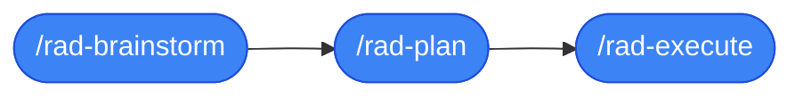

# Getting Started

This guide runs one complete project end to end in a throwaway repository, so you can watch
the whole loop before pointing it at anything you care about.

>Tip: Would rather be walked through this than read it? Run `/rad-help` and say you want to build
something — the agent paces you through this same walkthrough in conversation.


```mermaid
flowchart LR
    B(["/rad-brainstorm"]) --> P(["/rad-plan"]) --> E(["/rad-execute"])

    classDef step fill:#3C83F6,stroke:#1D4ED8,color:#ffffff
    class B,P,E step
```

Three commands. Brainstorm settles **what** you're building, plan settles **how**, execute gets it **done**.

## Before you start

- Install Rad Orc and prerequisites — see [install.md](install.md). That page is written so you can hand it straight to your agent: *"Read <https://github.com/MetalHexx/RadOrchestration/blob/main/docs/install.md> and install Rad Orc."* It will ask which harness you want it installed into.
- Make sure the **GitHub CLI** (`gh`) is properly authenticated, so we can create a throwaway repo and open a PR later.

## 1. Start the dashboard
From your chat terminal, execute the skill:
```
/rad-ui-start
```

We'll be using the UI dashboard to keep track of our project documents and the code execution.

Open [localhost:1337/projects](http://localhost:1337/projects). Your project list will be empty 
for the moment. As we continue, you'll see a new project appear here.

## 2. Register a repository

One of the cool things about Rad Orc is that your agent will know where all your repos are located 
anywhere on disk by registering your repositories. Pick whichever of these gets you there fastest:

- **Ask the agent to set one up.** It'll offer rather than just doing it — confirming with you
  first, asking where you want it cloned, creating the throwaway repo there, registering it, and
  narrating each step as it goes. When you're done practicing, ask it to clean up and it'll offer
  to remove the repo and its registration too.
- **Skip GitHub — practice as a side project instead.** Tell the agent this is just a throwaway
  experiment and it can set the project up as a **side project**: a real local git repo, no
  registration, and nothing to clean up on GitHub afterward. See
  [Side projects →](projects.md#standard-projects-and-side-projects).
- **Do it yourself.** From a normal terminal prompt:

  ```
  gh repo create hello-world-cli --private --clone
  ```

  Then open [localhost:1337/repo-registry](http://localhost:1337/repo-registry) to add it — that's
  token-free — or ask the agent to register it with the `/rad-repo` skill.

**Further reading:** [Repository Registry →](repo-registry.md)

## 3. Brainstorm

Now we'll work with the agent to create a requirements document.  Let's ask it to create a simple
hello-world CLI app.  The brainstorming skill is designed to help you think through your request
and converge on a set of goals.  Try this prompt:

```
/rad-brainstorm I'd like to create a new project called HELLO-WORLD-CLI.  It's a simple CLI app that prints "Hello, World!" using a figlet font.
```
Once you've agreed on goals, the agent will steer the conversation to scribe a **Requirements** doc.  Don't let it push you into doing so until you're ready though.  You're in charge, not the agent!

**Further reading:** [Planning →](planning.md)

## 4. Read the Requirements doc!

The requirements and other docs are automatically stored in `~/.radorc/projects/`. But
let's use the UI to read it.  

Open the UI or click this link: [localhost:1337/projects](http://localhost:1337/projects). 

Your project is listed now. Click into it.

Always read the requirements doc. It's the single most important document in the project — the execution
plan and all execution tasks are derived from it.  It only takes one vague, missing, or malformed requirement from this document
to cause your project to land wrong or incomplete.

This is the cheapest stage to make a correction to your project.  Take advantage of doing so now as any mistakes at this step will be more expensive to correct later.  

If you're tired and want to pick up on refining the requirements later, that's ok.  Take a break.  Just make sure you ask the agent to `scribe` before ending your session.  You can always start a new session later to resume refinement later with a prompt like this:

>/rad-brainstorm Let's make some corrections to HELLO-WORLD-CLI.  Update the requirements so that output text rainbow colored.

**Further reading:** [Planning →](planning.md) · [Visual docs →](visual-docs.md)

## 5. Create the Execution Plan
Now we'll take your requirements and break them down into a full execution plan.

```
/rad-plan HELLO-WORLD-CLI
```

| Question | Answer | Why |
|---|---|---|
| Review intensity | **Low** | It's a small project.  Keep it light.  I recommend **Medium** as a sensible daily default. |
| Phase/Task size | **Extra Large** | Fewer, bigger tasks. There isn't much to build. |
| Plan audit | **No** | Earns its keep on real work; overkill here. |

>Note: `Low` skips per-task and phase review, but you get a final code review — it's mandatory in every tier.

**Further reading:** [Planning →](planning.md)

## 6. Read the Execution Plan

Open [localhost:1337/projects/HELLO-WORLD-CLI](http://localhost:1337/projects/HELLO-WORLD-CLI).

You'll discover your requirements have been turned into an execution plan that is broken down into phases and tasks.

This is your last chance to change the plan before code gets written. If something's off, tell the agent and it can make corrections to the plan.

## 7. Execute

Time to execute the project run.  This will launch an automated execution pipeline to implement your plan in a worktree.

Clear or start a new session (to save tokens), then:

```
/rad-execute HELLO-WORLD-CLI
```

You'll be asked a few questions about the run characteristics:

| Question | Answer | Why |
|---|---|---|
| Auto-Commit | Strong Yes | Commits improve review agent focus by diffing on commits.  Just do it. |
| Auto-PR | Yes | Up to you.  It'll open in draft mode so you don't bother your team. |
| Where to work | New Worktree | Unless you're doing a follow-up work on an existing project, create a new one. |

A fresh terminal (or VS Code window) will open at the following directory: `~/.radorc/worktrees/HELLO-WORLD-CLI`.

This is your project's worktree "workspace".  In here, you'll find a folder per repo worktree.  Why?  In a multi-repo project, each repo will receive its own folder under a `PROJECT-NAMED` folder.  By standing your orchestrator agent on the parent folder, it has full scope of all your repos below it -- a makeshift-monorepo.

>**What is a worktree**: A worktree is a second working directory attached to the same repository, checked out to its own new branch off main (or your specified default. See: [Repository Registry](repo-registry.md)).  It differs from a normal branch checkout in that your files are physically separate, which makes file writes collision-safe when agents work parallel projects in the same repo.  It's also cheap -- no second download, one shared history.

**Further reading:** [Pipeline →](pipeline.md#where-the-run-happens)

## 8. Watch your project run

Head back over to your running project on the UI: [localhost:1337/projects/HELLO-WORLD-CLI](http://localhost:1337/projects/HELLO-WORLD-CLI)

You should now see a dashboard of your project run.  You can watch as tasks are coded and code reviews are in progress.  Every task produces a link to your commit on GitHub.  Every code review reveals a markdown report.

Once the final review lands, your PR link becomes available for easy access.  Your PR is open in **draft** mode so you don't send a premature code review signal to your team.

**Further reading:** [Dashboard →](dashboard.md) · [Source control →](source-control.md)

## While a project is running

The orchestrator is generally positioned as a dumb router -- it doesn't do much thinking.  That is, unless you need it to.  Feel free to talk to it.

- **You can interrupt.** Stopping to steer mid-run is a safe operation.
- **Ask for help.** If you see something going wrong, talk to the orchestrator -- it can step in to help.
- **Resume and compact safe.** If you need to close your laptop or lose power, no worries.  The run is easily resumed from any session using `/rad-execute <PROJECT-NAME>`.

>Tip: On extra long runs, compact the session from time to time to save on token cost.  When doing so, tell the orchestrator to stop after the last subagent completes.  This will save additional time and tokens.

## Project Completion
Your run is done, and hopefully you got a PR out of it.  Either way, don't skip what comes next.

Once the pipeline completes, the agent will offer you two choices: approve, or ask for changes.  This is a signal to you that it's time for you to step in and check out the code.  For this example project we just built, you could skip this and approve it.

But on a real team project, I would hold off on approving until you've reviewed it.  Don't skip this step.  Keeping the project in a pending state will also keep the agent aware that you're not done.  It will remember this on future sessions.  See:  [Unfinished work stays in view →](ambient-awareness.md#unfinished-work-stays-in-view)

If you ask for changes, just describe what's wrong in your own words -- you don't have to work out what kind of fix the problem needs.  The agent works that out and tells you what happens next.  And approving isn't the end of the road either: if you find a gap later, `/rad-amend` extends the finished project rather than making you start a new one.  See: [Amendments →](amendments.md)

Once you're satisfied, you can approve the project with the agent or from the UI project dashboard where you'll find an "Approve" button.

Don't forget to take your PR out of draft so your team can do further human review.

## Where to go next
This concludes the absolute bare minimum basics of running a project in Rad Orc.  There is a lot more to explore, so be sure to check out the links below for advanced techniques and leveraging other capabilities in Rad Orc.

| Page | What's there |
|---|---|
| [Projects](projects.md) | Linking projects together, project series, and side-projects |
| [Planning](planning.md) | Review tiers, task sizing, and other planning nuances.  |
| [Document Types](document-types.md) | What's inside each document a project produces |
| [Amendments](amendments.md) | Changing a plan after the run started, or after the project finished |
| [Pipeline](pipeline.md) | A peek under the hood on how the pipeline and subagents work |
| [Dashboard](dashboard.md) | Deeper dive into the UI features |
| [Configuration](configuration.md) | Every setting and where to change it |
