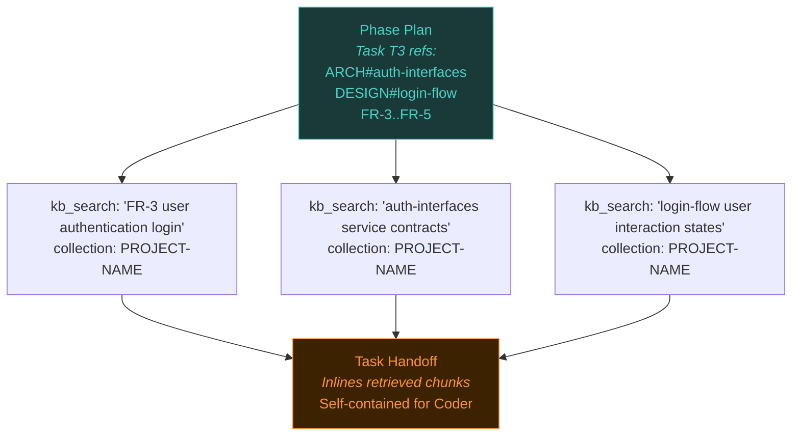

# Total-Recall Integration with the Planning Pipeline

A design exploration and decision record for integrating [total-recall](https://github.com/strvmarv/total-recall) (a three-tier MCP memory server) into the orchestration planning pipeline. Sister document to [planning-pipeline-overhaul.md](planning-pipeline-overhaul.md) — this covers how total-recall enables the thin-handoff model described there.

---

## Motivation

The planning pipeline overhaul introduces a **progressive scoping funnel**: Master Plan → Phase Plan → Task Handoff, where each level narrows from strategic to operational. The Phase Plan maps source doc sections to tasks via markdown links (e.g., `[FR-3..FR-5](PRD.md#functional-requirements)`). The Tactical Planner must then **retrieve the right content** from those source docs to inline into Task Handoffs.

Today, the Planner reads entire planning documents to find the relevant sections. This wastes context window tokens, creates extraction errors, and scales poorly as documents grow. Total-recall's Knowledge Base tier provides an alternative: **chunk planning documents by heading, embed them, and let the Planner retrieve exactly the chunks it needs via semantic + keyword search.**

This enables the thin-handoff model — Task Handoffs shrink because the Planner retrieves only targeted content instead of reading and filtering entire documents.

---

## Total-Recall Architecture (Relevant Subset)

Total-recall is a local MCP server with three memory tiers:

| Tier | Capacity | Access Pattern | Pipeline Use |
|------|----------|----------------|-------------|
| **Hot** | 50 entries, 4000-char budget | Auto-injected into every prompt | Not used — pipeline agents don't need cross-session memory |
| **Warm** | 10K entries | Semantic retrieval on demand | Not used — no cross-project memory in scope |
| **Cold / KB** | Unlimited | Chunked + embedded documents, collection-scoped search | **Primary integration point** — planning docs ingested here |

### KB Ingestion

`kb_ingest_dir` scans a directory, chunks each markdown file by heading, embeds each chunk with `all-MiniLM-L6-v2` (384-dim), and stores them in a named collection with hierarchical indexing (collection → document → chunk).

### Heading-Aware Chunking

The markdown parser (`markdown-parser.ts`) splits on `#`-level headings. Each chunk:
- Includes the heading text as its first line (critical for search relevance)
- Carries `headingPath` metadata (e.g., `["Functional Requirements", "FR-16: Gate mode resolution"]`)
- Falls back to paragraph/code-fence splitting if a section exceeds `chunk_max_tokens` (512)

### Hybrid Search

`kb_search` uses fused scoring: `fusedScore = vectorScore + 0.3 × ftsScore`. The FTS component provides exact-match boosting on identifiers like "FR-16", while the vector component handles semantic similarity. This combination is critical for disambiguating structurally similar requirements.

---

## Integration Design

### When: Ingestion Timing

Planning documents are ingested into total-recall's KB **once, as a batch, after the Master Plan is created** — the final planning artifact. At this point all five planning documents exist (Research Findings, PRD, Design, Architecture, Master Plan) and are ready for chunking.

**Mechanism**: The `create-master-plan` skill adds a final workflow step:

```
After writing the Master Plan:
1. If kb_ingest_dir is available, call it on the project directory
   with collection name = project name from state.json
2. If kb_ingest_dir is not available, skip — no error, no crash
```

This is a skill-level step, not a pipeline engine change. The pipeline engine remains a pure synchronous state machine. The agent executing the skill is already in an LLM context where MCP tools are available — adding one more tool call is idiomatic.

**Why not a pipeline action**: The pipeline engine (`pipeline-engine.js`) is a pure I/O-injected state machine with no MCP client. Its `io` interface is limited to `readState`, `writeState`, `readConfig`, `readDocument`, `ensureDirectories`. Adding MCP tool-calling would break this design boundary.

**Why not an agent**: An agent would require a new pipeline action, Orchestrator routing logic, and a new agent file — all for a single tool call. The skill-level step avoids all of this.

### Where: Collection Naming

Each project's planning documents are ingested into a KB collection named after the project:

```
Collection: "DAG-CONTRACT-REPAIRS"
├── RESEARCH-FINDINGS.md → chunks
├── DAG-CONTRACT-REPAIRS-PRD.md → chunks
├── DAG-CONTRACT-REPAIRS-DESIGN.md → chunks (or NOT-REQUIRED stub)
├── DAG-CONTRACT-REPAIRS-ARCHITECTURE.md → chunks
└── DAG-CONTRACT-REPAIRS-MASTER-PLAN.md → chunks
```

The project name comes from `state.json → project.name`, which is set by `scaffoldInitialState()` to `path.basename(projectDir)`.

Collection-scoped search ensures a Planner working on project X never retrieves chunks from project Y's planning docs.

### How: Retrieval Workflow

The Tactical Planner performs all retrieval. The Coder never calls total-recall — Task Handoffs remain fully self-contained.

**Phase Plan → Task Handoff flow**:



1. The Planner reads the Phase Plan's task manifest (source doc refs column)
2. For each ref, the Planner translates the markdown link into a `kb_search` query
3. The query includes the **identifier + descriptive text** (e.g., `"FR-16 gate mode resolution precedence"`)
4. The Planner inlines the top result into the Task Handoff
5. If `kb_search` returns no result or is unavailable → **fallback to direct file read**

### Query Format

Queries must include structual identifiers for FTS disambiguation:

| Phase Plan Ref | Query |
|---------------|-------|
| `[FR-3..FR-5](PRD.md#...)` | `"FR-3 user authentication login"`, `"FR-4 session token generation"`, `"FR-5 logout flow"` (one query per FR) |
| `[ARCH#auth-interfaces](...)` | `"auth-interfaces service contracts TypeScript"` |
| `[DESIGN#login-flow](...)` | `"login-flow user interaction states"` |
| `[NFR-2](PRD.md#...)` | `"NFR-2 session timeout idle"` |

The identifier (FR-3, NFR-2, auth-interfaces) triggers FTS exact-match boosting (+0.3 × ftsScore). The descriptive words drive vector similarity. Together they disambiguate semantically similar items — e.g., FR-16 (gate mode resolution) vs FR-17 (gate mode persistence), which have high vector similarity but distinct FTS signatures.

### Fallback Strategy

Total-recall is **preferred but not required**. If unavailable:

| Scenario | Behavior |
|----------|----------|
| `kb_ingest_dir` not available at Master Plan time | Skip ingestion silently. Planner falls back to file reads during execution. |
| `kb_search` not available at handoff time | Planner reads the full source document and extracts the relevant section manually (current behavior). |
| `kb_search` returns no results (below threshold) | Planner falls back to direct file read for that specific ref. |
| `kb_search` returns wrong content | Unlikely with ID+description queries, but same fallback — direct file read. |

The pipeline never crashes or halts due to total-recall absence. Graceful degradation means projects work identically with or without total-recall — they just use more context window tokens without it.

---

## Template Reform for Chunk Quality

Total-recall's markdown parser chunks on headings. For retrieval to work at the individual-requirement level, each retrievable unit must live under its own heading. This requires reforming planning document templates.

### The Problem

Current templates place all FRs in a single markdown table under one `## Functional Requirements` heading:

```markdown
## Functional Requirements

| # | Requirement | Priority |
|---|------------|----------|
| FR-1 | ... | P0 |
| FR-2 | ... | P1 |
| FR-3 | ... | P0 |
...20 rows...
```

The chunker produces **one chunk** containing all 20 FRs. Searching for "FR-16" returns the entire table — no precision.

### The Solution: Heading-Per-Unit

Every independently retrievable unit gets its own heading with a descriptive title:

```markdown
## Functional Requirements

### FR-1: Pipeline validates phase plan frontmatter on creation

The pipeline engine validates that the `tasks` array in phase plan frontmatter
matches the expected count and naming pattern. Validation runs during the
`phase_plan_created` event before state mutation.

**User role**: Pipeline operator
**Priority**: P0

### FR-2: Corrective tasks reference original acceptance criteria

When a code review issues a corrective task, the task handoff must include
the original acceptance criteria from the failed task alongside the specific
review findings that triggered the correction.

**User role**: Coder
**Priority**: P1
```

Each FR becomes its own chunk. The heading text (`FR-1: Pipeline validates phase plan frontmatter on creation`) is included in the chunk content, providing both the FTS-matchable identifier and the semantic signal for embedding.

### Word Budget

The embedding model uses a WordPiece tokenizer with `MAX_SEQ_LEN = 512` tokens. Practical constraints:

| Constraint | Value | Rationale |
|-----------|-------|-----------|
| **Minimum** | 50 words | Below this, embeddings lack semantic signal — too few tokens to capture meaning |
| **Maximum** | 400 words | ~400 English words ≈ 500 WordPiece tokens. Leaves margin below the 512-token truncation boundary |
| **Sweet spot** | 100-250 words | Rich enough for strong embeddings, short enough to avoid noise |

Skills teach agents to write within this budget without exposing total-recall internals. The rule is framed as a template quality constraint: *"Each heading section should contain 50-400 words of substantive content. If a requirement is under 50 words, add context sentences explaining rationale, edge cases, or constraints."*

### Templates Affected

| Template | Reform |
|----------|--------|
| **PRD** (`PRD.md`) | FRs and NFRs each get their own `###` heading with prose (not table rows) |
| **Architecture** (`ARCHITECTURE.md`) | Each module, interface, and contract gets its own `###` heading |
| **Design** (`DESIGN.md`) | Each flow, component, and token set gets its own `###` heading |
| **Research** (`RESEARCH-FINDINGS.md`) | Already structured by consumer topic — minimal change needed |
| **Master Plan** (`MASTER-PLAN.md`) | Each phase already has its own `###` — no change needed |

This reform aligns with the planning-pipeline-overhaul's template changes. The heading-per-unit structure independently improves document readability regardless of total-recall — it's good template design that also happens to enable precise retrieval.

---

## Interaction with Pipeline Overhaul Reforms

This integration layers on top of — not replaces — the reforms in `planning-pipeline-overhaul.md`:

| Overhaul Reform | Integration Effect |
|----------------|-------------------|
| **Thin routing** (#1) | Retrieval instructions go in skill reference docs, not agents or SKILL.md |
| **Master Plan as phase index** (#2) | Phase-level section links become the Planner's query source |
| **Master Plan → Tactical Planner** (#3) | Ingestion happens in the skill the Planner already owns |
| **Research facts only** (#4) | Unaffected — Research template already chunking-friendly |
| **Design default NOT-REQUIRED** (#5) | NOT-REQUIRED stubs are ingested but rarely retrieved — harmless |
| **PRD FR/story merge** (#6) | Heading-per-FR reform replaces the merged table with retrievable prose sections |
| **Architecture dependency constraints** (#7) | Each constraint gets its own heading — retrievable by the Planner |
| **Context7 integration** (#8) | Orthogonal — Context7 is for external docs, total-recall for project docs |
| **Phase Plan lean manifest** (#9) | Source doc refs column provides the Planner's query inputs |
| **Task Handoff self-containment** (#10) | Preserved — Planner retrieves and inlines; Coder sees only the handoff |
| **NFR traceability** (#11) | NFR headings enable individual NFR retrieval by ID |

---

## Precision Guarantee

The thin-handoff model depends on retrieval returning the right chunk. If *FR-16* retrieves *FR-17*, the Task Handoff contains wrong requirements and the Coder builds the wrong thing.

### Why Precision Should Be High

Three mechanisms work together:

1. **FTS exact-match boost**: Query `"FR-16 gate mode resolution"` triggers full-text search on "FR-16". Since each chunk's heading contains the FR ID, FTS produces an exact match. The 0.3× FTS weight boosts the correct chunk above semantically similar neighbors.

2. **Heading text in chunk content**: The markdown parser includes the heading as the chunk's first line. `### FR-16: Gate mode resolution precedence (state > config > ask fallback)` embeds distinctly from `### FR-17: Gate mode persistence across sessions` — different words produce different vectors.

3. **Collection scoping**: Queries are scoped to the project's collection, eliminating cross-project noise.

### Validation Before Shipping

Before enabling total-recall retrieval in production pipeline runs:

1. **Benchmark with real planning docs**: Take 3-5 completed projects with real PRDs, Architectures, etc.
2. **Ingest into test collections**: Run `kb_ingest_dir` on each project
3. **Query every FR/NFR/contract by ID+description**: Verify top-1 result is the correct chunk
4. **Measure precision**: Target ≥ 95% top-1 accuracy across all queries
5. **If below threshold**: Tune `fts_weight`, adjust heading format, or add disambiguation text to templates

This benchmark runs before the integration ships — not after. If precision doesn't meet the bar, the integration stays behind the fallback-to-file-read path.

---

## What's Out of Scope

| Item | Reason |
|------|--------|
| **Hot tier usage** | Pipeline agents don't need cross-session auto-injected memory |
| **Warm tier / cross-project memory** | Valuable but separate concern — no pipeline dependency |
| **Coder retrieval** | Coders read only the Task Handoff. Adding retrieval responsibility fragments the self-containment model |
| **KB refresh / re-ingestion** | Planning docs are immutable within a project. Once written, they don't change. No refresh needed |
| **Custom chunking logic** | The heading-aware markdown parser is sufficient. Table-aware or AST-level parsing is unnecessary if templates use heading-per-unit |
| **Embedding model changes** | `all-MiniLM-L6-v2` at 384-dim is adequate for the document sizes and query patterns involved |

---

## Decision Log

All decisions reached through structured interview sessions:

| # | Topic | Decision | Rationale |
|---|-------|----------|-----------|
| 1 | Handoff model | Thin handoff (retrieval-based) | Reduces context waste; contingent on retrieval precision validation |
| 2 | KB ingestion timing | Batch after Master Plan creation | All 5 planning docs exist at this point; single ingestion pass |
| 3 | Template reform | Heading-per-unit for all templates | Enables individual chunk retrieval; also improves readability |
| 4 | Hot tier | Not used in pipeline | Pipeline agents are stateless across sessions |
| 5 | Coder retrieval | None — Planner retrieves | Preserves Task Handoff self-containment |
| 6 | Cross-project memory | Out of scope | Separate concern; warm tier is the right home for this later |
| 7 | Retrieval fallback | Direct file read | Graceful degradation; pipeline works without total-recall |
| 8 | Planner skill workflow | Explicit `kb_search` in reference docs | Instructions live in skill references, not agent or SKILL.md |
| 9 | Query format | ID + descriptive text | FTS disambiguates IDs; vector handles semantics |
| 10 | Phase Plan refs | Markdown links → Planner translates to queries | Links are human-readable; Planner maps to `kb_search` calls |
| 11 | total-recall dependency | Preferred with graceful fallback | No hard dependency; pipeline never crashes on absence |
| 12 | Document title | `total-recall-integration.md` | Sister doc to `planning-pipeline-overhaul.md` |
| 13 | Collection naming | Project name from `state.json` | `project.name` = `path.basename(projectDir)`; natural scoping |
| 14 | KB refresh | No refresh — docs are immutable | Planning docs don't change after creation within a project |
| 15 | Precision validation | Benchmark with real planning docs | 3-5 projects, query every unit, target ≥ 95% top-1 accuracy |
| 16 | Ingestion mechanics | Skill-level step in `create-master-plan` | Zero engine changes; agent context has MCP tools; graceful skip |

---

## Implementation Sequence

This integration is **not a standalone project** — it layers into the planning pipeline overhaul:

1. **Template reform** (part of overhaul Split A or B): Heading-per-unit structure for all templates. This is independently valuable and a prerequisite for retrieval precision.

2. **Skill reference docs** (part of overhaul Split A): When creating the `create-master-plan` and `create-task-handoff` reference docs, include the total-recall workflow steps (ingestion and retrieval respectively).

3. **Precision benchmark** (pre-ship validation): Before enabling retrieval-based handoffs, run the benchmark against real project docs. Gate the feature on ≥ 95% top-1 accuracy.

4. **Gradual rollout**: Start with fallback-to-file-read as default. Enable retrieval-based handoffs per-project or globally once precision is validated.

No separate `TOTAL-RECALL-INTEGRATION` orchestration project is needed. The changes integrate into whichever project(s) implement the planning pipeline overhaul.
