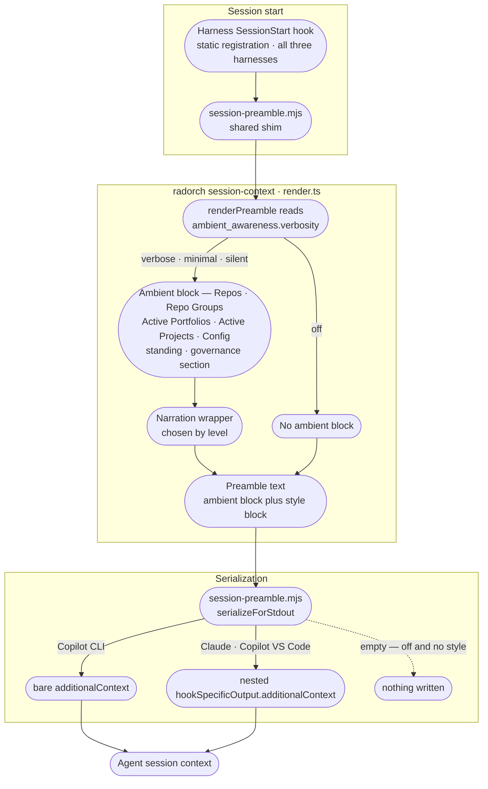

# Ambient Awareness Internals

Contributor-facing reference for the session-start ambient-awareness feature: how the preamble is built, gated by verbosity, and serialized across harnesses. For the user-facing levels and how to change them, see [ambient-awareness.md](../ambient-awareness.md).

---

## Preamble delivery flow

The `off` branch still reaches the shim: `renderPreamble` returns whatever the style layer produced,
so `off` only writes zero bytes when no style block was rendered either — see
[Empty-stdout-at-Off](#empty-stdout-at-off) below.

---

## Data/narration split and the narration wrappers

`render.ts`'s `renderPreamble` builds one structured data block — Repos, Repo Groups, Active Portfolios, Active Projects, Config, Session, closed by the governance section — that is identical at every level but `off`. Only the narration instruction wrapped around it changes with verbosity: what the assistant tells the user, not what it knows.

The wrapper constants that carry that instruction:

- **`DELIVERY_PREFIX`** (`verbose`) — instructs the assistant to begin its first reply by giving the user the full data block, plus the `/rad-init help` hint.
- **`minimalPrefix(header)`** (`minimal`) — instructs the assistant to open with exactly one line: the resolved `header` breadcrumb, the same string shared with the data block so the wrapper and the block never disagree; the rest of the block is framed as situational awareness the user's configured preference is to not see.
- **`SILENT_PREFIX`** (`silent`) — instructs the assistant to say nothing about the preamble to the user at all; the block is still loaded for the assistant's own situational awareness.

Each is framed as relaying the user's own configured preference, never as a coercive "echo this exactly" instruction — the coercive framing trips the assistant's prompt-injection guard. New level prefixes must keep that shape.

## The governance section

`buildGovernanceSection` closes the structured data block (when the registry is non-empty or a standing resolved) with one consolidated section — `### Framing, for you only`, the heading stating that none of what follows is part of what the user's configured verbosity shows them. It replaces the earlier `FRAMING_CUE`/`STANDING_DIRECTIVE` pair with one function that assembles up to four parts:

- **`### Ambient awareness`** — renders only when the registry is non-empty (there are Repos / Repo Groups / Active Portfolios / Active Projects rows above it to frame). Tells the assistant those rows are its own reach beyond the session's cwd, not merely a user-facing convenience list — entries may relate to past or future work — and explicitly tells it not to investigate or act on any of it now, deferring until the user's actual request makes it relevant. This is the one place that deferral instruction appears; no individual row repeats it.
- **`### Standing`** — renders only when a standing resolved. Nests the label-aligned project-detail rows described under [The standing block](#the-standing-block) below.
- **`### Portfolio`** — renders only when a standing resolved *and* the tip's portfolio lifecycle is `active`. See [The Portfolio subsection](#the-portfolio-subsection) below.
- The two pipeline subsections (`### If this session is running a pipeline execution` and `### Otherwise, before planning or writing code`) — render together whenever a standing resolved, gated on the same condition as `### Standing`.

With neither registry rows nor a resolved standing, the whole section is skipped — there is nothing to close.

Every part is written in the same declarative register as the narration wrappers above — stating what a row is and when it matters, never issuing the assistant a command — which is what keeps the whole section clear of its own prompt-injection guard: instruction-shaped text sitting inside data the assistant reads at session start is exactly the shape that guard exists to catch.

## The standing surface

The standing resolves the cwd to a project workspace and renders where in the series it sits, what is co-located there, and the managed workspace that holds it.

### Classification

A standing is classified by reading the work-graph registry, project state, and the worktree/side-project locator, to decide if the cwd deserves a standing line and block in the preamble. Only two classifications produce one:

- **Project worktree**: a directory within a managed workspace (under `~/.radorc/worktrees/`). Multiple projects co-locate here; the standing resolves which one is the series tip and names its immediate neighbours.
- **Side-project**: a standalone project outside any managed workspace, tracked by state alone. A single project occupies the entire directory; a standing still renders to name the tip and its series.

These deliberately do not produce standing:

- **Main clone**: a clone of the repo source itself — classified by reading the repo's root `.git/config` and finding no matching project in the registry. A main clone is for system development, not a project workspace.
- **Unclassified directory**: any directory outside a worktree or side-project root, or a location that matches no project name.

When the cwd is unclassified or matches no project, `resolveStanding()` returns null and the preamble carries neither standing line nor block.

### The visible standing line

The visible line is the header's breadcrumb suffix — `header` in `render.ts`, computed once and shared unconditionally by the data block and the `minimal` narration wrapper (`minimalPrefix(header)`). It goes out at every verbosity level that reaches the ambient block at all (`verbose`, `minimal`, `silent` — see the matrix below); only `off` suppresses it, because the entire ambient block is skipped then. It no longer varies by verbosity level.

It reads ` · you're in `project1` → `project2` → **`tip`**` — a series ordered by their `follows` edges, with the series tip bolded — preceded by the portfolio segment (`` `portfolio` › ``) when the tip is an iteration of a portfolio whose lifecycle is `active`; absent otherwise.

Edges assert real graph relationships:
- **`→` arrow** — a real `follows` edge from one project to the next; the projects are linked in sequence.
- **`·` dot** — an unlinked co-tenant not in the main series chain; it occupies the workspace but sits alone in the series order.

The series tip is the end of the first `follows` chain, never simply the last array element. If no chains exist, the first name-ordered co-tenant is the tip. Exactly one project always carries the `isTip` marker.

### The standing block

The block is an assistant-only channel of structured project detail, delivered as labelled rows and nested inside the governance section's `### Standing` subsection (see [The governance section](#the-governance-section) above) rather than closed by a standalone directive:

- **Project dir** — the tip's absolute directory
- **Docs** — planning documents (requirements, master plan, brainstorming, others) each on its own line, indented to the label width for alignment
- **Subfolders** — domain folders within the project (`docs`, `lib`, etc), dot-separated
- **Group** — the repo group (if any) that contains the project
- **Halted** — the halt reason, if the project is in a halted state
- **Worktree** — the absolute path to the managed workspace (present only for project worktrees, absent for side-projects)
- **Branch** — the workspace branch, always the same across all repos by construction (present only when the branch is known; side-projects report null)
- **Repos** — repos pinned to this workspace, dot-separated; one is marked `(you are here)` if the cwd falls within it
- **Series** — neighbours along the `follows` and `spawned-from` edges: predecessor and successor names, states, and directories. An absent neighbour prints explicitly ("no predecessor" / "no successor") so a chain end is distinguishable from an unresolved listing.
- **Also here** — co-tenants other than the tip or any already reported as a series neighbour, dot-separated with state and directory

Absolute roots (the worktree path and project directory) are stated once at the top of their rows; names and state labels are then nested indented beneath. All rows respect the label column width for visual alignment.

### The Portfolio subsection

When the tip is an iteration of a portfolio whose lifecycle is `active`, the governance section's `### Portfolio` subsection follows `### Standing`. It names the portfolio and renders exactly one labelled row — `Root doc`, the portfolio's root document path — deferring the rest of the portfolio's documents to `/rad-portfolio`. The root document is the only path rendered: the portfolio's description and its other four documents are deliberately withheld too — progressive disclosure. Session start states that a live initiative exists and where its map is; what the initiative is about, and the rest of its documents, are reached through that map on request, not loaded unasked. It is gated on portfolio lifecycle, not on verbosity: it renders at `verbose`, `minimal`, and `silent` alike whenever the condition holds, and not at all when the tip's portfolio is absent or not `active`.

### The verbosity matrix

| Verbosity | Standing line | Standing block | Ambient block |
|-----------|:---:|:---:|:---:|
| `verbose` | ✓ | ✓ | ✓ |
| `minimal` | ✓ | ✓ | ✓ |
| `silent` | ✓ | ✓ | ✓ |
| `off` | — | — | — |

Both the standing line (the header's breadcrumb suffix) and the standing block (the nested `### Standing` rows, and `### Portfolio` when it applies) go out at every level that delivers the ambient block (`verbose`, `minimal`, `silent`) — neither is gated by verbosity independently of the other. At `off`, the ambient block is not rendered at all, so neither goes out — see Reconciliation below.

### Reconciliation with Empty-stdout-at-Off

The **Empty-stdout-at-Off** section documents that `off` suppresses the ambient block while a configured communication style still renders independently. This standing surface is part of the ambient block: it is subject to the same gating. When `renderPreamble` is called with `verbosity: 'off'`, the entire `renderAmbientBlock` call is skipped, so standing is never added to the output. If a communication style is enabled at `off`, the style block is still rendered — the two layers are independent. The standing does not go out at `off`; the entire ambient block stays out.

### Design decisions

Three design calls are non-obvious from the code alone; they are recorded here to prevent re-litigation by a well-meaning later change.

#### Documents use a machinery denylist, not an extension allowlist

`scanDocs()` (`lib/work-graph/src/derive/projects.ts`) lists a project's files as documents (the tip's `Docs` row) by excluding a fixed set of pipeline machinery filenames — `MACHINERY_FILES`, which names `state.json`, `template.yml`, and `.project-sessions.json` — rather than including only files whose extension matches a known "document" set. Every other file in the project directory, whatever its extension, is listed. The failure modes of this denylist approach are deliberately asymmetric:

- **Spurious visible document**: if a future pipeline file is added to a project directory but never added to `MACHINERY_FILES`, `scanDocs()` lists it as a document. This is a visible signal — the file shows up in the `Docs` row where it plainly doesn't belong — that prompts a maintainer to extend the denylist.
- **Silently hidden user document**: an extension allowlist would instead risk the opposite failure — a legitimate user document with an unrecognized extension silently dropped from the list, with no visible sign anything is missing. The denylist can't produce that failure: any file not literally named in `MACHINERY_FILES` stays visible regardless of its extension.

The denylist is thus intentional: a gap in it produces a loud, visible false positive (an extra document shown) rather than a silent, hidden false negative (a real document dropped).

#### Phase and task progress are deliberately excluded

The standing names only project-level state — the tip's state label, halt reason, series neighbours, and co-located projects — not phase or task detail. The reason is architectural: phases and tasks are structured within a project and branch with each agent's own execution model. `/rad-execute` owns that narration; iterating through phases and tasks is `/rad-execute`'s job. The standing sits at session start, before any execution model is live. Reporting "you are in phase 2, task 3 of 5" at session start is false: the denominator (total task count) is not knowable until the tier is loaded, and the numerator (completed tasks) materializes only as each task is reached. Recording the absence of this data here prevents a future pass from adding it on an assumption of completeness.

#### The git budget is one invocation

The worktree branch is resolved by a single `git rev-parse --abbrev-ref HEAD` call (or equivalent) on the first repo in the workspace. All repos in a workspace are created on the same branch by construction, so one repo's branch is the workspace branch; divergence is deliberately not probed (see `probeBranch` in resolve.ts). The session-context command is invoked at session start before any user request — a tight budget to keep preamble rendering quick. Calling git multiple times per repo per worktree, or probing for branch divergence, would defeat that budget. The one-invocation ceiling is held by deferring the branch probe until it is actually needed (when the cwd has no repo segment and classify-time inspection could not determine it). The cost is borne on first render only and only for side-projects or worktrees where the branch was not already known.

---

## Harness serialization contract

`serializeForStdout` emits one of two shapes, and the split does not fall where the harness names suggest:

| Harness | Emitted shape | Why |
|---|---|---|
| Copilot CLI | bare top-level `additionalContext` | raw stdout is discarded for every event; only the bare key is read |
| Copilot in VS Code | nested `hookSpecificOutput.additionalContext` | *requires* the nested shape — raw stdout is silently dropped |
| Claude Code | nested `hookSpecificOutput.additionalContext` | accepts raw stdout **or** nested, so it rides the same branch as VS Code |

Only Copilot CLI is special-cased, and the discriminator is **`COPILOT_CLI=1`** — not the plugin-root environment variable. Claude Code and VS Code are deliberately *not* told apart: both set `CLAUDE_PLUGIN_ROOT`, and `VSCODE_PID` is present whenever Claude runs inside a VS Code terminal, so there is no reliable signal to split on. Since VS Code requires the nested shape and Claude Code accepts it, one branch serves both.

`session-preamble.mjs`'s `serializeForStdout` is the single source for this contract — see [harness-installers/shared/hooks/AGENTS.md](../../harness-installers/shared/hooks/AGENTS.md) for the shim's full behavior, and [copilot-cli-hooks.md](../research/copilot-cli-hooks.md) / [copilot-vscode-hooks.md](../research/copilot-vscode-hooks.md) for the per-harness stdout contracts this branch was derived from.

## The other SessionStart hook

The hooks that fire at session start are unrelated. `session-preamble.mjs` is this feature. `drift-check.mjs` compares the delivering plugin version against `~/.radorc/install.json` and prints a single line when they differ; it ships inside each plugin payload, is registered in that plugin's own `hooks/hooks.json`, and knows nothing about verbosity. Anyone debugging what actually arrived at session start is reading the output of both.

Registration differs per plugin, and the differences are load-bearing rather than stylistic:

- [claude-plugin/hooks/AGENTS.md](../../harness-installers/claude-plugin/hooks/AGENTS.md) — `SessionStart`, dispatched by an inline `node -e` shim reading `CLAUDE_PLUGIN_ROOT`
- [copilot-cli-plugin/hooks/AGENTS.md](../../harness-installers/copilot-cli-plugin/hooks/AGENTS.md) — camelCase `sessionStart`, dispatched through `hooks/launcher.cjs`, which resolves the payload from `COPILOT_PLUGIN_ROOT` because this runtime applies no shell expansion to a hook command
- [copilot-vscode-plugin/hooks/AGENTS.md](../../harness-installers/copilot-vscode-plugin/hooks/AGENTS.md) — PascalCase `SessionStart`, inline shim again, and additionally bakes the plugin-root token to absolute paths at install time

Each runs the same idempotency pattern for the sibling `UserPromptSubmit` bootstrap: it rewrites its own `hooks.json` to delete that one entry on success. None of them uses a marker file.

## Empty-stdout-at-Off

At `off`, `renderPreamble` does not write the ambient block. If the communication-style block is also empty (style disabled or not found), the preamble is entirely empty and `renderPreamble` returns `''`. That empty string flows unchanged through the envelope (`data.preamble`), `buildHookOutput`'s `additionalContext`, and `serializeForStdout`, which returns `''` for empty text. The hook's main-execution block only writes to stdout when the serialized payload is truthy, so `off` + no style produces zero stdout bytes rather than an empty JSON payload.

If a communication style is enabled with ambient awareness at `off`, the style block is still rendered (the two layers are independent), and stdout contains the style. See [communication-style.md](communication-style.md) for the full verbosity × enabled matrix.

Because the gating happens entirely inside the CLI's render path, hook registration itself never changes across levels — every harness registers the same static `SessionStart` hook regardless of the configured verbosity or style settings. Turning ambient awareness off is a data problem (render nothing), not a wiring problem (unregister a hook).

## `/rad-init`'s bare-command behavior

Bare `/rad-init` (no level argument) always calls `session-context --verbosity verbose`, overriding whatever level is persisted ([rad-init/SKILL.md](../../harness-files/skills/rad-init/SKILL.md)). This resolves the source ticket's "runs at the configured level" ambiguity: if the bare command inherited the persisted level, running it at `off` or `silent` would render or say nothing, defeating its purpose as an on-demand preview. Forcing verbose keeps `/rad-init` a reliable manual preview regardless of the session's ambient-awareness setting; it never persists the override.

---

## Cross-links

### Module contracts

The feature spans the modules below, each of which owns its own mechanics. Read these rather than
expecting this page to restate them:

- [cli/AGENTS.md](../../cli/AGENTS.md) — the module that owns the `session-context` command; envelope contract, command structure, build output layout
- [lib/work-graph/AGENTS.md](../../lib/work-graph/AGENTS.md) — `locate()`, the derive helpers, and `MACHINERY_FILES` itself; the module that must move when the standing's inputs change
- [harness-installers/shared/hooks/AGENTS.md](../../harness-installers/shared/hooks/AGENTS.md) — both shims, the dual `radorch.mjs` resolution, and the never-throw / never-block contract
- [harness-installers/standard/AGENTS.md](../../harness-installers/standard/AGENTS.md) — how the preamble hook is *registered* into the user's settings, keyed by the stable `rad-orc-preamble` marker, and why removing the telemetry hooks leaves `SessionStart` untouched
- [runtime-config/AGENTS.md](../../runtime-config/AGENTS.md) — the module that ships `orchestration.yml`, and what adding a field to it is owed everywhere else

### Pages and source

- [ambient-awareness.md](../ambient-awareness.md) — user-facing levels and how to change them
- [communication-style.md](communication-style.md) — the communication-style feature, which rides the same `SessionStart` hook and the same shim but gates on its own config, so the two render independently
- [system-architecture.md](system-architecture.md) — broader subsystem map
- [../../cli/src/commands/session-context/resolve.ts](../../cli/src/commands/session-context/resolve.ts) — the standing resolver; classifies the cwd and resolves series, neighbours, and workspace detail
- [../../cli/src/commands/session-context/render.ts](../../cli/src/commands/session-context/render.ts) — the standing render; formats the visible line, the standing block, and the governance section for the preamble
