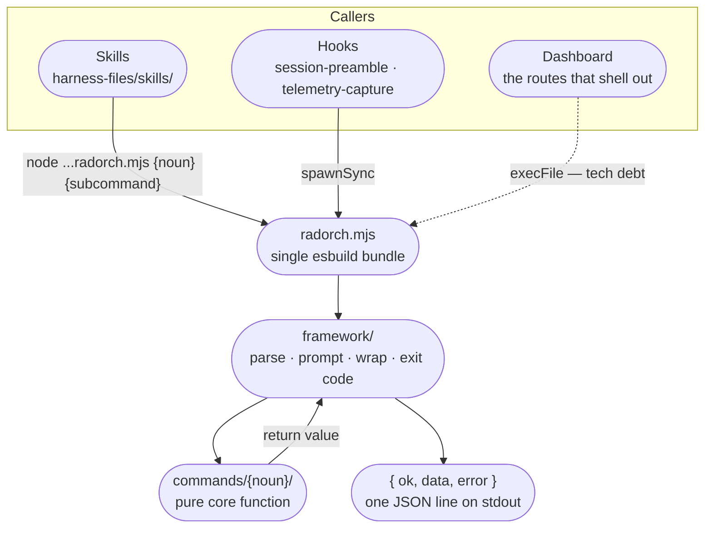

# CLI

`radorch` is a single Node binary that carries every deterministic operation in the system. It is
not a tool you use. Almost nothing in this repo expects a human to type `radorch` — the command
surface exists so that agents, hooks, and the dashboard all reach the same tested code rather than
each re-deriving the same decision.

That is the whole argument for it. Routing a pipeline event, resolving which worktree a project
lives in, deciding whether a plan is ready to execute — these are decisions with exactly one right
answer, and a language model asked to make them from prose will get them right most of the time.
Most of the time is not good enough for state transitions, so they live here instead, as functions
with tests.

This page maps the surface and routes you to the module that owns each part. For how the CLI is
built, tested, and extended, [`cli/AGENTS.md`](../../cli/AGENTS.md) is the authority and this page
does not repeat it.

---

## Who calls it



**Skills are the main path.** A `SKILL.md` invokes the bundle by its installed path, and the
`${PLUGIN_ROOT}` token expands at install time to the harness root:

```
node "${PLUGIN_ROOT}/skills/rad-orchestration/scripts/radorch.mjs" <noun> <subcommand> ...
```

That exact form is enforced across every shipped skill file by a regression guard,
`harness-files/tests/test-skill-call-form.test.mjs`. Worth knowing what the guard does and does not
do: it checks the *shape* of the invocation — the token, the quoting, the bundle path — and never
checks that the noun and subcommand name a command that exists.

**Hooks are callers too**, which is what makes the CLI the substrate under
[ambient awareness](ambient-awareness.md) and [observability](../observability.md) rather than a
separate mechanism. `session-preamble.mjs` runs `session-context`; `telemetry-capture.mjs` runs
`telemetry capture --event <name>`. Both resolve the same bundle and spawn it synchronously.

**The dashboard is the odd one.** Some API routes shell out instead of calling a library, and they
depend on `radorch ui start` having spawned the server with the CLI's own path in
`RADORCH_CLI_PATH` — so the CLI starts the dashboard, hands over its own location, and the
dashboard calls back. This is [recorded debt](system-architecture.md#the-dashboard-shells-out-to-the-cli),
not a pattern to copy.

---

## The command surface

Most top-level commands are noun groups with subcommands under them. The exceptions are `doctor`,
`session-context`, and `migrate` — bare commands that take flags directly.

Below they are grouped by what they serve, with a route to the page that owns the concept. This is
not a flag reference — flags change within a release and a copy here would be wrong before it was
read. Every command self-documents at three depths: `radorch --help`, `radorch <noun> --help`, and
`radorch <noun> <subcommand> --help`.

### Running the pipeline

| Group | What it does | Concept owned by |
|---|---|---|
| `pipeline` | `signal` — the engine's single entry point. Send an event, get the next action back. | [Execution Pipeline](../pipeline.md) |
| `gate` | `approve plan`, `approve final` — the gates this noun carries. The task and phase gates are approved by signalling `task_gate_approved` / `phase_gate_approved` through `pipeline signal`. | [Execution Pipeline](../pipeline.md) |
| `execute` | `resolve` classifies the run mode read-only; `prepare` provisions worktrees and seals source-control state. | [Execution Pipeline](../pipeline.md) |
| `plan` | `explode` splits the Master Plan into phase and task files; `prepare` stamps approval and freezes the tier and task size; `resolve` reports planning readiness. | [Planning](../planning.md) |
| `amendment` | `validate`, `apply`, `status` — extend a plan that has already run. | [Amendments](../amendments.md) |
| `migrate` | Upgrade a project's `state.json` to the current schema version. | — |

### Projects and the work graph

| Group | What it does | Concept owned by |
|---|---|---|
| `project` | `list`, `show`, `locate`, `worktrees`, `delete`. `locate` classifies a working directory against worktrees, side-projects, and the registry — it answers "where am I". | [Projects](../projects.md) |
| `project-group` | `create`, `edit`, `add`, `remove`, `delete`, `list`, `show`. | [Projects](../projects.md) |
| `graph` | `show`, `link`, `unlink`, `prune` — relationships between projects, and removing dangling edges. | [Projects](../projects.md) |
| `portfolio` | `list`, `show`, `create`, `provision` — a root project and the iteration projects beneath it, held together by a group and its edges. `provision` stands up one iteration: its directory, its group membership, and a `depends-on` edge per named target that resolves. | — |
| `side-project` | `init` — stand up a local-only project outside the registry. | [Projects](../projects.md) |
| `session` | `save`, `list`, `resume` — attribute a conversation to a project, list its saved sessions, or resume one in a new terminal. | [Sessions](../sessions.md) |

### Repositories

| Group | What it does | Concept owned by |
|---|---|---|
| `repo` | `add`, `bind`, `edit`, `remove`, `list`, `show`. | [Repository Registry](../repo-registry.md) |
| `repo-group` | The same operations as `project-group`, over repo groups. | [Repository Registry](../repo-registry.md) |

Both write through the registry library's named mutations rather than touching the files —
a hard rule with its own test, described in [`cli/AGENTS.md`](../../cli/AGENTS.md).

### The workspace

| Group | What it does | Concept owned by |
|---|---|---|
| `worktree` | `create`, `launch`, `remove`. `launch` opens a harness session in the worktree and takes an `--agent` discriminant. | [Source Control](../source-control.md) |
| `source-control` | `init` — validate a project's worktrees and record its source-control state. | [Source Control](../source-control.md) |

### Shaping how agents behave

| Group | What it does | Concept owned by |
|---|---|---|
| `config` | `get` and `set-verbosity` against `orchestration.yml`. | [Configuration](../configuration.md) |
| `communication-style` | `list`, `load`, `set`, `save`. | [Communication Styles](../communication-styles.md) |
| `action-events` | `compose` — assemble an action or event prompt from the catalog plus any user overlay, reading the overlay from stdin. | [Custom Instructions](../custom-instructions.md) |
| `skill` | `list` — enumerate a repo's `SKILL.md` files so the planner can encode them into Task Handoffs. | [Skills](../skills.md) |

### Surfaces and diagnostics

| Group | What it does | Concept owned by |
|---|---|---|
| `ui` | `start`, `stop`, `status` — dashboard lifecycle. `start` is also what plumbs `RADORCH_CLI_PATH` into the server. | [Dashboard](../dashboard.md) |
| `session-context` | Render the session-start preamble. Called by the `SessionStart` hook, not by an agent. | [Ambient Awareness](ambient-awareness.md) |
| `telemetry` | `capture` — append a usage record. Called by the telemetry hook. | [Observability](../observability.md) |
| `doctor` | Health checks across environment, install integrity, and registry shape. | — |

---

## One shape out

Every command emits exactly one JSON envelope on stdout and nothing else:

```json
{ "ok": true, "data": { } }
```

```json
{ "ok": false, "error": { "type": "user_error", "message": "..." } }
```

Success carries `data` and never `error`; failure carries `error` and, on the one path that needs
it, a `data` block naming the offending event and field. Exit codes follow from the envelope —
`0` for success, `1` for a user error, `2` for a system error.

This matters more here than the same contract would in an ordinary CLI, because the caller on the
other end is usually a language model reading stdout. A stray `console.log`, a progress line, or a
second JSON object breaks the parse. That is why `framework/output.ts#emit` is the single permitted
`console.log` site in the package, why it validates the envelope before printing it, and why
lint's `no-console` rule is disabled for exactly one file.

The consequence for a caller: a command that fails *inside* the framework returns a parseable
failure envelope, but a command that is rejected *before* the framework runs — an unknown noun, say
— produces no envelope at all, just a message on stderr. If you are parsing stdout and find nothing
there, check the command name first.

---

## Going deeper

| For | Read |
|---|---|
| Structure, envelope rules, coding standards, adding a subcommand | [`cli/AGENTS.md`](../../cli/AGENTS.md) |
| The state machine behind `pipeline signal` and `gate approve` | [`pipeline-engine/AGENTS.md`](../../cli/src/lib/pipeline-engine/AGENTS.md) |
| What the behavioral test tier asserts on, and what belongs in it | [`cli/tests/behavioral/AGENTS.md`](../../cli/tests/behavioral/AGENTS.md) |
| How the bundle is built and shipped into each harness | [`harness-installers/AGENTS.md`](../../harness-installers/AGENTS.md) |
| The call form and the `${PLUGIN_ROOT}` token contract | [`harness-files/AGENTS.md`](../../harness-files/AGENTS.md) |
| Where the CLI sits in the system | [System Architecture](system-architecture.md) |

---

**Read Next:** [System Architecture](system-architecture.md) · [Skills](skills.md) ·
[Execution Pipeline](../pipeline.md)
