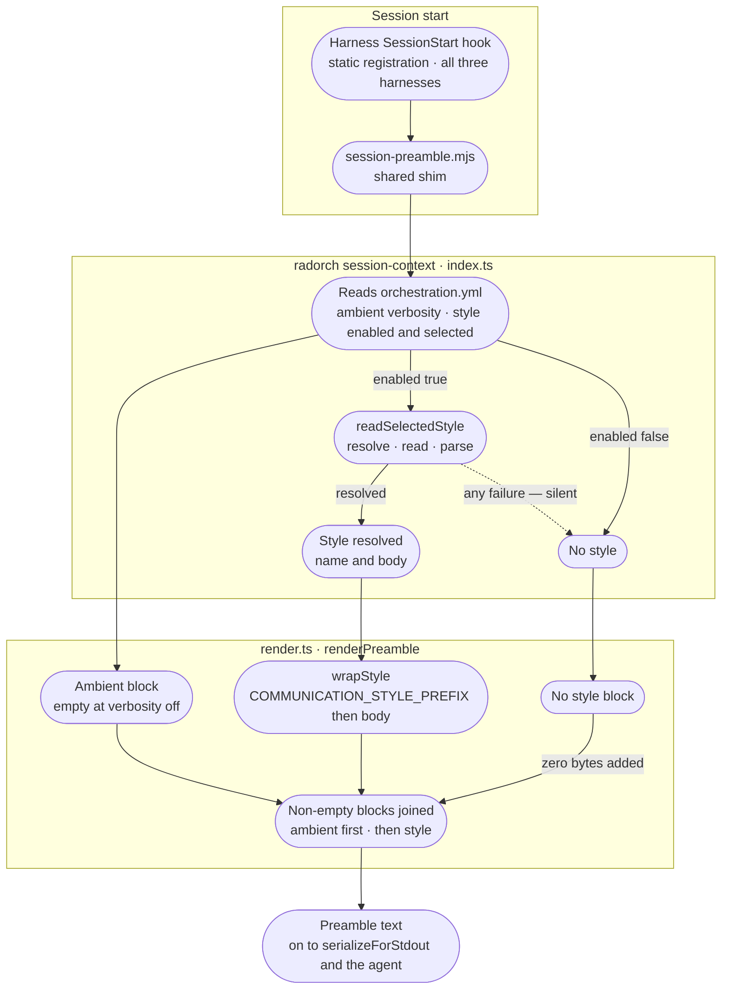

# Communication Style Internals

Contributor-facing reference for the communication-style feature: how the catalog is read, what
actually gets injected into the preamble, the containment rules on `selected`, and the independence
fence that keeps style selection and ambient verbosity from touching each other.

---

## Preamble delivery flow



**Resolution happens in `index.ts`, not in `render.ts`.** The handler reads the config, resolves the
style off disk, and hands `renderPreamble` either a `{ name, body }` object or `null`; render never
touches the filesystem for this. That split is why every style failure mode collapses to the same
thing — a `null` the renderer cannot distinguish from "disabled."

Serialization from there is shared with the ambient layer and identical for both —
[Ambient Awareness Internals](ambient-awareness.md#preamble-delivery-flow) carries the two
output shapes and the `COPILOT_CLI=1` discriminator that picks between them.

---

## Assembly split: ambient and style blocks

`renderPreamble` builds two independent blocks — ambient and style — filters out the empty ones, and
joins what remains with a blank line. **Ambient comes first.**

- **Ambient block** — the ambient-awareness preamble (Repos, Repo Groups, Active Projects, Config,
  framing cue) or empty, gated by `ambient_awareness.verbosity`.
- **Style block** — `COMMUNICATION_STYLE_PREFIX` followed by the style file's **body**, or empty when
  the resolved style is `null`.

**Only the body is injected. The frontmatter never reaches the agent.** `parseStyleFile` splits the
file and the renderer takes `body` alone; `name` survives only as the Config-row indicator, and
`title` and `description` exist for the config panel and `list` output. A contributor debugging "why
doesn't the agent see my style's description" is looking at a field that was never sent.

The two blocks are **orthogonal**: the person most likely to turn the banner down (ambient verbosity
off) is exactly the person most likely to want a terse register, and coupling them would silently
kill the feature for its most natural audience. Decoupling them means a user can choose any
combination of ambient and style settings independently.

When the ambient block renders (verbosity above `off`), its Config row carries the communication-style
indicator — see the matrix below. When verbosity is `off`, the ambient block itself is skipped
entirely, so no indicator reaches stdout; state stays discoverable through the configuration panel and
the `/rad-communication` direct-query endpoint instead.

### The scope fence is prompt text, not a guard

`COMMUNICATION_STYLE_PREFIX` (`render.ts`) is not a label — it carries the whole fence. It states that
the style governs tone, register, pacing, and how replies to the user are formatted, and that it does
**not** govern what the agent does, which tools or skills it invokes, or the structure and content of
code, code comments, documentation, or anything the pipeline reads: Task Handoffs, review verdicts,
planning documents, gate prompts.

So the boundary the user-facing page states as a product contract is enforced by instruction, not by
isolation — there is no runtime check that a style failed to stay in its lane. Anything that weakens
that paragraph weakens the fence itself.

The prefix is also deliberately framed as a **relay of the user's own configured preference** rather
than a command, matching the voice of the ambient narration prefixes directly above it in the same
file. The reason is written into `render.ts`: coercive framing ("echo this exactly", "you must
comply") trips the assistant's own prompt-injection guard. New prefixes must keep that shape.

---

## Catalog layout

The catalog root is `~/.radorc/communication-styles/`. Its lifecycle — shipped styles at the root
overwritten on upgrade and removed on uninstall, user-owned styles under `custom/` surviving both — is
owned by [`runtime-config/AGENTS.md`](../../runtime-config/AGENTS.md), along with the frontmatter
shape (`name`, `title`, `description`). What matters on the read path:

- **The catalog is exactly one level deep.** `listStyles` reads the root and `custom/`, nothing else;
  a style in a deeper folder is invisible.
- **`name` must equal the filename stem** (lowercase, alphanumeric, hyphens). `parseStyleFile` throws
  on a mismatch, which is what keeps the stored `selected` path and the rendered indicator agreeing.
- **Unparseable files fail two different ways depending on who is asking.** `listStyles` skips them
  with a `console.warn`, so a broken file is visible in the catalog listing. `readSelectedStyle` — the
  session-start path — returns `null` in silence. The same bad file is loud in the dashboard dropdown
  and mute at session start.

---

## Config structure

Two keys under `communication_style`:

```yaml
communication_style:
  enabled: false          # opt-in; fresh install behaves as it does today
  selected: high-level.md # catalog-relative path; 'custom/my-style.md' for user's own
```

- **`enabled`** — boolean, default `false`. When true, the selected style is active; when false, no style block is injected.
- **`selected`** — stores a catalog-relative path (POSIX-separated, `.md` suffix): `caveman.md` (shipped) or `custom/my-style.md` (user-owned). Absolute paths are rejected; paths that escape the catalog root are rejected. A missing or empty file is silently treated as no style. On a fresh install, `selected` defaults to `high-level.md` for symmetry with the shipped catalog.
- The `--style` / `--selected` command boundaries also accept a bare slug (e.g. `unicorn-speak`) — the CLI resolves it to the catalog-relative path (`custom/` first, then the catalog root) before it ever reaches `selected`, so the stored value is always the resolved path, never the raw slug.

---

## Containment of `selected`

The `selected` field is not a shell-escaped string — it is a path resolver with strict containment, and it is a resolve-and-compare check throughout, never string sanitization:

- `resolveStyleRef(catalogRoot, ref)` accepts either a catalog-relative `.md` path or a bare slug:
  - A `.md`-suffixed `ref` delegates to `resolveStylePath`, which validates that it is not empty or absolute, is a `.md` file, and does not resolve outside the `catalogRoot` (no `../` escape) — containment only, no filesystem read.
  - A bare slug is checked against `/^[a-z0-9][a-z0-9-]*$/` before any filesystem access — this rejects separators, traversal segments, absolute paths, and uppercase. A slug that passes the regex is then probed as `custom/<slug>.md` first, then `<slug>.md`; the first that exists as a file wins. Custom wins a name collision, since it is the more specific, user-authored file.
- On success it returns the resolved catalog-relative path and its absolute filesystem path; on any violation it returns `null`.
- When `null` is returned, no style is injected into the preamble.

This containment rule prevents a misconfigured or manually edited `orchestration.yml` from reading arbitrary files on the user's machine.

---

## Verbosity × enabled matrix

The two configuration domains (ambient verbosity and style enabled/disabled) form a 4×2 matrix:

| Ambient verbosity | Style enabled | Ambient block | Style block | Net result | Indicator |
|---|---|---|---|---|---|
| `verbose` | `true` | Full data + narration | Style | Both blocks | `· ambient awareness \`verbose\`` + `· communication style \`<name>\`` |
| `verbose` | `false` | Full data + narration | (none) | Ambient only | `· ambient awareness \`verbose\`` + `· communication style \`off\`` |
| `minimal` | `true` | One line + narration | Style | Minimal + style | `· ambient awareness \`minimal\`` + `· communication style \`<name>\`` |
| `minimal` | `false` | One line + narration | (none) | Minimal only | `· ambient awareness \`minimal\`` + `· communication style \`off\`` |
| `silent` | `true` | (none visible; loaded for situational awareness) | Style | Style only, nothing narrated (discoverable via `/rad-communication`) | `· communication style \`<name>\`` |
| `silent` | `false` | (none visible; loaded for situational awareness) | (none) | Nothing narrated | `· communication style \`off\`` |
| `off` | `true` | (none) | Style | Style only | (none) |
| `off` | `false` | (none) | (none) | Empty preamble | (none) |

The config-row indicator (the `· communication style \`<name>\`` or `· communication style \`off\`` fragment) is emitted as part of the ambient block's Config row inside the preamble text itself — present whenever the ambient block renders (`verbose`, `minimal`, `silent`), absent along with the rest of the preamble only at `off`. The dashboard panel has no equivalent free-text summary line; it exposes the same state through the `Enabled` switch and `Style` dropdown instead.

---

## Session-start flow with style

The mermaid diagram above shows the full flow. In prose:

1. `SessionStart` hook fires (static hook on every harness, every session).
2. `session-preamble.mjs` calls `radorch session-context` (via the shim).
3. The `session-context` handler in `index.ts` runs:
   - Reads `orchestration.yml` and normalizes `ambient_awareness.verbosity`.
   - If `communication_style.enabled` is true, calls `readSelectedStyle` with the catalog root and
     `selected`. Every failure — containment rejection, missing file, unreadable, unparseable, empty
     body — returns `null`, and the whole call additionally sits inside a `try/catch`, because
     session start must never throw.
   - Passes `verbosity` and the resolved style (or `null`) to `renderPreamble`.
4. `render.ts#renderPreamble` builds the ambient block (empty at `off`) and the style block (empty
   when the style is `null`), then joins the non-empty ones — ambient first — and returns the text.
5. The handler's return value is wrapped in the CLI's standard envelope, so the shim reads
   `{ ok: true, data: { preamble: '<text>' } }` on stdout. `buildHookOutput` **unwraps** it and
   returns `{ additionalContext: envelope.data.preamble }`; on a bad exit, an unparseable payload, or
   `ok: false` it returns a one-line notice instead and never throws.
6. `serializeForStdout` picks the output shape for the current harness and returns `''` for empty
   text; the hook's entry block writes to stdout only when that payload is non-empty.

---

## Cross-links

- [ambient-awareness.md](ambient-awareness.md) — the orthogonal verbosity-gated preamble block, and
  the shared serialization contract this page defers to
- [system-architecture.md](system-architecture.md) — broader subsystem map
- [communication-styles.md](../communication-styles.md) — the user-facing feature page

### Module contracts

The mechanics beyond this page live in the module contracts, not in `docs/`:

- [`cli/AGENTS.md`](../../cli/AGENTS.md) — the envelope contract, `defineCommand`/`runCommand`, and
  the conventions every noun group follows, `communication-style` included. For that group's
  subcommands, run `radorch communication-style --help`
- [`runtime-config/AGENTS.md`](../../runtime-config/AGENTS.md) — the shipped catalog, the style file
  shape, and the upgrade/uninstall lifecycle
- [`harness-installers/shared/hooks/AGENTS.md`](../../harness-installers/shared/hooks/AGENTS.md) —
  the shim, its dual `radorch.mjs` resolution, and the never-throw contract. The context-channel
  shapes themselves are in [ambient-awareness.md](ambient-awareness.md#harness-serialization-contract)
- [`ui/AGENTS.md`](../../ui/AGENTS.md) — the rule that every editable config field is registered in
  `config-field-meta.ts` with a matching validator entry, and the transplant convention the
  catalog reader follows

The root [`AGENTS.md`](../../AGENTS.md) map's *Surfaces* table lists every module the feature spans.
