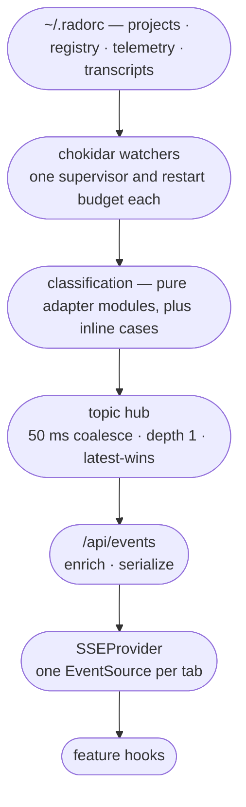

# Dashboard Internals

Contributor-facing reference for `ui/`: where its data comes from, what it is allowed to write,
how it stays live without polling, and the two builds it has to survive. For the user-facing
page — what each surface does and how to use it — see [dashboard.md](../dashboard.md).

`ui/` is the largest module in the repo, and this page does not try to cover all of it. It covers
the architecture and the invariants — the things that are expensive to learn by reading code, and
expensive to get wrong. The module's own conventions, folder by folder, live in
[`ui/AGENTS.md`](../../ui/AGENTS.md).

---

## Path resolution: one module, and the places that skip it

`ui/lib/path-resolver.ts` is the **intended** single indirection for every `~/.radorc` path.

| Function | Resolves to |
|---|---|
| `getProjectsRoot()` | `~/.radorc/projects` |
| `getWorktreesRoot()` | `~/.radorc/worktrees` |
| `getSideProjectsRoot()` | `~/.radorc/side-projects` |
| `getRegistryRoot()` | `~/.radorc` — **the home root itself**, not a subfolder |
| `getTemplatesRoot()` | `~/.radorc/templates` |
| `getDocsRoot()` | `~/.radorc/docs` |
| `getOrchestrationYmlPath()` | `~/.radorc/orchestration.yml` |
| `getTelemetryRoot()` | `RADORC_TELEMETRY_ROOT` if set, else `~/.radorc/telemetry` |
| `resolveProjectDir(name)` | `~/.radorc/projects/<name>` |
| `resolveDocPath(project, rel)` | A document inside a project, after normalizing backslashes and stripping a duplicated project prefix |

**It is not the only indirection, and you should know that before you copy a pattern.** A number of
production modules call `os.homedir()` and join `~/.radorc` by hand — the `observability/*` routes,
`start-action`, and several `lib/` helpers. The observability routes each reimplement
`getTelemetryRoot()` verbatim, `RADORC_TELEMETRY_ROOT` override included. That is a duplication to
work *away* from, not a second sanctioned style.

`resolveDocPath` is the one worth reading before you touch it: it normalizes client-supplied
relative paths, so it is the traversal-relevant function in this module.

Two naming details:

- **`getTelemetryRoot` is the only root with an environment override**, spelled
  `RADORC_TELEMETRY_ROOT` — no `H`. Mistyping it fails silently, back to the default path.
- **`RADORCH_CLI_PATH` is a different variable with an `H`, and it fails loudly.** Missing, it
  produces an explicit `RADORCH_CLI_PATH not set` error and an HTTP 500 — never a fallback.

Because every resolver path funnels through `os.homedir()`, one test helper — `withHomedir` in
`ui/lib/test-helpers.ts` — redirects the dashboard's whole filesystem surface.

---

## Reading: the dashboard owns no database

Everything the dashboard shows is derived, at read time, from files the rest of the system wrote.
There is no server-side store and no cache to invalidate.

`ui/lib/fs-reader.ts` holds the project reads — along with `writeConfig`, which is the atomic
write behind the config route, so do not read the module as read-only. The two reads that matter:

- **`discoverProjects()`** reads `~/.radorc/projects`, filters directories through
  `isProjectDirName`, and reads them **in parallel** via `Promise.all`. Sequential reads became the
  dominant cost once `state.json` grew from roughly 2 KB to 50–200 KB per project. Each project is
  wrapped in its own `try`/`catch`, so one malformed file cannot poison the list — it comes back
  flagged `hasMalformedState` instead.
- **`readProjectState(projectDir)`** reads and parses one `state.json`. Missing returns `null`; a
  parse failure is rethrown, and the route maps it to **422** rather than 500 — a malformed file is
  a bad document, not a broken server.

The workspace libraries are consumed **by name**, never by relative path into their source:

| Package | What the dashboard uses it for |
|---|---|
| `@rad-orchestration/work-graph` | `deriveProjectState`, the project-state vocabulary, `WorkGraphService` |
| `@rad-orchestration/repo-registry` | every registry read and write, rooted at `getRegistryRoot()` |
| `@rad-orchestration/telemetry` | usage rows, transcripts, saved sessions, `computeActiveTimeMs` |
| `@rad-orchestration/terminal-launch` | the shared launcher behind the spawn routes — `start-action`, `sessions/[sessionId]/launch`, `debrief/launch` |

`ui/lib/project-sessions-reader.ts` is a deliberate read-path transplant of the CLI's
`project-sessions.ts` — it copies the reads and **excludes the write path, the lock, and the
upsert**. Same posture as `state.json`: the dashboard reads a store another module owns.

**Artifact ordering is deliberately stable, and that is a design decision rather than an accident.**
`ui/lib/artifact-model.ts#deriveArtifacts` is pure — it takes a file list and returns project-root
files only, ordered markdown first and then HTML, alphabetical by filename within each type. It
never sorts by modification time. A live edit bumps mtime, so an mtime sort would reorder rows
underneath the reader on every surface that renders them and shift the artifact modal's active item
mid-view. Anything that makes ordering depend on file metadata reintroduces that.

**Portfolio root detection follows two data paths, and each carries its naming rule inside its own
convention module.** The sidebar list and the project header are fed by the dashboard's own
directory scan through `discoverProjects()`, which folds the check into the one directory listing
(`readdir`) it already performs per project for the brainstorming-doc check, testing
`baseFromRootDir()` and the basename of `rootDocPath()` — both from `ui/lib/portfolio-identity.ts`
— against that listing rather than issuing a second read. This is also a deliberate bypass of
`isPortfolioRootDir()`, which takes a synchronous `FsReads` adapter the reader doesn't have. The
work-graph canvas is fed by the library through `/api/work-graph`, whose `deriveProject` folds the
same check into the directory scan `scanDocs` already performs, testing `portfolioBaseFromRootDir()`
and `portfolioRootDocPath()` from `lib/work-graph/src/derive/portfolio.ts` against the listing
rather than issuing a second read. Both paths apply the same two-part gate: a directory must hold a
`-ROOT` suffix and a same-named markdown file at `{BASE}-ROOT/{BASE}-ROOT.md` — never restated
elsewhere. `isPortfolioRootDir()` itself backs only the unrelated `listPortfolios` path (`portfolio
list`/`portfolio show`, the session preamble), not either of these two. `ui/lib/portfolio-identity.ts`
is a deliberate transplant of the library module and carries a standing instruction to move with it:
see the comment at its head.

**Kind is an axis, not a state.** A portfolio root still derives `not_initialized` on the
project-state axis when it holds no `state.json` — that is the state vocabulary unchanged. What
changed is that the dashboard stops rendering the state word for a portfolio and stops sorting it
into the empty-directory bucket. The predicate that decides the badge replacement is
`KIND_PRESENTATION[kind].replacesStateBadge` — a centralized truth in
`ui/components/badges/project-kind-presentation.ts` rather than a hand-coded comparison in each
surface that renders one. The three surfaces that render project information — the sidebar list,
the project header, and the work-graph canvas — all read this one fixture and stay in sync.

**Sorting pins `Not Initialized` to the bottom of both directions.** In ascending (Urgent first),
portfolios sort at priority 8 and `Not Initialized` at priority 10. In descending (Done first),
portfolios sort at priority 9 and `Not Initialized` at priority 10. Both maps are explicit rather
than inverted from one another, so the bottom-pin survives the sort reversal — see
`ui/hooks/use-sort-config.ts#STATUS_PRIORITY_URGENT_FIRST` and
`STATUS_PRIORITY_DONE_FIRST`. Malformed state takes precedence over kind and sorts higher in
both.

The kind vocabulary is guarded by `tests/project-kind-cohesion.test.ts`, an exhaustive
`Record<ProjectKind, KindPresentation>` assertion that fails `next build` when a new kind is
added but the presentation fixture is not updated. See [`tests/AGENTS.md`](../../tests/AGENTS.md)
for how the file reaches into `ui/` internals and what keeps it confined.

---

## Writing: the boundary that defines this module

**Nothing in `ui/` writes `state.json`.** The pipeline engine is its writer inside the run loop;
`plan explode` and `amendment apply` write it from outside that loop. The dashboard is in neither
category, and no write primitive in `ui/app/` or `ui/lib/` targets that file.

What is easy to misread is the route list. **A route exporting a write verb — `POST`, `PUT`,
`DELETE`, `PATCH` — is not evidence that it writes to disk.** Plenty use `POST` only because they
need a request body, or because they cause a side effect somewhere else entirely. These are the
writes:

| The dashboard writes | Through |
|---|---|
| `~/.radorc/orchestration.yml` | `config` route, via `fs-reader.ts#writeConfig` — atomic tmp-then-rename |
| The repo registry | `repos`, `repos/[slug]`, `repo-groups`, `repo-groups/[slug]` — all via the seam package |
| Review-tier templates | `templates`, `templates/[id]`, YAML-validated before the write |
| Action-event overlays | `action-events/custom/[kind]/[name]/[slot]`, body-only — a body starting with frontmatter is rejected with a 400 |
| The saved-session index | `observability/saved*` — an index over telemetry, not session data |
| Project artifacts, and whole projects | `projects/[name]/delete` and `projects/[name]/remove` |

| It does not write, despite the verb | What actually happens |
|---|---|
| `projects/[name]/gate` | Shells out; **the CLI subprocess writes `state.json`** |
| `action-events/compose` | `POST` carries the body for a preview; nothing is persisted |
| `start-action`, `sessions/[sessionId]/launch`, `debrief/launch` | Spawns a terminal |
| `open-folder` | Opens the OS file browser |
| `brainstorm-poc` | Spawns a Claude turn |

Two edges look like exceptions to the invariant and are not:

- **The gate route** is the only path that mutates pipeline state, and it does so out of process —
  it runs the CLI and parses the envelope, mapping `ok: true` to 200, a system error to 500, and
  anything else to **409**. The dashboard never reaches into the state machine itself.
- **The remove route** deletes a whole project directory, `state.json` included, **in process**.
  That is deliberate: there is no state transition to signal, and the delete has to release *this
  process's own* watcher handles first — a subprocess cannot reach into its parent's in-memory
  watcher state. On Windows an open directory handle blocks the removal outright, so the route
  suspends the projects watcher inside the `try` and resumes it in a `finally`, and serializes
  concurrent requests through a module-scoped promise chain whose `.catch` is load-bearing:
  without it, one rejection poisons the chain permanently.

  **The suspend is conditional.** It runs through `getLiveRuntimeIfActive()`, so if no SSE
  connection has ever opened in this process, there is no runtime and nothing is suspended. The
  paired `closeSharedWatcherIfActive()` is a permanent no-op today — see the vestigial module noted
  further down.

### The trust model

The dashboard is an **unauthenticated local server**. It binds `127.0.0.1` and there is no login,
no session, and no `middleware.ts`. Origin checking is per-route and hand-rolled: the remove route's
destructive `POST`, the session `launch` route's, and `debrief/launch`'s each define their **own**
`isSameOriginRequest` and return 403 on failure. Nothing applies the check globally and no route
shares its copy — the function is written out separately in each. `start-action` spawns a local
process and carries no such check.

That matters because the write table above includes unlinking files and deleting whole project
trees. **A new destructive route inherits no protection.** Copy the guard deliberately; you will
not get it for free.

---

## Staying live

Nothing polls by default. A file changes on disk and the change reaches an open browser tab
through the stages below, each with one job.



**One watcher, one budget, each.** Projects, registry, telemetry, and transcripts each get their own
`chokidar` instance and their own supervisor with an independent restart budget, all sharing one
degraded-state callback. They start eagerly when the runtime is built rather than on first
subscriber, so the error handler is registered before any connection exists. Each restart captures
the outgoing watcher, wires the new one, then closes the old one — without that ordering a restart
leaks file handles and listeners.

The projects tree uses shared options from `ui/lib/live/watch-config.ts`, which exist because
**chokidar v4 dropped glob support**. That is not trivia: a watch pattern once silently matched
nothing and a dead watcher shipped. There is a regression test holding that shut.

**The topics.** `artifacts:<project>`, `state:<project>`, `sessions:<project>`, and the singletons
`lifecycle`, `registry`, `telemetry`, `transcripts`. Only artifacts, state, and sessions have a
dedicated adapter module, and those are genuinely pure path classifiers. The rest are classified
inline in the runtime, and the telemetry path does substantial real I/O.

The sessions adapter matches on **exact basename**, and the reason is worth knowing before you
touch it: the CLI's writer creates `.project-sessions.json.lock` and
`.project-sessions.json.<pid>.tmp` siblings on every save, so a prefix match would fire on lock
churn.

**The hub coalesces at depth 1.** Every subscriber holds at most one pending event per topic, on a
50 ms window, latest-wins. The number of distinct topics is uncapped — an all-topics subscriber
legitimately holds one entry per project. **Consumers must tolerate dropped intermediate events**,
and the ones that can't compensate: after `project_removed` the projects hook refetches the whole
list, because a burst of removals coalesces down to one.

**Only the state publisher reads a file.** It parses `state.json` once at the hub so N open
connections ride one parse, inside a try/catch so a malformed write never crashes the watcher.
Every other topic publishes a **nudge** — sessions, registry, lifecycle, transcripts, and artifacts
all ship a classification and let the subscriber re-fetch. Telemetry is different again: it
**tails**, holding a byte offset per file and seeding pre-existing files at EOF on startup so a
restart never re-emits delivered rows.

**One connection per tab.** `SSEProvider` opens a single `EventSource` at `/api/events` and fans
out to a set of listeners, each wrapped so a throwing subscriber is logged and skipped rather than
destabilizing the shared stream. It lives in `ui/components/layout/app-header-shell.tsx`, which the
root layout renders once — **not in `app/layout.tsx` itself**, which is where people look first.

**Enrichment happens on the server.** The `state_change` payload carries `projectState` already
derived, so no client hook recomputes a state label. The client renders the word it was handed.

Two naming hazards live in this path:

- **The internal notification is `telemetry_change`; the wire event is `telemetry_rows`.** Every
  other topic keeps its name across the boundary. Nothing tests the rename itself — the string
  `telemetry_change` appears in no test in the module.
- **`types/events.ts` declares the event names twice** — once as a TypeScript union and once as the
  runtime `EVENT_TYPES` array, because the client registers a named listener per entry. **An event
  in the union but not the array is silently dropped by the browser.** This duplication *is* guarded
  by a test.

"Nothing polls" holds by default and has two exceptions worth knowing: `CHOKIDAR_USEPOLLING=1`
switches every watcher to polling, and the SSE route sends a 30-second heartbeat.

---

## Two ports, and they are not the same

| How it is running | Port |
|---|---|
| `npm run dev`, `dev:live`, `build-and-start` | **3000** — Next's default; nothing overrides it |
| `radorch ui start` — the shipped path | **1337**, scanning 1337–1347 for the first free one |

The shipped port is configurable via `ui.port` in `~/.radorc/orchestration.yml`; a value that is
not a valid integer in range degrades silently back to 1337. That resolution has one shared home,
`cli/src/lib/ui-address.ts`'s `resolveUiPort`, and two callers: `ui start` picks the port to listen
on, and `amendment validate` reads the same config to build the dashboard link it returns for the
amendment document. Neither caller may see it throw — a bad config must never take the dashboard
down or fail a validate call. Developing against 3000 and then looking for the installed dashboard
on 3000 is a common few minutes lost.

---

## The standalone build, and the trap inside it

`next.config.mjs` sets `output: 'standalone'` and traces from the **monorepo root**, one level
above `ui/`. The seam packages are listed in `serverComponentsExternalPackages`, so they are
never bundled.

That externalization is what creates the trap. **Next's file tracer cannot see through an
externalized package**, so every route that value-imports one needs a hand-written
`outputFileTracingIncludes` entry pulling in that library's `dist/` and `package.json`. The routes
that have one are listed in `ui/next.config.mjs` under `experimental.outputFileTracingIncludes` —
read it against your own route rather than assuming you are covered.

Add a route that value-imports a seam package, forget the entry, and **the route works in dev and
returns 500 in the shipped standalone build.** A guard exists — `ui/tests/standalone-trace.test.ts`
— but it is opt-in behind `RADORCH_STANDALONE_TRACE=1` and skips by default.

---

## Things that will bite you

- **Never import TypeScript source from `cli/src/`** — not relatively, not via a re-export, not
  through a third package that hides the same edge. `tsx` resolves `.js` to `.ts` across packages;
  **Next's webpack does not.** Local tests go green while `next build` — and therefore the
  installer — breaks.
- **`next build` typechecks every `.ts`/`.tsx` in the module, test files included.** One `as any`
  added for fixture convenience blocks the standard-installer build, not just `npm test`. Linting
  is narrower — it covers Next's default directories, so a test under `hooks/`, `tests/`, or
  `types/` is typechecked but not linted.
- **Stale `dist/` is invisible.** The seam packages resolve through the workspace symlink to
  compiled output that Fast Refresh does not watch, so an unbuilt library edit serves stale data
  with no warning. `dev:live` rebuilds them on startup; `dev:live:watch` keeps them fresh per edit.
- **Plain `npm run dev` breaks the gate route and the compose preview.** Without
  `RADORCH_CLI_PATH`, both return 500. Everything else works, which is what makes it confusing. Use
  `dev:live`.
- **Call `getLiveRuntimeIfActive()` outside the SSE route.** The runtime is a singleton built with
  roots that only `/api/events` supplies. Calling `getLiveRuntime` anywhere else constructs it
  with a partial argument set and poisons every later consumer for the life of the process.
- **Project-name validation is not uniform.** The shared `isProjectDirName` pattern is stricter
  than the inline one several routes carry, which additionally allows an underscore, and the remove
  route carries a guard of a different shape entirely. A name with `_` passes a route guard
  and then vanishes from discovery.
- **`ui/lib/live/shared-watcher.ts` is vestigial, but not unreferenced.** Its constructor has no
  production caller and both `*IfActive` helpers no-op when the singleton is cold — so it is not a
  live moving part. It still exports the `RawWatchEvent` type that `artifact-adapter.ts` imports,
  which is on the live path. Do not delete the file on the strength of the first half.
- **`app/api/brainstorm-poc/` hardcodes an absolute path to one developer's machine.** It is a
  proof of concept reachable from the main navigation and it does not work anywhere else. Treat it
  as a known caveat rather than a pattern.

---

## Testing

Node's built-in runner with `tsx` as the loader — **not Vitest**, which the CLI and
`lib/telemetry` do use, so the habit does not transfer:

```
cd ui && npm test
```

Build the workspace libraries from the repo root first, or a fresh checkout with no compiled
`dist/` fails before the first test runs.

**Tests normally sit beside the module they cover**, and multiple test files per module are
normal — disambiguated with a middle segment, as in `use-projects.lifecycle.test.tsx`. The
exception is `ui/tests/`, a small parallel tree of cross-cutting guards that belong to no
single module.

Coverage is high but not total: most API routes have a `route.test.ts` sibling and most hooks have
their own file, but a handful of each have none. **Do not assume a route is tested because the
convention says it should be** — the 422 mapping described above is one of the untested ones.

**Source-text inspection is an accepted technique here**, which is unusual and deliberate. The SSE
route has a guard asserting its source contains no `chokidar.watch(` and no watcher-wiring helpers
— a structural claim no behavioral test can make. Another regex-extracts the runtime construction
call and asserts the telemetry root is wired, because the failure mode it guards against is a
watcher that silently does nothing.

The cross-surface project-state guard lives at the **repo root**, not here, and runs with the root
runner. It is the one file in the repo permitted to reach into both `cli/src/` and `ui/` internals,
because proving that every project-state surface agrees is the only thing that requires it.

---

## Cross-links

- [dashboard.md](../dashboard.md) — the user-facing page: every surface the dashboard offers
- [observability.md](../observability.md) — what the telemetry and transcript topics ultimately feed
- [session-tracking.md](session-tracking.md) — the `sessions:` topic and the shared launcher, from
  the feature's side
- [system-architecture.md](system-architecture.md) — where the dashboard sits among the subsystems,
  and how `~/.radorc/ui/` is built and shipped

### Module contracts

- [`ui/AGENTS.md`](../../ui/AGENTS.md) — the module's own conventions: folder layout, the
  cross-package import rule in full, the shell-out decision procedure, the transplant rule, and the
  hazards that bite when editing routes
- [`lib/work-graph/AGENTS.md`](../../lib/work-graph/AGENTS.md) — the project-state derivation every
  badge renders
- [`lib/repo-registry/AGENTS.md`](../../lib/repo-registry/AGENTS.md) — the registry seam
- [`lib/telemetry/AGENTS.md`](../../lib/telemetry/AGENTS.md) — usage rows, transcripts, and the
  saved-session index
- [`lib/terminal-launch/AGENTS.md`](../../lib/terminal-launch/AGENTS.md) — the launcher behind the
  dashboard's spawn routes
