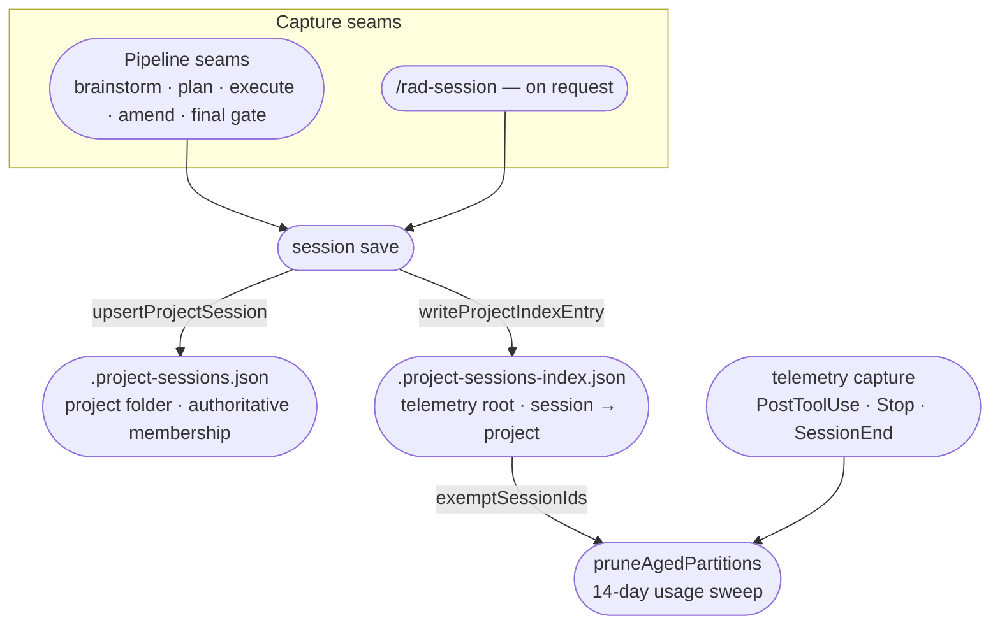

# Session Tracking Internals

Contributor-facing reference for the session-tracking feature: the two on-disk stores, where a
session gets recorded, how the dashboard learns a record changed, the shared launcher, and what was
deliberately left out. For the user-facing concept — what a session is and how to step back into
one — see [sessions.md](../sessions.md).

This is a *feature* page, not a library page — `docs/internals/` is organised by capability, and no
individual library gets a page of its own here. The mechanics of `@rad-orchestration/telemetry` and
`@rad-orchestration/terminal-launch` beyond what this feature needs of them live in each library's
own `AGENTS.md`.

---

## The two-store architecture

A session's record is split across two files, on purpose, because they answer two different
questions and live at two different roots.

- **`.project-sessions.json`** (`cli/src/lib/project-sessions.ts`), one per project folder, is
  **authoritative for membership** — the list of sessions attributed to this project, each with its
  name, harness, recorded launch `cwd`, and its append-only `activity` trail. `readProjectSessions`
  never throws — an absent or malformed file reads as a valid empty index — and every write goes
  through `upsertProjectSession`, which serializes concurrent writers with an exclusive lock file
  (stale after 10s, waited out for at most 5s) and writes atomically (`tmp` + `rename`).
- **The project index** (`PROJECT_INDEX_FILE = '.project-sessions-index.json'`,
  `lib/telemetry/src/project-index.ts`), one per telemetry root, maps `sessionId → project`. It
  exists for exactly one reason: `cli/src/commands/telemetry/capture.ts` reads it on every capture
  and passes every session id it lists as `exemptSessionIds` to `pruneAgedPartitions`, so a
  project-attributed session's telemetry (usage rows, ingested transcript, checkpoints) survives the
  14-day retention sweep the same way a *starred* session already does — the two exemption
  mechanisms are independent, checked by the same set union. **This index is what tells the prune to
  spare a session.** Losing it doesn't lose the session record — `.project-sessions.json` is
  untouched — it only means that session's telemetry ages out on the normal schedule the next time
  capture runs.

The same shape repeats on read: `sessionResume` (`cli/src/commands/session/resume.ts`) looks a
session id up in the project index first, then reads that project's `.project-sessions.json` for
the actual launch directory and harness — an index entry pointing at a project that no longer holds
the session record is treated as stale rather than trusted blindly.

**Deleting a project deletes both, but only when the delete actually took.**
`cli/src/commands/project/delete.ts` calls `removeProjectIndexEntries` only when the `project-dir`
item in the deletion report itself came back `removed` — a held-back or partially-failed delete
leaves the project's own `.project-sessions.json` in place, so its claims must stay too. The
dashboard's remove route applies the identical gate.

## The capture seams

Nothing here is polled. Every write to `.project-sessions.json` traces back to one of two entry
points, both of which call the same `session save` core (`cli/src/commands/session/save.ts`):

- **The pipeline's own seams** — `runtime-config/action-events/action.spawn_master_plan.md`,
  `action.display_complete.md`, `action.display_halted.md`, and `action.request_final_approval.md`,
  plus the inline recording steps in `harness-files/skills/rad-brainstorm/`, `rad-execute/`, and
  `rad-amend/`. Each fires once, at the
  moment that stage of the pipeline reaches something worth remembering — before authoring the
  Master Plan, before presenting the final review, on the halt or rejection path, and so on. None of
  them ask the operator anything first; recording is not a decision point.
- **`/rad-session`, on request** (`harness-files/skills/rad-session/SKILL.md`) — the only path that
  takes a project, name, description, and activity type from the conversation rather than from a
  fixed pipeline seam. It owns the activity-type vocabulary — including which of its values are
  inferable from the shape of free-form work — so no other skill has to restate it.

`sessionSave` itself (the core function both paths call into) is where the two-store write and the
attribution-conflict check both live: a session already attributed to a *different* project is a
judgment call the function refuses to resolve — it returns `data.conflict` and writes nothing,
leaving the decision to whoever is driving the conversation.

A third read of the project index happens off the write path entirely: `captureCore`
(`cli/src/commands/telemetry/capture.ts`) reads it on **every** `telemetry capture` invocation — at
`PostToolUse` frequency — specifically so retention can exempt attributed sessions without walking
every project folder. One file read buys that; see the two-store section above.

## The live topic and its coalescing

The dashboard never polls a project's sessions file. `ui/lib/live/sessions-adapter.ts` classifies a
raw filesystem event as a `.project-sessions.json` write by exact basename — not a prefix match,
because the CLI's writer also creates `.project-sessions.json.lock` and
`.project-sessions.json.<pid>.tmp` siblings on every save, and a looser match would fire on that
lock churn too.

A match publishes a **nudge, not a payload** — `{ type: 'sessions_change', payload: { projectName }
}` on the topic `sessions:<project>` — mirroring the registry-change pattern already used
elsewhere in the hub: the sessions file itself is never read, parsed, or shipped through the hub.
`ui/hooks/use-session-journey.ts` is the one subscriber; on receipt it calls
`GET /api/projects/:name/sessions` and replaces its state with the response, which is where the
server-side sort (newest session first, newest activity within it) and the active-time computation
actually happen.

Coalescing is the hub's, not this feature's own: every topic is bounded to `maxQueuePerTopic = 1`,
so a burst of saves against the same project within the coalesce window collapses to one delivered
nudge, latest-wins. `subscribeAllSessionsTopics` rides one `hub.subscribeAll` registration filtered
to the `sessions:` prefix, the same fan-in pattern `subscribeAllStateTopics` uses for `state:` — one
SSE connection serves every project's sessions topic without a per-project subscription.

## The launcher library

`@rad-orchestration/terminal-launch` (`lib/terminal-launch/`) exists because two call sites needed
the exact same platform-and-agent-specific spawn logic and neither may depend on the other: `session
resume` (CLI) and the dashboard's `POST /api/projects/[name]/sessions/[sessionId]/launch` route. Both
now call one `launchTerminal(opts)` — it validates the `cwd` exists, builds the per-platform,
per-agent argument array, and spawns it — instead of maintaining two copies of the same
harness-argument logic.

Two details are worth carrying into any future caller:

- **The resume argument shapes are asymmetric and must stay byte-identical.** Claude is a
  two-token `['claude', '--resume', id]`; Copilot is a single-token `['copilot', '--resume=' +
  id]` — the `=` form isn't stylistic, a value starting with a dash would otherwise be read as a
  flag by Copilot's own parser.
- **The dashboard's launch route never reads its own request body.** Every value passed to
  `launchTerminal` — `agent`, `cwd` — is looked up server-side from the project's own
  `.project-sessions.json` by the validated session id in the URL, so a body carrying `cwd` or
  `command` has no effect on what gets spawned. This is the first route in the codebase that spawns
  a local process on a request, so its input surface is deliberately tiny.

`@rad-orchestration/terminal-launch` has no workspace dependencies of its own — it's the bottom of
the stack both `cli/` and `ui/` sit on for this, the same leaf role `repo-registry` and `telemetry`
already play elsewhere in the dependency graph.

## Deliberate omissions

Three things are missing that might otherwise read as gaps.

- **No curation.** There's no way to edit, delete, or reorder an individual session or activity
  entry short of deleting the whole project (which takes its `.project-sessions.json` with it). The
  closest thing to curation is supplying a sharper `--name` on a later save when the first one was
  provisional — that replaces the stored name; nothing else does.
- **No cross-harness switching from the dashboard.** The Overview page's **Continue Session**
  button always launches with the session's own recorded `harness` field; there is no control to
  reopen a Claude session as Copilot or vice versa. The CLI's `session resume --harness` override
  exists, but it changes which binary launches, not which harness's transcript is being resumed —
  it is a CLI-only escape hatch, not a feature the dashboard exposes.
- **No advance resumability check — the one that looks like a gap until you know it was a
  decision.** Neither `session resume` nor the dashboard's launch route checks in advance whether
  the harness itself still has the transcript to resume. `sessionResume` used to probe the
  filesystem before launching; it doesn't anymore. The harness's own conversation-history store is
  not a documented, stable contract this codebase owns — a probe against it would either read a
  private, version-fragile layout or produce a false negative when the harness refuses to resume
  for some other reason entirely. Both call sites instead **attempt and degrade**: hand the
  recorded directory straight to `launchTerminal`, and if the resume itself fails, the harness's own
  error is what surfaces — the same posture this codebase already takes wherever a harness-specific
  signal can't be reliably observed from outside it. This is also the mechanism behind
  [the honest disclosure that sessions eventually disappear](../sessions.md#good-to-know): the
  harness's own transcript store and this feature's own telemetry copy age completely
  independently, and only one of them is inspectable in advance — and it isn't the one that
  determines whether resume will work.

---

## Cross-links

- [sessions.md](../sessions.md) — the user-facing page: what a session is, what gets recorded, and
  the honest caveat about a harness's own transcript pruning
- [observability.md](../observability.md) — where a session's active time, transcript, and spend
  are actually reviewed once **View Telemetry** takes you there
- [projects.md](../projects.md) — what else accumulates in a project folder alongside
  `.project-sessions.json`
- [system-architecture.md](system-architecture.md) — broader subsystem map, including
  `@rad-orchestration/terminal-launch` in the module dependency graph

### Module contracts

The mechanics beyond this page live in the module contracts, not in `docs/`:

- [`cli/AGENTS.md`](../../cli/AGENTS.md) — the envelope contract every one of these commands emits,
  and the rule that a new capture seam calls `session save` rather than writing
  `.project-sessions.json` itself
- [`ui/AGENTS.md`](../../ui/AGENTS.md) — why the launch route never reads its own request body, the
  route-segment validation rule both journey routes follow, and the transplant convention that
  keeps the CLI sole writer of `.project-sessions.json`
- [`lib/telemetry/AGENTS.md`](../../lib/telemetry/AGENTS.md) — the project index, the derived
  `computeActiveTimeMs` read, and the retention sweep the index feeds into
- [`lib/terminal-launch/AGENTS.md`](../../lib/terminal-launch/AGENTS.md) — the shared launcher
  both the CLI's resume path and the dashboard's launch route call into
- [`runtime-config/AGENTS.md`](../../runtime-config/AGENTS.md) — the shipped `action-events/`
  catalog these capture seams are authored into, and what a change to one obliges
- [`harness-files/skills/rad-session/SKILL.md`](../../harness-files/skills/rad-session/SKILL.md) —
  the on-request save/list/resume relay and the activity-type vocabulary it owns

The root [`AGENTS.md`](../../AGENTS.md) map's *Surfaces* table lists every module the feature spans.
