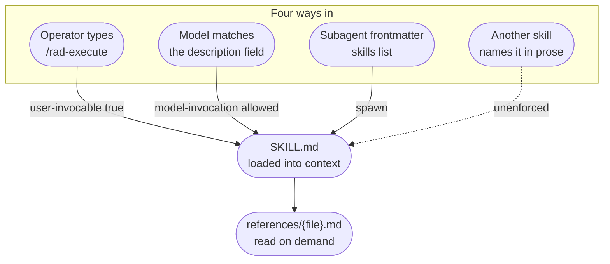

# Skills

A skill is a markdown file an agent loads when the job it describes is the job at hand. Between
them, the skills Rad Orc ships carry most of what the system actually does.

The [CLI](cli.md) exists because some decisions have exactly one right answer and should not be
re-derived from prose. Skills are the complement: the judgment that *cannot* be reduced to a
function still has to be written down, and this is where it goes. Between the two, very little of
the system's behavior lives in an agent's standing prompt — which is the point. A standing prompt
is always loaded, always costing context, and always applying. A skill applies only while it is
relevant, so the set can grow without every agent paying for all of it.

[`harness-files/AGENTS.md`](../../harness-files/AGENTS.md) is the authority on authoring one — the
folder layout, the frontmatter contract, the `${SKILLS_ROOT}` and `{{FRONTMATTER}}` tokens, the
per-harness projection — and this page does not repeat it. [Skills](../skills.md) is the
user-facing index of what each one does for you. What follows is how the set fits together: how one
gets loaded, where each enters the loop, and what does and does not hold it consistent.

---

## How a skill gets loaded

**The operator types it.** Plain slash form — `/rad-execute`, never namespaced. Most are typable;
the exceptions are the ones a human never starts — `rad-orchestration`, `rad-create-plans`,
`rad-execute-coding-task`, `rad-code-review`, `rad-source-control`, and `rad-log-error`, each
carrying `user-invocable: false` and reached by handoff or by an agent's frontmatter instead.

**The model reaches for it.** The `description` field is the entire interface for this path: it is
the only part of the file the model sees before deciding whether to load the rest. That is why the
descriptions in this repo read as lists of triggering situations rather than as summaries. Some
skills opt out of this path with `disable-model-invocation`, covered below.

**An agent carries it.** Subagent frontmatter has a `skills:` list, and that list is exhaustive —
a subagent gets what its own frontmatter names and nothing more. Every coder carries
`rad-execute-coding-task` and `rad-source-control`; every reviewer carries `rad-code-review`.
Nothing propagates down from the main agent's session. That constraint is the reason the planner
mines each in-scope repo for its own skills and writes what it finds into the Task Handoff — it is
the only route by which a repo's skills reach a coder at all. See
[Planning](../planning.md#how-skills-are-applied).

**Another skill hands off.** This is the busiest path and the only one nothing checks. The handoff
is prose — the target skill's name written into a sentence — with no manifest, no import, and no
resolution step. `/rad-brainstorm` hands to `/rad-create-plans`, `/rad-plan` hands to
`/rad-execute`, `/rad-project` hands to `/rad-source-control`, and so on; the skills that name none
are leaves. Rename a skill and the only thing that will tell you what broke is reading every file
that mentioned it.

One structural note that explains the invocation path wherever it appears: the CLI bundle is
emitted *into* `rad-orchestration`'s own folder at build time, landing at
`skills/rad-orchestration/scripts/radorch.mjs`. Most other skills invoke
`${PLUGIN_ROOT}/skills/rad-orchestration/scripts/radorch.mjs` this way, reaching into one
particular skill's directory. The ones that never touch the CLI at all: `rad-log-error`,
`rad-visual-docs`, `rad-execute-coding-task`, `rad-code-review`. In canonical source that
`scripts/` folder does not exist — only the installer creates it.

---

## Two flags, three reachability classes

Frontmatter carries two booleans that decide who can reach a skill. They are not independent, and
together they produce three classes rather than two:

| `user-invocable` | `disable-model-invocation` | Reachable by |
|---|---|---|
| `true` | absent | the operator, or the model on its own judgment |
| `true` | `true` | the operator only |
| `false` | — | an agent's frontmatter, or another skill's handoff |

The middle row is the interesting one. `rad-init` and `rad-communication` both set a persistent
preference — how loud the session banner is, how the agent talks to you — and neither should fire
because a conversation drifted near the subject. Opting out of model invocation is how a skill says
*only when asked*.

`rad-help` sits in the same row for a different reason. It sets no preference at all; it changes the
agent's posture for the rest of the engagement — answering only from the shipped documentation, at
an altitude that never reaches implementation detail. A posture that broad is something an operator
chooses to enter, not something a conversation should wander into because the word *help* came up.

That flag has a second effect that is easy to miss. `buildSkillManifest`
([`cli/src/lib/skill-manifest.ts`](../../cli/src/lib/skill-manifest.ts)) is what `skill list` uses
to enumerate a repo's skills for the planner, and it drops an entry **silently** when the name
begins with `rad-` or `disable-model-invocation` is `true` — no warning, no entry, no record. Its
other drops — unreadable file, unparseable frontmatter, missing `name`, missing `description` —
each write a warning to stderr, so they leave a trace the silent exclusions do not. For the shipped
set the silent exclusions are moot, since everything here is `rad-*` and excluded on the first rule
anyway. They matter for a contributor's own repo skills: setting that flag makes a skill invisible
to the planner as well as to the model, and nothing will say so.
The `rad-` filter is a deliberate reserved-namespace rule — see the
[root `AGENTS.md`](../../AGENTS.md).

---

## Where each skill enters the loop

Grouped by the point in the arc at which each becomes relevant, with a route to the page that owns
the concept. Each `SKILL.md` remains the source of truth for its own behavior; nothing below
restates it.

### Orientation — before there is a project

| Skill | Enters when | CLI it drives | Concept owned by |
|---|---|---|---|
| `rad-repo` | work might span code outside the current directory | `repo`, `repo-group` | [Repository Registry](../repo-registry.md) |
| `rad-project` | you need to know what exists, how it relates, or where its worktrees are | `project`, `project-group`, `graph` | [Projects](../projects.md) |

### Shaping the work

| Skill | Enters when | CLI it drives | Concept owned by |
|---|---|---|---|
| `rad-brainstorm` | goals are still being argued out | `session save` | [Planning](../planning.md) |
| `rad-create-plans` | a planning document has to be written | `skill list` | [Document Types](../document-types.md) |
| `rad-plan` | requirements are approved and a Master Plan is owed | `plan resolve`, `plan explode` | [Planning](../planning.md) |

`rad-create-plans` is the one skill three different callers share. It routes on a **mode** the
caller declares — `requirements` from a brainstorm handoff, `master-plan` from the pipeline's
`spawn_master_plan` action, `amendment` from `/rad-amend` — into one workflow file per mode. All
three are followed *inline by the main agent*, not by a spawned subagent.

### Running it

| Skill | Enters when | CLI it drives | Concept owned by |
|---|---|---|---|
| `rad-execute` | a plan is ready, or a stopped run needs resuming | `execute resolve`, `project worktrees` | [Execution Pipeline](../pipeline.md) |
| `rad-orchestration` | the run is underway and something must drive it | `pipeline signal` | [Execution Pipeline](../pipeline.md) |
| `rad-execute-coding-task` | a coder has been spawned against a Task Handoff | none | [Subagents](../subagents.md) |
| `rad-code-review` | a reviewer has been spawned at task, phase, or final scope | none | [Subagents](../subagents.md) |
| `rad-source-control` | work needs committing, a PR opening, a worktree creating or clearing | `project locate`, `worktree remove` | [Source Control](../source-control.md) |
| `rad-log-error` | the pipeline envelope comes back `ok: false` | none | [Document Types](../document-types.md#the-error-log) |

`rad-source-control` and `rad-code-review` are dispatch tables rather than instructions: each
identifies its case — which operation, which review scope — and sends the reader to one file under
`references/`. The behavior is in the reference, not the `SKILL.md`.

### Changing a plan that execution has sealed

| Skill | Enters when | CLI it drives | Concept owned by |
|---|---|---|---|
| `rad-amend` | what the project owes has grown or shifted since the run started | `amendment status`, `validate`, `apply`; `project show`; `pipeline signal` | [Amendments](../amendments.md) |

**The boundary is execution, not the plan gate.** A plan that has been approved but not yet run is
still freely re-authored — the operator says what is wrong and `rad-create-plans` rewrites the Master
Plan, regenerating the phase and task documents. Only once a coder or reviewer has acted on a task
does that stop being possible, which is the line `cli/src/lib/amendment/frontier.ts` reads. **Note
that the skill corpus draws the line at approval instead, calling a plan "already-approved"** —
`rad-amend`'s own `description` frontmatter, `rad-create-plans`'s `SKILL.md` and its
`references/amendment/workflow.md`, and `rad-session`'s `SKILL.md` among them. Logged as
`DOC-014`, and the wording here is the accurate one until that lands.

Reached two ways — typed directly, or routed here from the final-approval gate. The second path is
worth understanding, because it does not work the way the menu suggests. The gate offers the
operator a choice between approve and request changes, and asks anyone requesting changes to
describe what is wrong in their own words. They are never asked to pick between a corrective and an
amendment. **The agent routes the objection itself, and the bias is deliberately toward the
corrective** — routing down merely costs rounds and recovers cleanly, while routing up costs a
phase and a full re-review.

Typing `/rad-amend` does not skip that fork. When it finds the project parked at the final gate it
applies the same routing, so a request reaching the skill directly can still come back as a
corrective. Only one of the two outcomes is a pipeline event at all: a corrective grounds the
objection, writes it up in a short summary that preserves the operator's own words rather than
paraphrasing them away, and — once the operator confirms it — signals it as
`final_corrective_requested`; an amendment is a skill handoff and no event signals it.
`final_corrective_requested` is also the only operator-initiated corrective trigger in the system —
at task and phase scope, a corrective fires from a reviewer's verdict and nothing else. Neither
route applies anything without explicit operator approval.

### Ambient — available at any point

| Skill | Enters when | CLI it drives | Concept owned by |
|---|---|---|---|
| `rad-visual-docs` | something is easier seen than described | none | [Visual Documents](../visual-docs.md) |
| `rad-ui-start` · `rad-ui-status` · `rad-ui-stop` | the dashboard needs starting, checking, or stopping | `ui start` · `ui status` · `ui stop` | [Dashboard](../dashboard.md) |
| `rad-init` | the session-start banner is too loud, too quiet, or wanted on demand | `config get`, `config set-verbosity`, `session-context` | [Ambient Awareness](ambient-awareness.md) |
| `rad-communication` | the register the agent writes in should change | `communication-style load`, `set`, `save` | [Communication Styles](../communication-styles.md) |
| `rad-session` | a session's progress needs saving, resuming, or listing against a project | `session save`, `list`, `resume` | [Sessions](../sessions.md) |
| `rad-portfolio` | an initiative spans more sessions than a context window holds | `portfolio list`, `show`, `create`, `provision`; `project show` | — |
| `rad-help` | the user asks for help and wants it answered from the shipped documentation | none — hands off to `rad-ui-start` for the one thing it needs | [Rad Orc README](../../README.md#help-when-you-want-it) |

Most of the skills that drive the CLI are deliberately thin. `rad-plan`, `rad-execute`, and
`rad-amend` each describe themselves as a relay: the CLI command classifies, resolves paths, and
returns a data envelope, and the skill runs only the human beats that envelope flags. The recurring
instruction is some form of *do not re-derive what the command already told you*. When adding a
skill over an existing command, that division is the convention to follow — judgment and
conversation in the markdown, arithmetic and state in the CLI.

---

## What holds the set together

The tests in [`harness-files/tests/`](../../harness-files/tests/) check the corpus as a whole
rather than any one skill. Run them from the repo root with
`node --test harness-files/tests/*.test.mjs`.

| Guard | What it asserts |
|---|---|
| `test-skill-call-form.test.mjs` | Every `radorch` invocation in every `SKILL.md` and `references/*.md` matches the canonical form — `node`, the double-quoted `${PLUGIN_ROOT}` token, the exact bundle path, and some token after it. |
| `test-agent-skill-refs.test.mjs` | No agent's frontmatter `skills:` entry names one of the pre-`rad-` names on its denylist. |
| `test-final-review-corrective-claims.test.mjs` | No markdown under `harness-files/skills/`, `runtime-config/action-events/`, or `docs/` carries one of the denylisted phrases about the corrective and amendment cycles. |

Worth seeing what these have in common, because it is the shape of the gap. Every one is a pattern
check — a shape to match, or a denylist to avoid. **None of them resolves a reference to its
target.** The call-form guard confirms that *some* token follows `radorch.mjs`, never that the token
names a registered command. The agent guard confirms a skill reference is not on its list of old
names, never that the skill exists. And the skill-to-skill handoffs — the busiest coupling in the set —
have no guard at all.

That gap is not hypothetical — it already happened once. Two `rad-create-plans` reference files
used to invoke `radorch.mjs skill-list`, which was never a command: the noun group is `skill` and
the subcommand is `list`, and `skill-list` was only the internal identifier the framework logs
under. The invocation was well-formed by every rule the guard knows, so it failed on every run,
silently — the unknown command was rejected before the framework was reached, giving no envelope on
stdout at all, which a caller looking for `data.skills` couldn't distinguish from a repo that simply
has no skills. Both call sites are now corrected (`references/requirements/workflow.md:23` and
`references/master-plan/workflow.md:53` read `skill list`), but nothing checks for a repeat — the
guard gap that let it ship unnoticed is still open.

The command tree is introspectable from the CLI, so resolving each documented invocation against
the real surface would close that first gap cheaply. The skill-to-skill one is harder and currently
unaddressed.

---

## Going deeper

| For | Read |
|---|---|
| Authoring a skill or an agent — layout, frontmatter, tokens | [`harness-files/AGENTS.md`](../../harness-files/AGENTS.md) |
| What belongs in a corpus-wide guard and what does not | [`harness-files/tests/AGENTS.md`](../../harness-files/tests/AGENTS.md) |
| How skills are projected per harness and shipped | [`harness-installers/AGENTS.md`](../../harness-installers/AGENTS.md) |
| The commands the relay skills drive | [CLI](cli.md) |
| The reserved `rad-` namespace rule | [root `AGENTS.md`](../../AGENTS.md) |
| Where skills sit in the system | [System Architecture](system-architecture.md) |

---

**Read Next:** [System Architecture](system-architecture.md) · [CLI](cli.md) ·
[Subagents](../subagents.md) · [Planning](../planning.md)
