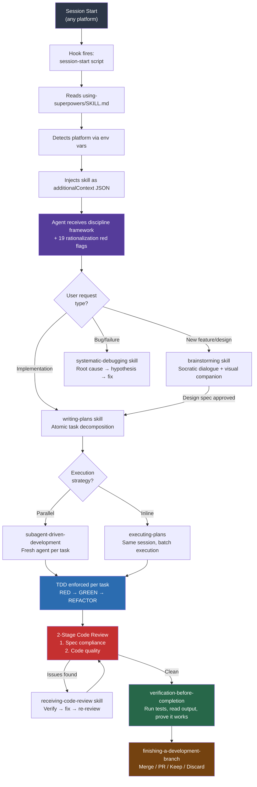
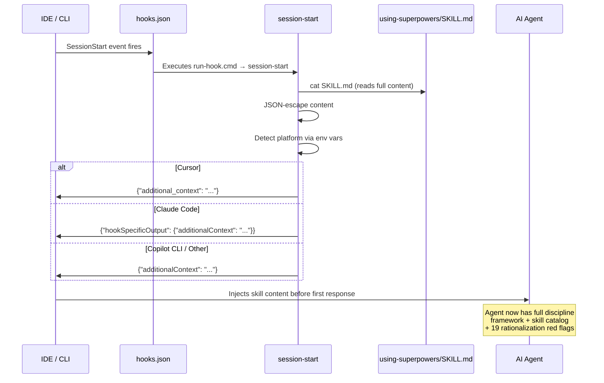
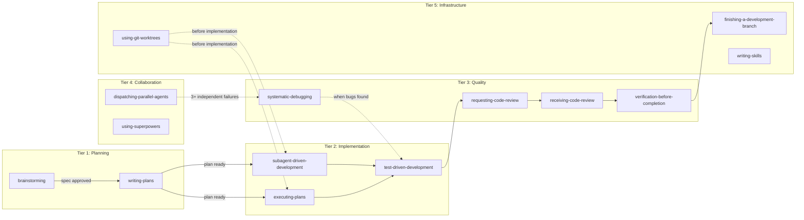
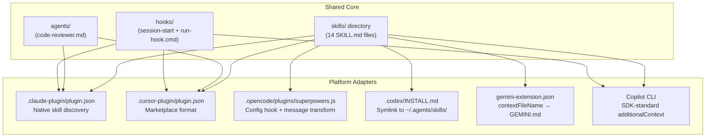

# Superpowers — Technical Deep Dive

**Superpowers** is a cross-platform **development workflow plugin for AI coding agents** (v5.0.7). It's not a traditional extension — it's a **methodology-as-code** system that shapes agent behavior through **14 composable skills**, session hooks, and strict quality gates. It runs on Claude Code, Cursor, Codex, OpenCode, Gemini CLI, and GitHub Copilot CLI.

The core philosophy: agents left to their own devices will rationalize skipping best practices. Superpowers prevents that by injecting discipline at session start and enforcing a strict pipeline: **brainstorm → design → plan → implement (TDD) → review → integrate**.

## File Structure

The repo is **zero-dependency** — no `node_modules`, no build step, no compilation. Everything is markdown skills, bash scripts, and one self-contained Node.js file.

```
superpowers/
├── skills/                    # 14 core skills (the heart of the system)
│   ├── using-superpowers/     # Meta-skill: injected at session start
│   ├── brainstorming/         # Design via Socratic dialogue + visual companion
│   │   └── scripts/           # Zero-dep WebSocket server (server.cjs)
│   ├── writing-plans/         # Task decomposition into atomic steps
│   ├── test-driven-development/  # RED-GREEN-REFACTOR enforcement
│   ├── subagent-driven-development/  # Parallel task execution
│   ├── executing-plans/       # Inline (same-session) execution
│   ├── systematic-debugging/  # Root cause analysis methodology
│   ├── requesting-code-review/  # Review dispatch
│   ├── receiving-code-review/   # Feedback handling
│   ├── verification-before-completion/  # Proof requirements
│   ├── dispatching-parallel-agents/  # Concurrent investigation
│   ├── using-git-worktrees/   # Isolated branch workspaces
│   ├── finishing-a-development-branch/  # Merge/PR/discard
│   └── writing-skills/        # Meta: creating new skills via TDD
├── hooks/                     # Session initialization system
│   ├── hooks.json             # Claude Code hook config
│   ├── hooks-cursor.json      # Cursor hook config
│   ├── run-hook.cmd           # Polyglot CMD+bash wrapper
│   └── session-start          # Main bootstrap script
├── agents/                    # Custom agent definitions
│   └── code-reviewer.md       # Dedicated code review agent
├── commands/                  # Deprecated slash commands
├── scripts/
│   └── bump-version.sh        # Version sync across all config files
├── tests/claude-code/         # Integration test suite (bash)
├── docs/                      # Platform guides + design artifacts
├── .claude-plugin/            # Claude Code plugin manifest
├── .cursor-plugin/            # Cursor plugin manifest
├── .codex/                    # Codex config
├── .opencode/                 # OpenCode plugin (JS config hook)
├── gemini-extension.json      # Gemini CLI extension config
└── package.json               # Minimal — just name + version + opencode entry
```

## Scripts

Three key scripts power the system:

| Script | Purpose |
|--------|---------|
| `hooks/session-start` | Reads `using-superpowers/SKILL.md`, JSON-escapes it, detects the platform (Cursor/Claude Code/Copilot CLI) via env vars, and outputs the skill content in the platform's expected JSON format. This is the bootstrap that makes the whole system work. |
| `hooks/run-hook.cmd` | A **polyglot file** valid in both CMD.exe and bash. On Windows, it locates Git Bash and delegates. On Unix, it runs directly. This solves the cross-platform hook execution problem without separate platform scripts. |
| `scripts/bump-version.sh` | Reads `.version-bump.json` to find all files declaring a version number, checks for drift, bumps them all atomically, and can audit the entire repo for stale version strings. |

The brainstorming skill also contains `skills/brainstorming/scripts/server.cjs` — a **zero-dependency WebSocket server** implementing RFC 6455 from scratch using only Node.js builtins (`http`, `fs`, `crypto`). It serves a browser-based visual mockup companion with `fs.watch()` for live reload and a 30-minute idle auto-exit.

## Process Flow



## Session Bootstrap — The Injection Mechanism



## The 14 Skills — Organized by Tier



## Cross-Platform Plugin Architecture



## Key Design Decisions

| Decision | Rationale |
|----------|-----------|
| **Zero dependencies** | No `npm install`, no build step. The brainstorm WebSocket server implements RFC 6455 from scratch in a single `.cjs` file. Removed 1,200 lines of bundled node_modules in v5.0.2. |
| **Polyglot hook wrapper** | `run-hook.cmd` is valid in both CMD.exe and bash — CMD sees `: << 'CMDBLOCK'` as a label and ignores the heredoc, bash uses it to skip the batch portion. No duplicate scripts needed. |
| **Session injection, not opt-in** | `using-superpowers` is force-injected at every session start. Agents don't discover skills — they're given discipline before they can rationalize skipping it. 19 documented rationalization patterns they're trained to resist. |
| **Two-stage reviews** | Spec compliance and code quality are separate review passes by separate prompts. The spec reviewer reads code independently (doesn't trust implementer self-reports). |
| **Skills are code, not prose** | Modified via TDD: write pressure-test scenarios BEFORE the skill, baseline WITHOUT the skill (RED), add skill (GREEN), close loopholes (REFACTOR). |
| **94% PR rejection rate** | Intentional. Agents must verify real problems, search for duplicates, get human approval on full diffs. No speculative fixes, no compliance rewrites, no domain-specific skills in core. |

## Skill Details

### Tier 1: Planning & Design

- **brainstorming** — Socratic dialogue producing 2-3 approach proposals, design sections with user approval gates, and a spec document at `docs/superpowers/specs/YYYY-MM-DD-<topic>-design.md`. Includes a Visual Companion (zero-dep WebSocket server for browser-based mockups).
- **writing-plans** — Decomposes approved specs into atomic 2-5 minute tasks with checkbox syntax. Zero placeholders — every step shows complete code/commands. Output: `docs/superpowers/plans/YYYY-MM-DD-<feature>.md`.

### Tier 2: Implementation

- **test-driven-development** — The Iron Law: NO PRODUCTION CODE WITHOUT FAILING TEST FIRST. Cycle: write failing test → verify fails → write minimal code → verify passes → refactor while green. Code written before tests must be deleted.
- **subagent-driven-development** — Fresh subagent per task (context isolation). 2-stage review after each: spec compliance then code quality. Model selection: cheap model for mechanical tasks, capable model for judgment. Statuses: DONE → DONE_WITH_CONCERNS → NEEDS_CONTEXT → BLOCKED.
- **executing-plans** — Alternative to subagent-driven: same session, batch execution with checkpoints. Better when subagents unavailable.

### Tier 3: Quality

- **systematic-debugging** — The Iron Law: NO FIXES WITHOUT ROOT CAUSE INVESTIGATION FIRST. 4 phases: root cause investigation → pattern analysis → hypothesis testing → fix at source.
- **requesting-code-review** — Dispatches the `code-reviewer` agent. Classifications: Critical (must fix), Important (should fix), Suggestions.
- **receiving-code-review** — No performative agreement. Skeptical verification for external review. Push back with technical reasoning if reviewer is wrong.
- **verification-before-completion** — The Iron Law: NO COMPLETION CLAIMS WITHOUT FRESH VERIFICATION EVIDENCE. No weasel words ("should pass now", "probably", "seems to").

### Tier 4: Collaboration

- **dispatching-parallel-agents** — When 3+ independent failures exist (different test files, subsystems, bugs). One focused agent per problem domain with no shared state.
- **using-superpowers** — Injected at session start. Teaches skill discipline. Core rule: 1% chance a skill applies = MUST invoke. Documents 19 rationalization patterns agents use to skip skills.

### Tier 5: Infrastructure

- **using-git-worktrees** — Smart directory selection: `.worktrees/` → `worktrees/` → `~/.config/superpowers/worktrees/`. Safety verification ensures directory is .gitignore'd.
- **finishing-a-development-branch** — Verify tests pass, present 4 options (merge locally, push+PR, keep branch, discard), cleanup worktree.
- **writing-skills** — Meta-skill for creating new skills via TDD. RED (baseline without skill) → GREEN (skill works) → REFACTOR (close loopholes).

## Testing

Tests are bash scripts under `tests/claude-code/` that verify skill behavior both statically (checking SKILL.md content for required sections) and via real integration sessions that produce `.jsonl` transcripts. A Python script (`analyze-token-usage.py`) breaks down token consumption per subagent to track cost efficiency.

- **Fast tests** (~2 min): Verify skill requirements, workflow order, self-review documentation
- **Integration tests** (~10-30 min): Create real Node.js projects, execute plans with subagents, verify behaviors in session transcripts

## Summary

Superpowers is a **behavior-shaping system** — not a library, not an SDK. It's 14 markdown files, a bash bootstrap, a polyglot wrapper, and a zero-dep WebSocket server that together enforce a professional software engineering methodology on AI agents across 6 platforms. The entire system fits in a repo with no build step and no dependencies.
