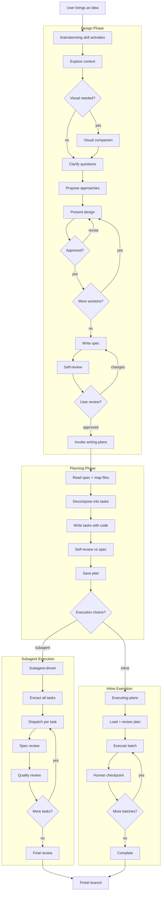
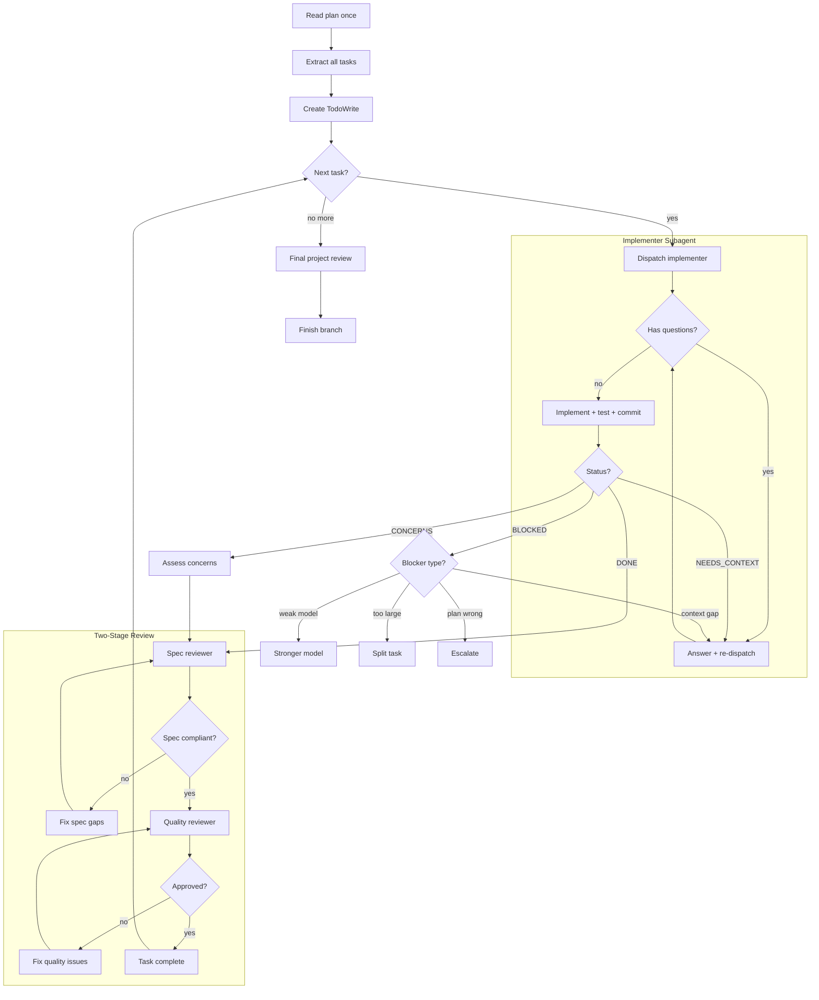
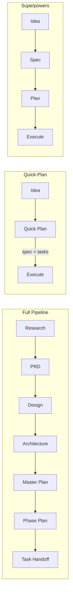

# Superpowers Planning & Execution Process

**Purpose:** Reference document for adapting the [obra/superpowers](https://github.com/obra/superpowers) planning methodology into the orchestration v3 pipeline — specifically for the quick-plan template work in DAG-PIPELINE-2.

**Date:** 2026-04-09

---

## 1. The Document Chain

Superpowers uses a **two-document model** with strict boundaries between design-time and execution-time artifacts.

| Document | Produced by skill | Saved to | Audience | Contains code? |
|---|---|---|---|---|
| **Spec** (design) | `brainstorming` | `docs/superpowers/specs/YYYY-MM-DD-<topic>-design.md` | Human + planner | Signatures, DDL, pseudocode |
| **Plan** (implementation) | `writing-plans` | `docs/superpowers/plans/YYYY-MM-DD-<topic>.md` | Implementer agent | Full copy-pasteable code in every step |

The plan links back to the spec via a `**Source spec:**` header field. The spec never references the plan (it's written first). The plan **duplicates** key information from the spec (record types, SQL schemas, architecture summary) rather than saying "go read section X" — this is intentional for agent self-containment.

### Contrast with orchestration v3

| Superpowers | Orchestration v3 |
|---|---|
| Brainstorming → Spec | Research → PRD → Design → Architecture |
| Writing-plans → Plan | Master Plan → Phase Plan → Task Handoff |
| 2 documents | 6+ documents |
| Single agent per task | Agent-per-role pipeline |

The quick-plan concept targets the sweet spot: collapsing spec + plan into a single lightweight artifact for smaller features, similar to how superpowers collapses PRD/design/architecture into one brainstorming-produced spec.

---

## 2. End-to-End Flow



---

## 3. Plan Document Format

Every superpowers plan follows this exact structure, enforced by the `writing-plans` skill.

### Mandatory header

```markdown
# [Feature Name] Implementation Plan

> **For agentic workers:** REQUIRED SUB-SKILL: Use
> superpowers:subagent-driven-development (recommended) or
> superpowers:executing-plans to implement this plan task-by-task.
> Steps use checkbox (`- [ ]`) syntax for tracking.

**Goal:** [One sentence]
**Architecture:** [2-3 sentences]
**Tech Stack:** [Key technologies]
**Source spec:** [path to design doc]
```

### File structure block

Before any tasks, all creates/modifies are listed per phase with exact paths:

```markdown
## File Structure
### Phase N — [name]
**Create:**
- `exact/path/to/new-file.ts`
**Modify:**
- `exact/path/to/existing.ts:123-145`
```

### Task format

```markdown
## Task N: [Component Name]

**Files:**
- Create: `exact/path/to/file.ts`
- Modify: `exact/path/to/existing.ts:42-60`
- Test: `tests/exact/path/to/test.ts`

- [ ] **Step 1: Write the failing test**
<full code block>

- [ ] **Step 2: Run test to verify it fails**
Run: `<exact command>`
Expected: <exact failure message>

- [ ] **Step 3: Write minimal implementation**
<full code block>

- [ ] **Step 4: Run test to verify it passes**
Run: `<exact command>`
Expected: PASS

- [ ] **Step 5: Commit**
```bash
git add <files>
git commit -m "feat: ..."
```

### Hard rules

- **No placeholders** — no "TBD", "TODO", "implement later", "similar to Task N"
- **No references without code** — if a step changes code, the code block is mandatory
- **Full duplication** — if two tasks use the same type, both tasks show the type definition
- **Exact commands** — every verification step has the shell command and expected output
- **2-5 minute steps** — each checkbox is one atomic action

---

## 4. Subagent-Driven Execution (Detail)

The most interesting part for our pipeline: how superpowers dispatches and reviews work.



### Context isolation principle

The coordinator **never passes its full context** to subagents. For each dispatch:

| Role | Receives | Does NOT receive |
|---|---|---|
| Implementer | Task text + scene-setting context | Full plan, spec, other tasks, session history |
| Spec reviewer | Implemented code + spec file path | Plan, other tasks |
| Code quality reviewer | Implemented code + git SHAs | Spec, plan |
| Final reviewer | All implemented code | Task-level details |

This is the same principle behind our task handoff design ("the SOLE input the Coder reads").

### Model routing

Superpowers recommends routing by task complexity:

| Complexity signal | Model tier |
|---|---|
| 1-2 files, complete spec, mechanical | Cheap/fast |
| Multi-file integration, pattern matching | Standard |
| Architecture, design judgment, review | Most capable |

This maps directly to our `coder-junior` / `coder` / `coder-senior` routing.

---

## 5. Spec Document Structure

The design/spec doc has no rigid template (unlike the plan), but observed sections from real superpowers specs:

1. **Summary** — one paragraph
2. **Goals / non-goals / deferred** — explicit scope fence
3. **Architecture** — module map, integration diagram, boundary invariants
4. **Data model** — schemas, column rationale
5. **Ingestion / processing pipeline** — interface contracts, per-variant parsing rules
6. **Query layer / UX surface** — API shapes, CLI help text, illustrative output
7. **Domain-specific sections** — varies by feature
8. **Known risks** — numbered table with mitigations
9. **Testing strategy** — test count targets, class breakdown
10. **Observability** — log line templates
11. **Migration & backwards compatibility**
12. **Implementation phasing** — LOC/test estimates per phase
13. **Decision log** — Q&A table: question → options → decision → rationale

The decision log is particularly valuable — it records *why* a choice was made, not just what was chosen. This is the kind of context that gets lost between plan and execution in our current pipeline.

---

## 6. Key Design Principles

### Self-containment over cross-referencing

The plan never says "see spec section 4.1" — it duplicates the relevant code/schema inline. This costs tokens but eliminates:
- Hallucinated section lookups by the implementer
- Context-window waste from loading a second document
- Drift if the spec is updated after the plan is written

### Checkpoint-based execution

Each `- [ ]` step is a checkpoint. The TDD cycle is explicit:
1. Write failing test
2. **Run it to see it fail** (not assumed)
3. Write minimal code
4. **Run it to see it pass** (not assumed)
5. Commit

Steps 2 and 4 are verification — they catch plan errors early.

### Spec compliance before code quality

The two-stage review is ordered: spec compliance *first*, code quality *second*. Rationale: there's no point polishing code that implements the wrong thing. The spec reviewer catches over-building (extra features not in spec) and under-building (missing requirements) before the quality reviewer looks at style, performance, and maintainability.

### Graceful escalation

When a subagent is blocked, the coordinator has four options in order:
1. Provide missing context → same model
2. Re-dispatch with stronger model
3. Break task into smaller pieces
4. Escalate to human

This avoids the "retry with the same inputs and hope for different results" anti-pattern.

---

## 7. Implications for Quick-Plan Template

Based on this analysis, a quick-plan template for smaller features could adopt:

### From superpowers — keep these

- **Mandatory self-contained header** (goal, architecture summary, tech stack)
- **File structure block** before tasks (all creates/modifies listed upfront)
- **Full code in every step** — no "implement the handler" without showing the handler
- **Exact verification commands** — every test step has the command and expected output
- **`- [ ]` checkbox tracking** — compatible with both human and agent execution
- **Decision log** (even abbreviated) — captures "why" for the reviewer

### From superpowers — adapt for our pipeline

- **No separate spec** — the quick-plan IS the spec + plan combined (like superpowers collapses PRD/design/architecture into one brainstorming spec)
- **Phase structure optional** — for small features, a flat task list suffices
- **Standing rules in header** — superpowers embeds project-specific rules (commit author, test commands) directly in the plan header, avoiding cross-references to project config

### From our pipeline — keep these

- **Agent routing hints** — quick-plan should indicate coder-junior vs coder-senior suitability per task
- **Contract-first** — interfaces and types defined before implementations (our architecture skill's strength)
- **Exit criteria** — explicit "done when" per task (our phase plan's strength)



---

## 8. Reference Links

- [obra/superpowers repository](https://github.com/obra/superpowers)
- [writing-plans SKILL.md](https://github.com/obra/superpowers/blob/main/skills/writing-plans/SKILL.md) — plan format rules
- [brainstorming SKILL.md](https://github.com/obra/superpowers/blob/main/skills/brainstorming/SKILL.md) — spec/design creation
- [subagent-driven-development SKILL.md](https://github.com/obra/superpowers/blob/main/skills/subagent-driven-development/SKILL.md) — execution with per-task subagents
- [executing-plans SKILL.md](https://github.com/obra/superpowers/blob/main/skills/executing-plans/SKILL.md) — inline batch execution
- [plan-document-reviewer-prompt.md](https://github.com/obra/superpowers/blob/main/skills/writing-plans/plan-document-reviewer-prompt.md) — review template (spec ↔ plan cross-check)
