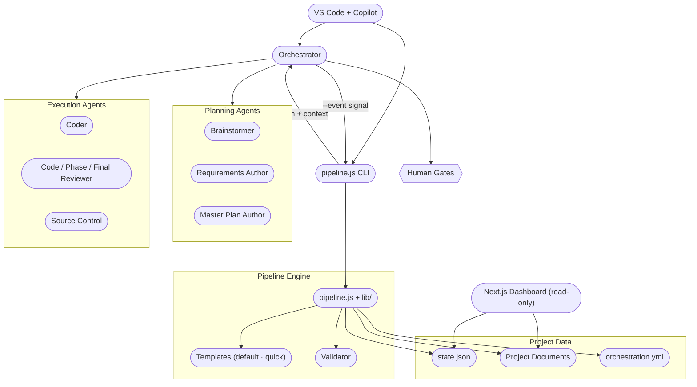

# System Architecture

Contributor-facing reference for the orchestration system as it actually exists in the repo today. For the operator-facing narrative of how a project moves from idea to done, see [pipeline.md](../pipeline.md). That page describes the operational lifecycle and explicitly punts the full `status` × stage transition tables here.

---

## Subsystem Map

**Orchestrator** — agent running inside VS Code Copilot; routes pipeline-emitted actions to the right specialized agent or human gate.

**Planning agents** — Brainstormer (optional idea-shaping conversation), Requirements Author, Master Plan Author. These produce the planning artifacts that the explosion script then unfolds into per-phase and per-task handoff documents.

**Execution agents** — Coder writes code and tests against a task handoff; Reviewer evaluates with one of three review surfaces (code review per task, phase review per phase, final review per project); Source Control owns commits and PR creation.

**Human gates** — three checkpoints (plan approval, optional task/phase gate, final approval) where the pipeline pauses for explicit operator approval.

**Pipeline engine** — `pipeline.js` is the sole writer of `state.json`. It loads a process template, walks the DAG, applies a mutation for each event, runs the validator, and returns the next action plus an enriched context to the Orchestrator.

**Templates** — declarative YAML defining the node graph for a process variant (`default.yml`, `quick.yml`).

**Validator** — runs before and after every state mutation; rejects illegal transitions and contract violations.

**Project data** — `state.json` (per-project pipeline state), the planning and execution markdown documents, and `orchestration.yml` (system configuration).

**Dashboard** — read-only Next.js UI at `:3000`. Reads project data via filesystem API routes and pushes live updates over SSE driven by a `chokidar` file watcher. Never mutates state — every write to `state.json` flows through `pipeline.js`, which gives the dashboard a single-writer guarantee without locking.

The CLI (`pipeline.js`) and the Orchestrator agent share one entry point: every `--event` invocation reads state, applies a mutation, walks the DAG to the next action, runs validation on both sides of the mutation, writes state, and returns the action plus context. Out-of-band events (rejections, halts, configuration mutations) bypass the event index but use the same read-mutate-validate-write loop.

---

## State-Machine Reference

The pipeline tracks two dimensions on every task and phase. **status** is the operational state of a node (`not_started`, `in_progress`, `completed`, `failed`, `halted`, `skipped`). **stage** is the node's identity in the template DAG — the engine routes on it. The two dimensions move together: an event names which node-id (the stage) it targets and which status it writes there.

The tables below are sourced from `.claude/skills/rad-orchestration/scripts/lib/mutations.ts` and `engine.ts`.

### Task transitions

| from-status | from-stage | event | to-status | to-stage |
|---|---|---|---|---|
| not_started | task_executor | execution_started | in_progress | task_executor |
| in_progress | task_executor | task_completed | completed | task_executor |
| not_started | code_review | code_review_started | in_progress | code_review |
| in_progress | code_review | code_review_completed (verdict=approved) | completed | code_review |
| in_progress | code_review | code_review_completed (verdict=changes_requested, budget remaining) | completed | code_review (+ corrective task appended; new task_executor begins at not_started) |
| in_progress | code_review | code_review_completed (verdict=changes_requested, budget exhausted) | completed | code_review (+ task_iteration → halted, graph → halted) |
| in_progress | code_review | code_review_completed (verdict=rejected) | completed | code_review (+ hosting iteration via ancestor derivation → halted, graph → halted) |
| not_started | task_gate | task_gate_approved | completed | task_gate |
| not_started | commit | commit_started | in_progress | commit |
| in_progress | commit | commit_completed | completed | commit |

Corrective task body nodes (re-scaffolded `task_executor` + `code_review`) re-enter the same transitions as their parent; corrective entries are stored on `taskIter.corrective_tasks`.

### Phase transitions

| from-status | from-stage | event | to-status | to-stage |
|---|---|---|---|---|
| not_started | task_loop | (first task_executor moves to in_progress) | in_progress | task_loop |
| in_progress | task_loop | (last task_iteration completes) | completed | task_loop |
| not_started | phase_review | phase_review_started | in_progress | phase_review |
| in_progress | phase_review | phase_review_completed (verdict=approved) | completed | phase_review |
| in_progress | phase_review | phase_review_completed (verdict=changes_requested, budget remaining) | completed | phase_review (+ phase corrective appended; new task_executor begins at not_started) |
| in_progress | phase_review | phase_review_completed (verdict=changes_requested, budget exhausted) | completed | phase_review (+ phase_iteration → halted, graph → halted) |
| in_progress | phase_review | phase_review_completed (verdict=rejected) | completed | phase_review (+ phase_iteration → halted, graph → halted) |
| not_started | phase_gate | phase_gate_approved | completed | phase_gate |

Phase iteration status itself transitions `not_started → in_progress` when its first child node leaves `not_started` (`dag-walker.ts`), and `in_progress → completed` when every body node is `completed` or `skipped`. A `halted` phase or task iteration also halts the top-level graph. Task iterations follow the same pattern within their phase iteration.

Task corrective entries append to `taskIter.corrective_tasks`. Phase corrective entries append to `phaseIter.corrective_tasks` and seed a fresh body-node set (re-scaffolded `task_executor` + `code_review`). Routing for new correctives uses ancestor derivation: a code_review completing under an active phase corrective births its next corrective on the phase iteration; otherwise it births on the task iteration.

### Top-level (planning + finalization) transitions

| from-status | from-stage | event | to-status | to-stage |
|---|---|---|---|---|
| not_started | requirements | requirements_started | in_progress | requirements |
| in_progress | requirements | requirements_completed | completed | requirements |
| not_started | master_plan | master_plan_started | in_progress | master_plan |
| in_progress | master_plan | master_plan_completed | completed | master_plan |
| not_started | explode_master_plan | explosion_started | in_progress | explode_master_plan |
| in_progress | explode_master_plan | explosion_completed | completed | explode_master_plan |
| in_progress | explode_master_plan | explosion_failed (parse retry count ≤ 3) | not_started | explode_master_plan (master_plan re-enters in_progress) |
| in_progress | explode_master_plan | explosion_failed (parse retry count > 3) | failed | explode_master_plan (graph → halted) |
| not_started | plan_approval_gate | plan_approved | completed | plan_approval_gate (current_tier → execution) |
| not_started | final_review | final_review_started | in_progress | final_review |
| in_progress | final_review | final_review_completed | completed | final_review |
| not_started | final_approval_gate | final_approved | completed | final_approval_gate |
| not_started | final_pr | pr_requested | in_progress | final_pr |
| in_progress | final_pr | pr_created | completed | final_pr |

Out-of-band events (`plan_rejected`, `gate_rejected`, `final_rejected`, `halt`, `gate_mode_set`, `source_control_init`) reset or halt nodes outside the normal event index; see `mutations.ts` for the exact resets. `plan_rejected` resets `master_plan` and `plan_approval_gate` to `not_started` and clears `phase_loop.iterations`. `final_rejected` resets `final_review` and `final_approval_gate`. `gate_rejected` and `halt` set `pipeline.current_tier = halted` and `graph.status = halted` with a halt reason.

Verdict mediation: `code_review_completed` and `phase_review_completed` accept an `effective_outcome` field set by the Orchestrator's mediation addendum. When the raw verdict is `changes_requested` and `orchestrator_mediated=true`, the effective outcome (one of `approved` or `changes_requested`) becomes the routing-authoritative verdict that drives corrective birth or completion.

---

## Cross-links

- [pipeline.md](../pipeline.md) — operator-facing narrative of the run
- [scripts.md](scripts.md) — engine entry points, mutations, and CLI surface
- [validation.md](validation.md) — validator architecture and check modules
