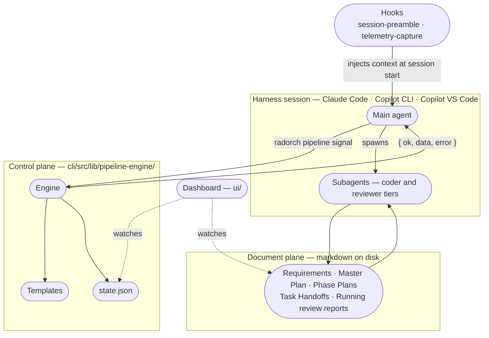
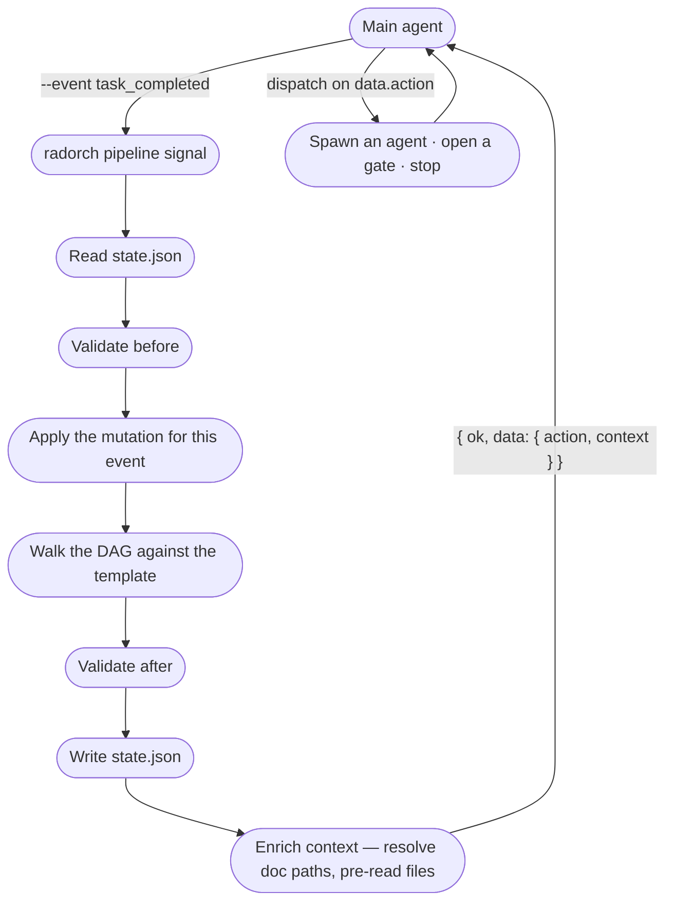
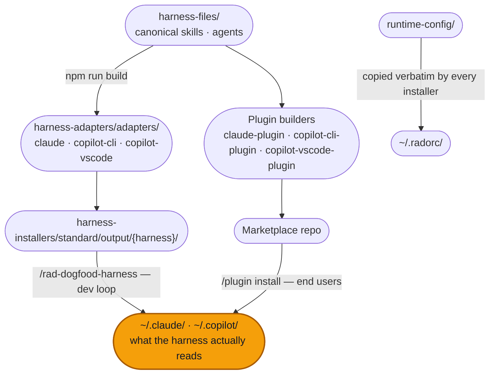
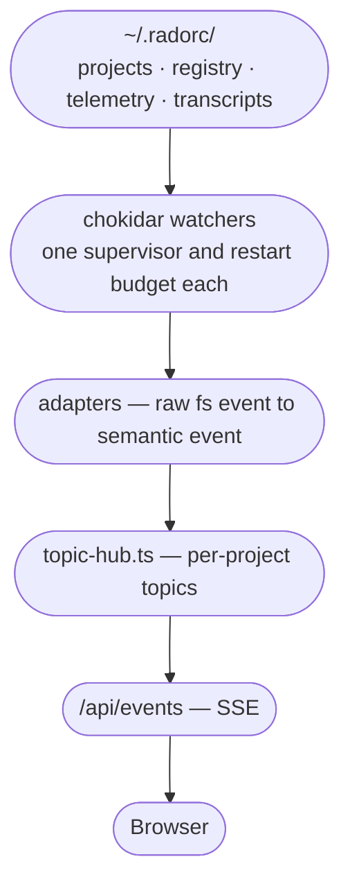
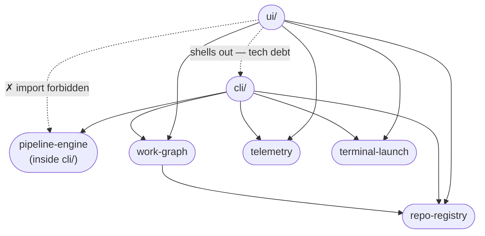
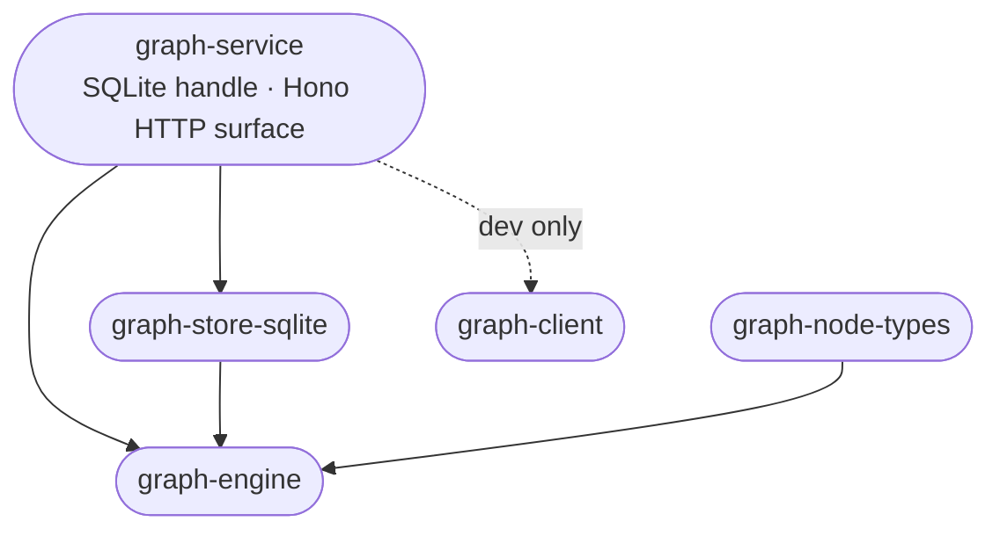

# System Architecture

A bird's-eye map of the system, and a router to the module that owns each part.

This page shows you the **shape** — which pieces exist, how they connect, and which direction the
dependencies run. It deliberately stops short of mechanics. Nearly every module in this repo
carries its own `AGENTS.md`, and those are the authority on how that module works, what its
conventions are, and how to build and test it. When you need that detail, route to the module
through the map in the root [`AGENTS.md`](../../AGENTS.md) rather than looking for it here.

For the operator-facing story of how a project moves from idea to done, see
[pipeline.md](../pipeline.md).

---

## The system in one picture


```mermaid
flowchart TD
    subgraph HARNESS ["Harness session — Claude Code · Copilot CLI · Copilot VS Code"]
        MAIN(["Main agent"])
        SUB(["Subagents — coder and reviewer tiers"])
    end

    HOOKS(["Hooks<br/>session-preamble · telemetry-capture"])

    subgraph PLANE ["Document plane — markdown on disk"]
        DOCS(["Requirements · Master Plan · Phase Plans<br/>Task Handoffs · Running review reports"])
    end

    subgraph CONTROL ["Control plane — cli/src/lib/pipeline-engine/"]
        ENGINE(["Engine"])
        TPL(["Templates"])
        STATE(["state.json"])
    end

    UI(["Dashboard — ui/"])

    HOOKS -->|"injects context at session start"| MAIN
    MAIN -->|"radorch pipeline signal"| ENGINE
    ENGINE -->|"{ ok, data, error }"| MAIN
    MAIN -->|spawns| SUB
    SUB --> DOCS
    DOCS --> SUB
    ENGINE --> TPL
    ENGINE --> STATE
    UI -.->|"watches"| STATE
    UI -.->|"watches"| DOCS
```

Two decisions shape everything downstream.

**The main agent makes no routing decisions.** It signals an event, parses the envelope, and
dispatches on `data.action` against a fixed table. Routing, triage, and state validation are pure
functions in TypeScript. LLM judgment is reserved for planning, coding, and review — the three
places where judgment is actually the product.

**The engine is the sole writer of `state.json` during a run.** Every mutation a run makes flows
through one code path, which is what gives the dashboard a consistent read without any locking. Note
the precise scope of that claim. It is about `state.json`, not about the dashboard, which writes
plenty of other things. It says nothing about the *documents* — those work differently, and that is
the next section. And it holds for the run, not for the whole lifecycle: plan-authoring paths
write `state.json` outside the loop, `plan explode` seeding the iteration arrays and
[`amendment apply`](#amendments-write-outside-the-loop) rewriting them. Both use the same
atomic tmp-and-rename, and neither runs while the engine is mid-turn.

---

## How the work moves between agents

There is no shared memory, no message bus, and no direct channel between a coder and a reviewer.
Every interaction is mediated by a markdown document on disk. This is what makes a run inspectable
after the fact — the documents *are* the conversation.

**Documents are not single-writer. Sections are.** Several documents are deliberately co-authored,
and the contract is section ownership within one shared file:

| Document | Written by | Section |
|---|---|---|
| Task Handoff | Planner | the body |
| | Coder | `## Execution Notes`, appended to the end |
| Review report | Reviewer | `## Verdict`, `## Summary`, scope, `## Findings` |
| | Coder | `## Coder Dispositions` |

The review report is a **running report**: the reviewer creates it with an empty
`## Coder Dispositions` heading, the coder fills that section in — `fixed` or `disputed`, keyed to
the reviewer's finding numbers — and re-review reopens **the same file in place** and adjudicates
from it. The reviewer's `## Findings` stay intact across cycles. One file carries the whole
corrective conversation.

At final scope there is no handoff at all, so the review report is both the work driver and the
place the coder appends its Execution Notes.

**Owners:** [`rad-execute-coding-task/SKILL.md`](../../harness-files/skills/rad-execute-coding-task/SKILL.md)
and [`rad-code-review/SKILL.md`](../../harness-files/skills/rad-code-review/SKILL.md) carry the
contract from each side.

---

## The agent–engine loop

The engine is exposed to skills as `radorch pipeline signal` — one of the CLI's command groups, all
of which are covered in [CLI](cli.md). One turn of the loop looks like this:


```mermaid
flowchart TD
    A(["Main agent"]) -->|"--event task_completed"| B(["radorch pipeline signal"])
    B --> C(["Read state.json"])
    C --> D(["Validate before"])
    D --> E(["Apply the mutation for this event"])
    E --> F(["Walk the DAG against the template"])
    F --> G(["Validate after"])
    G --> H(["Write state.json"])
    H --> I(["Enrich context — resolve doc paths, pre-read files"])
    I -->|"{ ok, data: { action, context } }"| A
    A -->|"dispatch on data.action"| J(["Spawn an agent · open a gate · stop"])
    J --> A
```

The catalog at [`runtime-config/action-events/`](../../runtime-config/action-events/) is the
contract for that loop — every action the engine can hand back and every event it accepts, one
markdown file each.

State files are versioned. `CURRENT_SCHEMA_VERSION` is `orchestration-state-v6`, the schema
validates every write, and a migration ladder in
[`pipeline-engine/migrations/`](../../cli/src/lib/pipeline-engine/migrations/) upgrades older
`state.json` files forward rather than breaking on them.

Which nodes exist in the DAG is a **template** decision, not an engine decision. The review
tiers in [`runtime-config/templates/`](../../runtime-config/templates/) — `low`, `medium`, `high`,
`extra-high` — are the same graph with review nodes added or removed. A project's template is
copied into the project at plan time, so a template change cannot reach a run already in flight.

Out-of-band events (rejections, halts, configuration mutations) sit outside the normal event index
but use the same read → mutate → validate → write path.

**Owner:** [`cli/src/lib/pipeline-engine/AGENTS.md`](../../cli/src/lib/pipeline-engine/AGENTS.md)
carries the module map, the conventions for adding an event or a node status, and what else has to
move when the state shape, the node ids, or the event vocabulary change.

---

## Amendments write outside the loop

Everything above moves through `pipeline signal`. **An amendment doesn't.** No event signals one,
none exists in the catalog, and the loop above never hands one back. The operator runs `/rad-amend`,
and [`cli/src/lib/amendment/`](../../cli/src/lib/amendment/) rewrites `state.json` and the plan
documents itself. That is the exception worth carrying: a contributor who assumes every state
mutation is an event will not find this one.

Three properties make it safe to sit outside the loop, and all three are worth knowing before
touching that folder:

- **The frontier is the authority on what may change.** `frontier.ts` reads `state.json` and draws
  one line: plan content some agent has already acted on is frozen, everything else is soft. A phase
  brief freezes once a review judged it or the run stopped on it; a task freezes once a review judged
  it or a coder landed real work on it — **not** merely because the DAG walker's cursor arrived.
  Every refusal the merge makes traces back to this one file, so the rule is written once rather than
  re-derived per call site.
- **One core validates for both writers.** `buildMergePlan` produces the numbering and reopen-cascade
  decisions, and `validate` and `apply` both run it. `validate` stops there and returns the report;
  `apply` continues. Running `validate` first is a courtesy to the operator, not a safety measure
  `apply` depends on.
- **Apply is all-or-nothing, by construction rather than by convention.** There is no regeneration to
  fall back on and no undo, so every write and every deletion both halves produce is staged in memory
  first, with the prior bytes captured, and only then committed. A failure partway through restores
  what was there. This became load-bearing when drop arrived — it is the first operation that
  *removes* plan entries and handoff files rather than only adding or rewriting them, and a
  half-applied drop leaves a handoff with no plan entry behind it.

The second entry point is the final-approval gate. When the operator asks for changes there, the
agent routes the objection to a corrective or an amendment; the corrective is a signalled event and
the amendment is a skill handoff, which is why only one of the two shows up in the catalog at all. On
the corrective route the agent grounds the objection, writes it up preserving the operator's own
words, and shows it to them for confirmation before the signal fires — a synthesized write-up is
never assumed correct.
[`runtime-config/action-events/action.request_final_approval.md`](../../runtime-config/action-events/action.request_final_approval.md)
carries the routing rule, the write-up's shape, and the deliberate bias toward the corrective.

**Owner:** the root [`AGENTS.md`](../../AGENTS.md) map's *Surfaces* table lists every module the
feature spans, from the skill to the dashboard badge. [Skills](skills.md#changing-a-plan-that-execution-has-sealed)
covers `rad-amend`'s two entry paths, and [Amendments](../amendments.md) is the user-facing page.

---

## Hooks — the one inbound path

Skills and the CLI are both things an agent reaches for. Hooks are the opposite direction: the
system pushing into a session without anyone asking. The hooks that reach the CLI —
`session-preamble.mjs` and `telemetry-capture.mjs` — are single-sourced from
[`harness-installers/shared/hooks/`](../../harness-installers/shared/hooks/AGENTS.md) and copied
into each installer variant at build time. Each plugin variant additionally authors its own
`bootstrap.mjs` and `drift-check.mjs`, which never call the CLI.

| Hook | Fires on | Does |
|---|---|---|
| `session-preamble.mjs` | `SessionStart` | Renders the ambient-awareness block and the selected communication style into `additionalContext`. Verbosity `off` drops the ambient block only — a configured style still renders. |
| `telemetry-capture.mjs` | `PostToolUse`, `Stop`, `SessionEnd` | Parses the agent transcript and appends usage records for the observability dashboard. The `PostToolUse` entry carries no matcher — it fires on every tool, so main-agent spend is harvested mid-turn rather than only at `Stop`. |

This is why a session already knows your repos, projects, and settings before you type anything —
and it is the mechanism behind both [ambient awareness](ambient-awareness.md) and
[communication style](communication-style.md).

The capture hook is deliberately dependency-free and runs in a spawn that must stay cheap to kill,
which is why `@rad-orchestration/telemetry` uses Node built-ins only.

---

## From canonical source to your machine

This is the part of the repo most likely to trip you up, because the thing you edit is not the
thing the harness reads.


```mermaid
flowchart TD
    SRC(["harness-files/<br/>canonical skills · agents"])
    ADPT(["harness-adapters/adapters/<br/>claude · copilot-cli · copilot-vscode"])
    OUT(["harness-installers/standard/output/{harness}/"])
    BUILDERS(["Plugin builders<br/>claude-plugin · copilot-cli-plugin · copilot-vscode-plugin"])
    MKT(["Marketplace repo"])
    HOME(["~/.claude/ · ~/.copilot/<br/>what the harness actually reads"])
    RC(["runtime-config/"])
    RADORC(["~/.radorc/"])

    SRC -->|"npm run build"| ADPT
    ADPT --> OUT
    OUT -->|"/rad-dogfood-harness — dev loop"| HOME
    SRC --> BUILDERS
    BUILDERS --> MKT
    MKT -->|"/plugin install — end users"| HOME
    RC -->|"copied verbatim by every installer"| RADORC

    classDef gap fill:#F59F0A,stroke:#A95C04,color:#111827,stroke-width:2px
    class HOME gap
```

**`harness-files/` is the only authored source**, but it is not all one shape:

- **Skills** are `SKILL.md` plus a `references/` folder, written in the form Claude Code reads
  natively. The adapter changes the filename and frontmatter per harness.
- **Agents** are a **harness-neutral body** (`coder.md`, opening with a `{{FRONTMATTER}}` token)
  plus **a hand-authored frontmatter file per harness** — `coder.claude.yml`, `coder.copilot-cli.yml`,
  `coder.copilot-vscode.yml`. Model names, tool vocabulary, and tool syntax genuinely differ per
  harness, so that metadata is written by hand rather than derived. The adapter substitutes the
  token; it never transforms the body.

[Skills](skills.md) walks the whole set — how each one gets loaded, where it enters the loop, and
what holds the set consistent.

**The build does not deploy.** `npm run build` writes into
`harness-installers/standard/output/<harness>/` and stops there. Getting an edit onto your own
machine is a separate reinstall, and it matters: the install step is what expands the
`${PLUGIN_ROOT}` token into a concrete path. A plain file copy leaves the token literal and breaks
command resolution.

One consequence that catches people: `~/.claude/` is **per-machine**, not per-worktree. Only one
branch's harness content can be active at a time, so switching worktrees means redeploying.

**Owners:** [`harness-files/AGENTS.md`](../../harness-files/AGENTS.md),
[`harness-adapters/AGENTS.md`](../../harness-adapters/AGENTS.md),
[`harness-installers/AGENTS.md`](../../harness-installers/AGENTS.md),
[`runtime-config/AGENTS.md`](../../runtime-config/AGENTS.md).

---

## How the dashboard stays live

Nothing pushes to the dashboard. It watches the filesystem and derives everything from what it
sees change.


```mermaid
flowchart TD
    FS(["~/.radorc/<br/>projects · registry · telemetry · transcripts"])
    W(["chokidar watchers<br/>one supervisor and restart budget each"])
    ADAPT(["adapters — raw fs event to semantic event"])
    HUB(["topic-hub.ts — per-project topics"])
    SSE(["/api/events — SSE"])
    BROWSER(["Browser"])

    FS --> W
    W --> ADAPT
    ADAPT --> HUB
    HUB --> SSE
    SSE --> BROWSER
```

The design point is **many watchers, one hub**. Each root it cares about — projects, registry,
telemetry, transcripts — gets its own `chokidar` instance and its own supervisor with an independent
restart budget, so one failing watch cannot take the others down. Raw filesystem events are
classified into semantic ones, published to per-project topics, and fanned out over SSE. API routes
subscribe to the hub; they do not open watches of their own. A guard test
(`route.no-watchers.test.ts`) reads the SSE route's own source and fails if that route imports
`chokidar` or calls `chokidar.watch` directly. It is scoped to that one file, and `ui`'s test run
is not wired into CI — no other route is covered and nothing blocks automatically.

That guard exists because the failure mode already happened once: chokidar v4 dropped glob support,
a watch pattern silently matched nothing, and a dead watcher shipped.

**Owner:** [Dashboard Internals](dashboard.md) — it holds the supervisor and restart-budget detail,
the SSE event vocabulary, where the data comes from, the write boundary, and the two builds this
module has to survive. The implementation is `ui/lib/live/`; the conventions for editing it are in
[`ui/AGENTS.md`](../../ui/AGENTS.md).

---

## Module dependencies

Every intra-workspace edge below is declared in a `package.json` and consumed **by name**. Deep
relative imports into another module's `src/` are prohibited.


```mermaid
flowchart TD
    UI(["ui/"])
    CLI(["cli/"])
    PE(["pipeline-engine<br/>(inside cli/)"])
    WG(["work-graph"])
    RR(["repo-registry"])
    TEL(["telemetry"])
    TERM(["terminal-launch"])

    UI --> RR
    UI --> WG
    UI --> TEL
    UI --> TERM
    CLI --> RR
    CLI --> WG
    CLI --> TEL
    CLI --> TERM
    CLI --> PE
    WG --> RR
    UI -.->|"shells out — tech debt"| CLI
    UI -.->|"✗ import forbidden"| PE
```

The graph is acyclic and shallow. `repo-registry`, `telemetry`, and `terminal-launch` are leaves;
`work-graph` builds on `repo-registry`; `cli/` and `ui/` are the top-level consumers and
**neither depends on the other**. That last property is the one worth protecting — it is why the
dashboard can ship as a standalone Next build and the CLI as a single bundle.

The two dashed edges are the exceptions. `ui/` may not import `cli/`, so the pipeline engine is
unreachable from the dashboard by design; the shell-out is how that gap is currently bridged, and
it is [tech debt](#architectural-debt).

Note `lib/repo-registry/`'s `dist/` must be compiled before anything bundles the CLI or builds the
UI. The standard-installer build does this for you as its `build-lib-dist` step.

---

## Architectural debt

What is known-wrong is recorded here so nobody has to rediscover it.

### The dashboard shells out to the CLI

Two API routes spawn the `radorch` binary and parse the envelope off stdout, instead of calling a
library. They do not even share a helper:

| Route | Shells out to | Spawns via |
|---|---|---|
| `ui/app/api/action-events/compose/` | `radorch action-events compose` | `ui/lib/cli-shell.ts` |
| `ui/app/api/projects/[name]/gate/` | `radorch gate approve` | its own inline copy of the same wrapper |

**Both should become library calls.** This is an early-days shortcut, not a design: the UI's API
routes should reach capability through a package under `lib/`, the same way they already reach
`repo-registry`, `work-graph`, and `telemetry`. The gate route is the larger of the two, since the
capability it needs lives inside the pipeline engine and the engine has not been extracted into a
library yet — but that is the direction of travel, not a reason to keep shelling out.

A side effect worth knowing while developing: both routes need `RADORCH_CLI_PATH` plumbed in by
`radorch ui start`. Launch the dashboard yourself with `next dev` and both fail with a system
error.

Other process spawns reached from `ui/` are **not** this. `ui/lib/open-folder.ts` opens the OS file
browser and `ui/lib/brainstorm-poc/run-claude-turn.ts` drives the brainstorm POC, both through
`node:child_process` directly; the session-launch, start-action, and debrief-launch routes spawn a
harness session through `launchTerminal` in `@rad-orchestration/terminal-launch`. All of them reach
things that are genuinely external. Those stay.

### Dev skills are split across `.agents/` and `.claude/`

Non-shipping skills currently live in two places:

| Folder | Holds |
|---|---|
| `.agents/skills/` | `rad-build-harness`, `rad-build-ui` — plus a `tests/` folder holding `no-parallel-skill.test.mjs` |
| `.claude/skills/` | `agents-md`, `rad-dogfood-harness`, `rad-dogfood-plugin`, `rad-release`, `rad-ui-dev` |

**The intended end state is one folder: everything under `.claude/`.** The split is historical and
carries no meaning — do not infer a rule from which folder a skill happens to sit in today.

Consolidating the other way — moving the `.claude/` set into `.agents/` — was considered and
rejected: `rad-release` is on the release path and a bad move breaks it. So the consolidation runs
toward `.claude/`, and until it happens both folders are live and hand-authored.

---

## The v3 pipeline engine (on hold, off limits)

> **Do not change these modules.** `lib/graph-engine/`, `lib/graph-node-types/`,
> `lib/graph-store-sqlite/`, `lib/graph-client/`, and `graph-service/` are the **future v3
> pipeline engine**, currently on hold. No change should touch them unless the explicit goal is to
> carry that project forward. Treat an incidental edit here — a lint fix, a dependency bump, a
> drive-by refactor — as out of scope.


```mermaid
flowchart TD
    GS(["graph-service<br/>SQLite handle · Hono HTTP surface"])
    GE(["graph-engine"])
    GST(["graph-store-sqlite"])
    GNT(["graph-node-types"])
    GC(["graph-client"])

    GS --> GE
    GS --> GST
    GST --> GE
    GNT --> GE
    GS -.->|"dev only"| GC
```

This is a second execution engine — a SQLite-backed steerable DAG with its own node-type registry
and an HTTP surface. `examples/` holds reference custom node types built against it, and
`runtime-config/node-graph-templates/` holds its templates.

**Nothing in `cli/src/` or `ui/` imports any of it.** These packages depend only on each other, so
the two stacks are entirely disjoint. If you are tracing how a run works today, none of this is in
the path — the engine described at the top of this page is.

[`graph-service/AGENTS.md`](../../graph-service/AGENTS.md) is the composition root and the best
entry point if you are picking the project back up.

---

## What lives on disk

Three roots, routinely conflated:

```
<repo>/                     what you edit — canonical source, CLI, UI, libraries
~/.claude/  ~/.copilot/     what the harness reads — deployed, never edited by hand
~/.radorc/                  runtime state — everything a run reads or writes
├── orchestration.yml       system configuration
├── templates/              the review tiers, shipped verbatim
├── action-events/          the action/event catalog, plus custom/ overlays you own
├── communication-styles/   shipped styles
├── docs/                   the shipped documentation corpus — installer-owned, replaced wholesale on any file-writing install
├── projects/<NAME>/        planning documents, review reports, state.json
├── worktrees/<NAME>/<repo> where code is actually written
├── side-projects/          projects outside the repo registry
├── repo-registry.yml       repo identity (shared)
├── repo-registry.local.yml slug → local path (per-machine)
├── work-graph.yml          project relationships: groups, edges, rev
├── telemetry/              captured usage records
└── ui/                     the dashboard's standalone build
```

The registry split is deliberate: identity is shareable, local paths are not.

---

## Where to go next

Routing to a module, and the rules that cross module boundaries, both live in the root
[`AGENTS.md`](../../AGENTS.md) — its *Modules* table names what each one owns and links the
`AGENTS.md` that is authoritative for it, and its *Invariants* carry the cross-boundary rules no
single module can own. That file is loaded on every session, so it is the copy that stays current;
this page deliberately does not mirror it.

What this folder adds on top of a module's own `AGENTS.md`: [Skills](skills.md) for everything
under `harness-files/skills/`, [CLI](cli.md) for the `radorch` command surface, and
[Dashboard](dashboard.md) for `ui/`. [Ambient Awareness](ambient-awareness.md),
[Communication Style](communication-style.md), and [Session Tracking](session-tracking.md) each
document a feature that spans several modules at once — no single module could own any of them.

The v3 packages are covered [above](#the-v3-pipeline-engine-on-hold-off-limits).

---

**Read Next:** [Execution Pipeline](../pipeline.md) · [CLI](cli.md) ·
[Amendments](../amendments.md) · [Ambient Awareness](ambient-awareness.md) ·
[Communication Style](communication-style.md) · [Session Tracking](session-tracking.md)
