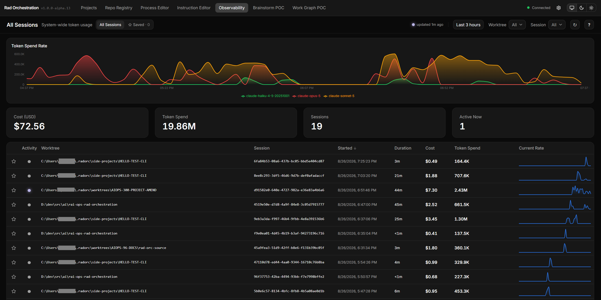
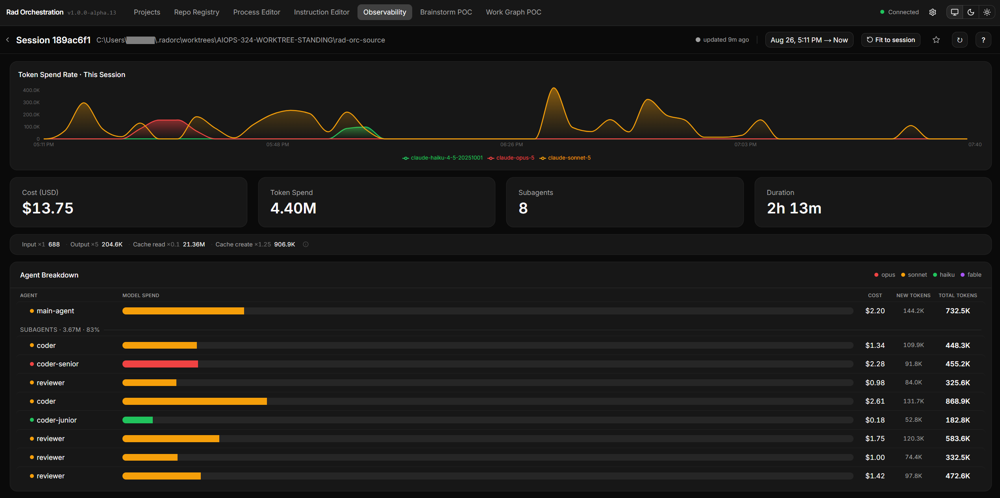
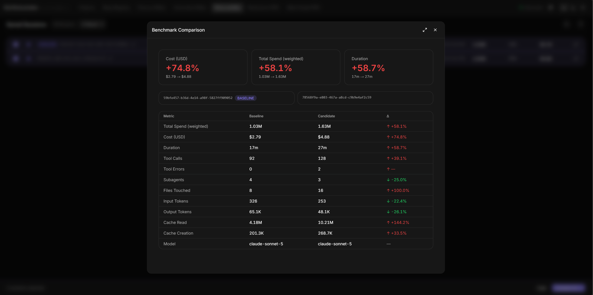
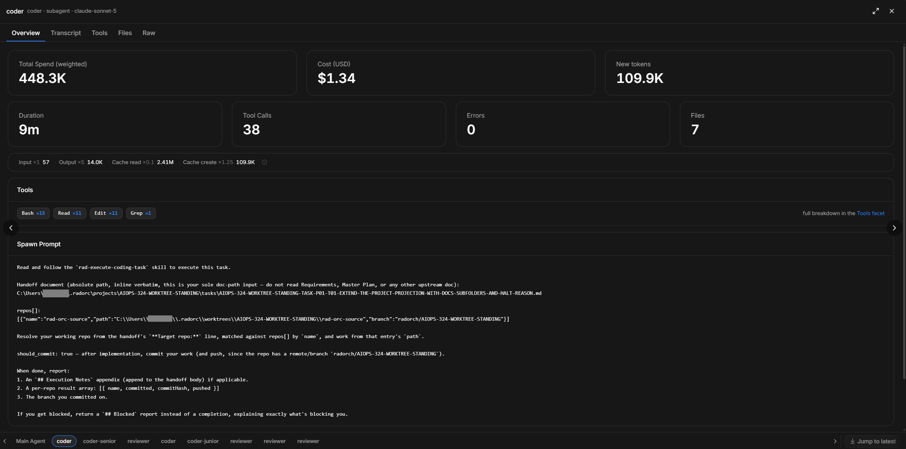
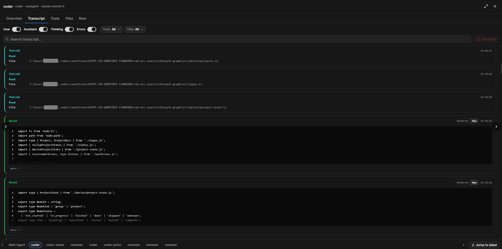
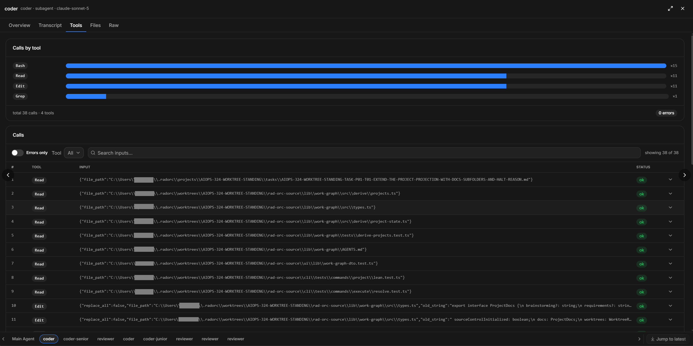

# Observability

You just ran an AI agent for two hours. What did that cost?

Usually there's no good way to know. The bill shows up at the end of the month, and by then you can't
remember which experiments were worth it. Observability answers the question while you can still do
something about it — what each session cost, in real dollars, and which agent spent it.

It's already running. Open the dashboard and click **Observability**. See [Dashboard](dashboard.md).

<table>
  <tr>
    <td width="33%" align="center" valign="top">
      
      <b>All Sessions</b> — every session in the window, with what it cost and how fast it burned.
    </td>
    <td width="33%" align="center" valign="top">
      
      <b>Session detail</b> — four headline numbers, and the agent breakdown underneath them.
    </td>
    <td width="33%" align="center" valign="top">
      
      <b>Benchmark Comparison</b> — two saved sessions, twelve metrics, each with its direction.
    </td>
  </tr>
  <tr>
    <td width="33%" align="center" valign="top">
      
      <b>Inspector · Overview</b> — the spawn prompt, verbatim.
    </td>
    <td width="33%" align="center" valign="top">
      
      <b>Inspector · Transcript</b> — filterable, searchable, errors isolated.
    </td>
    <td width="33%" align="center" valign="top">
      
      <b>Inspector · Tools</b> — every call it made, and what it passed.
    </td>
  </tr>
</table>

## Why this matters more than it used to

One person typing at one agent is easy to keep track of. Modern agent workflows aren't that. A single
run can spawn a dozen subagents, each reading, thinking, and writing in the background — and you never
see any of it happen.

In the session pictured above, the agents nobody watched account for **83% of the spend**.

That's the gap this closes. It isn't limited to Rad Orc pipelines either: every Claude Code session on
your machine is recorded, whether an orchestrator started it or you were just asking a question.

## The two numbers you'll see

Every screen shows both, and they're good at different jobs.

**Cost (USD)** is real money — what the session cost at current prices. This is the number to quote
when someone asks.

**Token Spend** is the fairer way to compare two runs. Tokens aren't all priced the same, so counting
them raw is misleading. Token Spend weights each kind by roughly what it's worth:

| Token type | What it is | Weight |
|---|---|---|
| Input | What you send the model | ×1 |
| Output | What the model writes back | ×5 |
| Cache read | Re-reading context it has already seen — cheap | ×0.1 |
| Cache create (5-minute) | Storing context so it can be reused shortly | ×1.25 |
| Cache create (1-hour) | Storing context so it can be reused across a longer session | ×2 |

Cache writes come in two lifetimes, priced differently, and the weight follows the price. If this
is new to you, the short version is that output is expensive and cached context is cheap — the
1-hour write costs more than the 5-minute one because it sticks around longer. That's why a session
that looks enormous in raw token counts can cost very little. Use dollars to report, and Token
Spend to compare.

## Where the money went

Open any session and the headline numbers sit at the top — cost, spend, how many subagents ran, and
how long the whole thing took.

Below them is the **Agent Breakdown**: the main agent first, then every subagent it spawned, in the
order they ran. Each row shows its model, what it cost, and how many tokens it used, so the expensive
one is obvious at a glance.

## Looking inside an agent

Click any agent and its inspector opens. Five tabs:

| Tab | What you get |
|---|---|
| **Overview** | Its numbers, plus the exact prompt this agent was given and the answer it sent back |
| **Transcript** | Everything it did, turn by turn — searchable, with a filter for errors |
| **Tools** | Every tool it called and what it passed |
| **Files** | What it created, and what it changed |
| **Raw** | The underlying data, if you want it |

**Overview is the one to try first.** A subagent starts with a blank slate, so the prompt it was
handed is everything it knew. When something comes back wrong, reading that prompt usually tells you
right away whether the instructions were bad or the agent was.

Use the strip along the bottom to move between agents instead of going back to the list.

These transcripts are kept even after a subagent's working folder is cleaned up, so you can still read
what it did long after the run is over.

## Saving and comparing runs

Star a session to keep it. Starred sessions get a name you choose and live under **Saved**, where they
stop expiring — everything else clears out after 14 days. A session attributed to a project's
[journey](sessions.md) is exempt the same way, without you having to star it separately — as long as
it's part of a journey, its telemetry stays put.

Pick two saved sessions and you get a straight comparison: cost, spend, and duration side by side,
plus a table of a dozen metrics with an arrow on each showing which way it moved and whether that
counts as better or worse.

This is the loop worth learning. Change one thing — a cheaper model, less context, fewer agents — run
something comparable, and look at the difference instead of guessing at it.

> Cost instincts are usually wrong. The part you were watching often isn't the expensive part, and
> re-sending the same context every turn adds up faster than most people expect.

## Good to know

**It won't match Claude Code's `/cost`, and that's expected.** `/cost` counts everything Claude Code
does, including background work it performs on your behalf. Observability counts your actual
conversation. `/cost` reads higher — around 15% on a short session, more on a long one. If you want
the two to line up, set `CLAUDE_CODE_ENABLE_PROMPT_SUGGESTION=0` to turn off the background work
causing most of the gap.

**Claude Code only, for now.** Copilot CLI and Copilot in VS Code aren't captured yet. They're
planned.

**Everything stays on your machine.** Nothing is uploaded, there's no account, and there's no service
to sign up for. It all lives in `~/.radorc/telemetry` on your own disk.

**It won't slow anything down.** Recording happens out of the way of whatever your agents are doing.

**It's already on.** If you'd rather it weren't, there's an **Enabled** switch under **Observability**
in the gear panel. See [Configuration](configuration.md).

---

**Read Next:** [Sessions](sessions.md) · [Dashboard](dashboard.md) · [Configuration](configuration.md) ·
[Subagents](subagents.md) · [Docs Viewer](docs-viewer.md)
