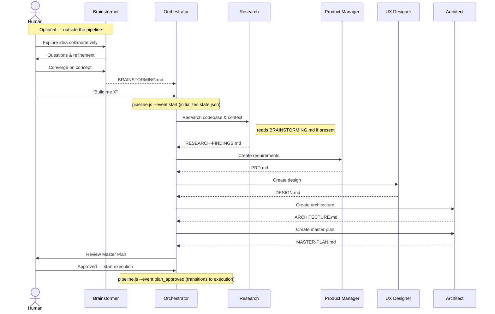
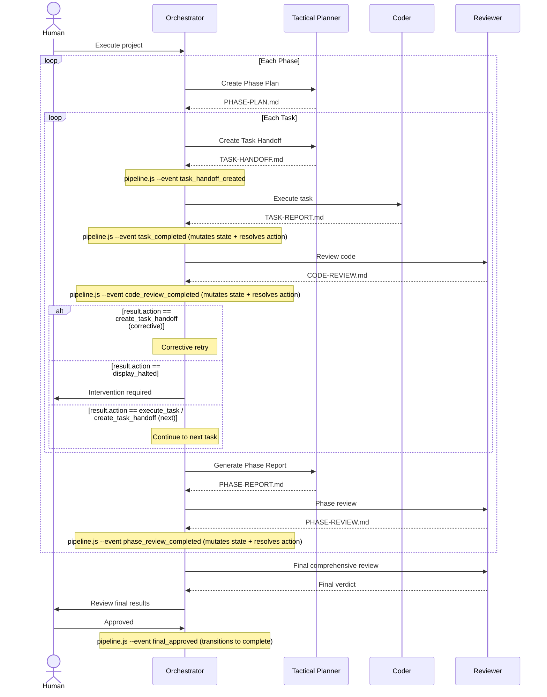

# Pipeline

The orchestration pipeline takes a project from idea through planning, execution, and review. The Orchestrator operates as an event-driven controller: it signals events to `pipeline.js`, parses JSON results, and routes on an 18-action table. The pipeline script (`pipeline.js`) is the sole state-mutation authority — it internalizes all state transitions, validation, and next-action resolution to maximize determinism in your agentic SDLC.

## Pipeline Tiers

The pipeline progresses through four major tiers:

```
planning → execution → review → complete
```

A project can also be `halted` from any tier when a critical error occurs or a human gate is not satisfied.

## Planning Pipeline

The planning phase produces all the documents needed before any code is written.



### Planning Steps

Each planning step runs sequentially in fixed order:

| Step | Agent | Output |
|------|-------|--------|
| 1. Research | Research | `RESEARCH-FINDINGS.md` |
| 2. Requirements | Product Manager | `PRD.md` |
| 3. Design | UX Designer | `DESIGN.md` |
| 4. Architecture | Architect | `ARCHITECTURE.md` |
| 5. Master Plan | Architect | `MASTER-PLAN.md` |

After all steps complete, the system transitions to a **human gate** — the Master Plan must be reviewed and approved before execution begins.

## Execution Pipeline

Execution is organized into **phases**, each containing multiple **tasks**. Phases execute sequentially; tasks within a phase execute sequentially.



### Task Lifecycle

Each task progresses through a deterministic lifecycle:

1. **Handoff** — Tactical Planner creates a self-contained Task Handoff document
2. **Execution** — Coder implements the task and produces a Task Report
3. **Review** — Reviewer evaluates the code against PRD, architecture, and design
4. **Resolution** — Pipeline script processes the `code_review_completed` event: applies state mutation, validates, resolves next action (advance to next task, corrective retry via `create_task_handoff` with `context.is_correction`, or halt)

### Phase Lifecycle

After all tasks in a phase are complete:

1. **Phase Report** — Tactical Planner aggregates task results and assesses exit criteria
2. **Phase Review** — Reviewer performs cross-task integration review
3. **Resolution** — Pipeline script processes the `phase_review_completed` event: applies state mutation, validates, resolves next action
4. **Advance or Correct** — pipeline returns `create_phase_plan` (advance), `create_task_handoff` with `context.is_correction` (corrective), or `display_halted` (halt)

## Human Gates

Human gates are enforced checkpoints that require explicit approval before the pipeline proceeds.

| Gate | When | Configurable? |
|------|------|---------------|
| **After planning** | Master Plan is complete | No — always enforced |
| **During execution** | Varies by mode | Yes — see below |
| **After final review** | All phases complete, final review done | No — always enforced |

### Execution Gate Modes

Controlled by `human_gates.execution_mode` in `orchestration.yml`:

| Mode | Behavior |
|------|----------|
| `ask` | Prompt the human at the start of execution for their preferred level of oversight |
| `phase` | Gate before each phase begins |
| `task` | Gate before each task begins |
| `autonomous` | No gates during execution — run all phases and tasks automatically |

## Error Handling

Errors are classified by severity with deterministic responses:

| Severity | Examples | Pipeline Response |
|----------|----------|------------------|
| **Critical** | Build failure, security vulnerability, architectural violation, data loss risk | Pipeline halts immediately. Human intervention required. Recorded in `errors.active_blockers`. |
| **Minor** | Test failure, lint error, review suggestion, missing coverage, style violation | Auto-retry via corrective task. Retry count incremented and checked against `limits.max_retries_per_task`. |

### Retry Budget

Each task has a retry budget defined by `limits.max_retries_per_task` (default: 2). When a task receives a `changes_requested` review verdict: if retries remain (`task.retries < config.limits.max_retries_per_task`), a corrective task handoff is issued; if retries are exhausted, the pipeline halts.

The pipeline script encodes this logic in a deterministic decision table — the same review verdict with the same retry state always produces the same action.

## Pipeline Routing

Pipeline routing is event-driven. The Orchestrator signals events to `pipeline.js` and receives one of 18 possible actions in the JSON result. All routing is deterministic: the same event combined with the same `state.json` always produces the same result.

The Orchestrator calls `pipeline.js`, reads `result.action`, and performs the corresponding operation (spawn an agent, present a human gate, or terminate the loop).

See [Deterministic Scripts](scripts.md) for the full event vocabulary and CLI reference.

### Master Plan Pre-Read

When the engine processes the `plan_approved` event, it performs a pre-read of the master plan document before applying the mutation:

1. Reads the master plan path from `state.planning.steps.master_plan.output`
2. Loads the document via `io.readDocument()`
3. Extracts `total_phases` from the document's YAML frontmatter
4. Validates that `total_phases` is a positive integer
5. Injects the value into the mutation context as `context.total_phases`

The `handlePlanApproved` mutation then uses `context.total_phases` to initialize `execution.phases[]` with the correct number of phase entries (each starting as `not_started` with empty tasks).

**Error conditions** — all produce a hard error (exit 1, no state written):

| Condition | Error |
|-----------|-------|
| Master plan path missing from state | `"Master plan path not found in state.planning.steps.master_plan.output"` |
| Document not found or unreadable | `"Failed to read master plan at '{path}': {reason}"` |
| `total_phases` missing from frontmatter | `"Master plan total_phases must be a positive integer, got 'undefined'"` |
| `total_phases` not a positive integer | `"Master plan total_phases must be a positive integer, got '{value}'"` |

### Status Normalization

When the engine processes the `task_completed` event, the existing task report pre-read step normalizes the report's `status` field from frontmatter before passing it to the mutation:

| Raw Value | Normalized Value |
|-----------|------------------|
| `pass` | `complete` |
| `fail` | `failed` |
| `complete` | `complete` (no change) |
| `partial` | `partial` (no change) |
| `failed` | `failed` (no change) |
| Anything else | **Hard error** (exit 1) |

Only two synonyms are normalized. Any unrecognized status value produces a hard error with message: `"Unrecognized task report status: '{value}'. Expected one of: complete, partial, failed (or synonyms: pass, fail)"`.

The canonical status vocabulary is `complete`, `partial`, `failed`. The normalization acts as a safety net for minor LLM vocabulary drift; the `generate-task-report` skill enforces the canonical values at the source.

### 18-Action Routing Table

| # | Action | Category | Orchestrator Operation |
|---|--------|----------|----------------------|
| 1 | `spawn_research` | Agent spawn | Spawn Research agent |
| 2 | `spawn_prd` | Agent spawn | Spawn Product Manager |
| 3 | `spawn_design` | Agent spawn | Spawn UX Designer |
| 4 | `spawn_architecture` | Agent spawn | Spawn Architect |
| 5 | `spawn_master_plan` | Agent spawn | Spawn Architect (master plan) |
| 6 | `create_phase_plan` | Agent spawn | Spawn Tactical Planner (phase plan mode) |
| 7 | `create_task_handoff` | Agent spawn | Spawn Tactical Planner (handoff mode) |
| 8 | `execute_task` | Agent spawn | Spawn Coder |
| 9 | `spawn_code_reviewer` | Agent spawn | Spawn Reviewer (task review) |
| 10 | `spawn_phase_reviewer` | Agent spawn | Spawn Reviewer (phase review) |
| 11 | `generate_phase_report` | Agent spawn | Spawn Tactical Planner (report mode) |
| 12 | `spawn_final_reviewer` | Agent spawn | Spawn Reviewer (final review) |
| 13 | `request_plan_approval` | Human gate | Present master plan for approval |
| 14 | `request_final_approval` | Human gate | Present final review for approval |
| 15 | `gate_task` | Human gate | Present task results for approval |
| 16 | `gate_phase` | Human gate | Present phase results for approval |
| 17 | `display_halted` | Terminal | Display halt message — loop terminates |
| 18 | `display_complete` | Terminal | Display completion — loop terminates |

## State Management

Pipeline state is tracked in `state.json` — see [Project Structure](project-structure.md) for the full state schema and invariants.

Key rules:
- Only the pipeline script (`pipeline.js`) writes `state.json`
- Every state mutation is validated against invariants before being written to disk. Invalid state never reaches disk.
- Tasks progress linearly: `not_started` → `in_progress` → `complete` | `failed`
- Only one task can be `in_progress` at a time across the entire project (for now -- parallel execution is a future enhancement)
