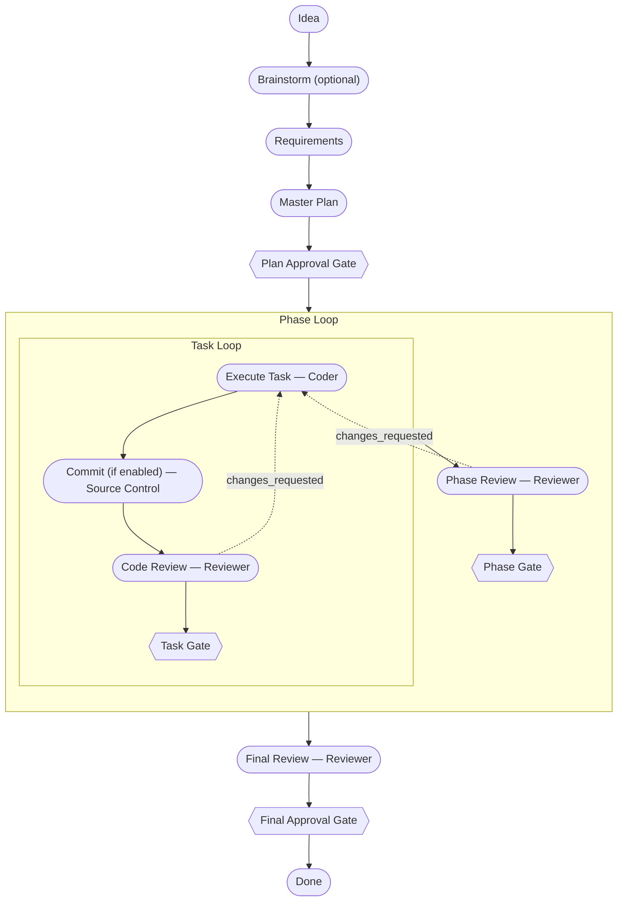

# Pipeline

The orchestration pipeline takes a project from idea through planning, execution, and review. The Orchestrator coordinates each step — choosing a process template at planning time, spawning specialized agents, enforcing human gates at three checkpoints, and shepherding tasks through code review and corrective cycles when needed.

## Lifecycles

A task begins `not_started`, transitions to `in_progress` when the Orchestrator dispatches it, and stays there while the Coder implements and the Reviewer evaluates. In tiers with per-task code review (`extra-high`, `high`), the task transitions to `completed` once code review approves and the per-task gate clears — auto-approved under `phase` or `autonomous` modes, awaits the operator under `task` mode. In tiers without per-task review (`medium`, `low`), the task transitions to `completed` immediately after implementation. On a `changes_requested` verdict with retries remaining, the Orchestrator authors a corrective task handoff and the task re-enters `in_progress` for another implementation pass.

A phase aggregates over its tasks. While any task in the phase is still working, the phase remains `in_progress`. After the last task completes — and, in tiers with phase review (`extra-high`, `medium`), the phase review approves — the phase transitions to `completed`. The next phase then begins.

## Status vs. Stage

The pipeline tracks two distinct dimensions on every task and phase. `status` is the operational state described above (`not_started`, `in_progress`, `completed`, and so on); `stage` is the pipeline placement that tells the engine which node in the template a task currently sits at. The two move on different cadences and serve different consumers — operators reason about `status`, the engine routes on `stage`. For the full transition tables across both dimensions, see [internals/system-architecture.md](internals/system-architecture.md).

## Human Gates

The pipeline asks for explicit human approval at three checkpoints. Two are non-negotiable; one is shaped by the execution mode the operator picks at the start of the run.

| Gate | When it fires |
|------|---------------|
| **After planning** | Always. Fires after the Master Plan is authored and exploded into phase and task docs. |
| **During execution** | Mode-dependent. Fires before each task or each phase, or not at all, based on the chosen execution mode. |
| **After final review** | Always. Fires after the Final Review and before the project is marked done. |

Execution-mode behavior:

| Mode | Behavior |
|------|----------|
| `ask` | Prompt the operator at the start of execution to choose one of the modes below. |
| `phase` | Pause for approval before each phase begins; tasks within a phase run unattended. |
| `task` | Pause for approval before each task begins. |
| `autonomous` | Run all phases and tasks without pausing. |

## Corrective Cycles

When a code review or phase review flags problems, the Orchestrator authors a corrective task automatically and re-runs the affected work. Corrective passes count against `max_retries_per_task`; if a task exhausts its retry budget without a clean review, the pipeline halts and waits for the operator to step in.

## Process Templates

Four review-intensity tiers ship with the system. They share planning
ceremony — Requirements, Master Plan, plan-audit pass, and a plan-approval
gate — and they share final review with its approval gate. They differ
only in defensive review depth between planning and final approval.

| Tier | Per-task code review | Phase review | Use case |
|---|---|---|---|
| `extra-high` (Recommended) | yes | yes | Production-critical, regulated, untrusted contributors. Maximum defense in depth. |
| `high` | yes | no | High-value work where per-task feedback matters but phase-level review is redundant. |
| `medium` | no | yes | Trusted team or well-understood scope; keep cross-task audit, skip per-task ceremony. |
| `low` | no | no | Quick exploration, prototyping, hot fixes — final review still gates merge. |

The tier is selected at `/rad-plan` time. Plan approval, final review, and
final approval are mandatory anchors in every tier; only the defensive
review depth between them varies.

Phase/Task Size — task and phase scope — is selected as a separate
question at `/rad-plan` time, with five options: `Small`, `Medium`,
`Large`, `Extra Large`, and `Custom` (user-supplied prose criterion).
The `(Recommended)` size moves with the chosen tier per a monotonic
mapping: `extra-high` → Small, `high` → Medium, `medium` → Large,
`low` → Extra Large. More review depth pairs with smaller scope. Every
size remains selectable in every tier; the marker is a hint, not a
constraint.

## Source Control

Source control behavior is controlled by two configuration keys: `auto_commit` and `auto_pr`. Each accepts `always`, `ask`, or `never`. `always` runs the operation without prompting, `ask` pauses for explicit operator approval, and `never` skips the operation entirely.

Commits fire after each task implementation completes — before code review and the task gate. Each implementation pass commits its own changes, including corrective re-runs.

The auto-PR fires after the final review and before the final-approval gate.

Commits use a conventional-commits-style subject line derived from the task's metadata (type, scope, and title), with bodies drawn from the task handoff. The subject communicates intent at a glance; the body carries the rationale and the trail of decisions made during execution.

Source-control failures are logged to the project error log and never block the pipeline — the run continues, and the operator can act on the failure after the fact.

For the YAML keys themselves and how to set them, see [configuration.md](configuration.md).
