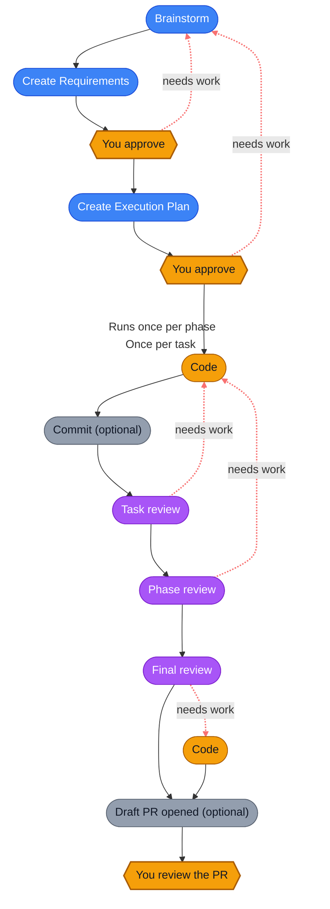
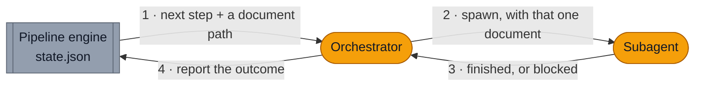

# Execution Pipeline

`/rad-plan` leaves you with a plan on disk. This page is about what happens when you run it.


```mermaid
flowchart TD
    BRAIN(["Brainstorm"]) --> REQ(["Create Requirements"])
    REQ --> H1{{"You approve"}}
    H1 -.->|"needs work"| BRAIN
    H1 --> PLAN(["Create Execution Plan"])
    PLAN --> H2{{"You approve"}}
    H2 -.->|"needs work"| BRAIN
    H2 --> CODE

    subgraph PHASE ["Runs once per phase"]
        direction TB
        subgraph TASK ["Once per task"]
            direction TB
            CODE(["Code"]) --> COMMIT(["Commit (optional)"])
            COMMIT --> TREV(["Task review"])
            TREV -.->|"needs work"| CODE
        end
        PREV(["Phase review"])
        TREV --> PREV
        PREV -.->|"needs work"| CODE
    end

    PREV --> FINAL(["Final review"])
    FINAL --> PR(["Draft PR opened (optional)"])
    FINAL -.->|"needs work"| FCODE(["Code"])
    FCODE --> PR
    PR --> H3{{"You review the PR"}}

    classDef you fill:#F59F0A,stroke:#A95C04,color:#111827,stroke-width:2px
    classDef planning fill:#3C83F6,stroke:#1D4ED8,color:#ffffff
    classDef executing fill:#F59F0A,stroke:#A95C04,color:#111827
    classDef reviewing fill:#A855F7,stroke:#7E22CE,color:#ffffff
    classDef optional fill:#939EAE,stroke:#5B6472,color:#111827

    class H1,H2,H3 you
    class BRAIN,REQ,PLAN planning
    class CODE,FCODE executing
    class TREV,PREV,FINAL reviewing
    class COMMIT,PR optional

    style PHASE fill:#ffffff,fill-opacity:0.04,stroke:#ffffff,stroke-opacity:0.18
    style TASK fill:#ffffff,fill-opacity:0.07,stroke:#ffffff,stroke-opacity:0.22

    linkStyle 2,5,9,11,14 stroke:#F87171,stroke-width:2px
```

Everything from the second approval onward is this page. For more details on planning, see: [Planning](planning.md).

## Starting a run

```
/rad-execute SEARCH-FILTERS
```

There's no approval button. Running this command *is* the approval — you read the plan, you're
happy with it, so you start it.

You'll get a few questions before anything spawns. How many depends on your settings and on which
agent you're running:

| Question | What it decides |
|---|---|
| **Auto-commit** | whether each task commits its own work |
| **Auto-PR** | whether a draft pull request opens at the end |
| **Workspace** | a new workspace for this project, or continue in one that already exists |
| **Launch flavor** | Claude Code, Copilot CLI, or VS Code |

>Note: You'll only be asked about launch flavor outside of Claude Code. In a Claude Code session it
launches another Claude Code session and skips the question.

Once you've answered, Rad Orc creates the worktrees, saves your answers, and marks the plan
approved. Your commit and PR answers are locked in for the whole run now, so you won't be asked
about them again.

>**Recommended: Sonnet, at medium or high reasoning.** Your model choice drives the *orchestrator* —
the coding and review agents each arrive with their own model already assigned, so it doesn't change
who writes the code — see: [About the models](subagents.md#about-the-models). What it does change is
the one agent that stays alive for the entire run, so its
cost multiplies across every phase while its job stays a routing job. Sonnet handles that well.
Opus is overkill here and generally advised against on cost. That's why a launched session always
starts on Sonnet — the recommendation applied for you rather than a limitation. Reasoning level
carries over from the session you launch from, so set that before you launch. Planning is the
opposite call — see:
[Choose the right model for planning](planning.md#choose-the-right-model-for-planning).

### Set your commit and PR preference once

Auto-commit and auto-PR both come from `~/.radorc/orchestration.yml`, so you can stop being asked:

```yaml
source_control:
  auto_commit: ask
  auto_pr: ask
```

| Value | What happens |
|---|---|
| `always` | do it, don't ask |
| `never` | skip it, don't ask |
| `ask` | ask me at the start of the run |

`ask` doesn't stop for approval on every commit. It puts the question in that opening batch, once,
and then it's settled. Which is why I'd leave both on `ask` — it costs you one answer per run, and
you get to see what's about to happen to your repos before it happens. A real project you want
pushed and a scratch experiment you'd rather keep local are different calls, and this way you make
them per run instead of editing a config file.

For more details, see:
[source_control.auto_commit](configuration.md#source_controlauto_commit).

Before you turn auto-commit off, read
[Commits give your reviews their boundaries](#commits-give-your-reviews-their-boundaries) further
down. It changes how your code reviews work.

## Where the run happens

When you type `/rad-execute`, the first thing it works out is where you're currently standing and
whether this project already has a workspace on disk. Those two answers land you in one of three
places.

**A new session launches.** The normal case for a new project. A terminal opens at the project's
workspace folder with an agent already running and already told to start the run — you don't type
anything.

```text
~/.radorc/worktrees/SEARCH-FILTERS/
├── search-api/
└── search-ui/
```

Notice the terminal opens on the parent folder, not on a repo. Every repo the project touches gets
its own worktree folder underneath it. That way an agent working across three repos can see all
three at once, like a makeshift monorepo.

>Note: If you pick VS Code, the window opens but the run won't start on its own. Kick it off from
the chat panel once the window is up.

**The run happens right where you are.** If you're already standing in the project's workspace,
there's no point opening a second terminal — so it asks whether to run here, and the session you're
in drives the pipeline. Decline and it stops rather than picking somewhere else for you; run
`/rad-execute` again from wherever you actually want it.

>Note: This is also the path that offers to bind a project to a clone you already have instead of a
worktree, which is how you run a project on a branch you're already working in. For more details,
see: [Source Control](source-control.md).

**It resumes.** Everything was already settled, so it picks up where it stopped.

Remember that last one. Re-running `/rad-execute` on a project that's already underway
is how you're meant to recover — after a crash, after you closed the terminal, after a compaction,
after a long weekend. Nothing important lives in the session, so losing the session costs you
nothing.

### Running a follow-up in the same workspace

That workspace question has a second answer. Instead of a new workspace, you can point the run at
one that already exists — and for a follow-up project, that's often what you want.

Workspace folders are named after projects, and two projects pointed at the same folder share the
same worktrees on the same branch. Whatever the first project wrote is simply there for the second
one to build on, with no merge in between.

Which means the real question isn't about folders. **Same workspace means the same branch, which
means one pull request covering both projects.** You're deciding how the work gets reviewed and
shipped, and that's a much easier thing to reason about than a directory layout.

**Share the workspace when:**

- The follow-up genuinely builds on code that isn't merged yet. Anything else is guesswork against a
  moving base.
- The two projects only really make sense together — a feature, and the thing that finishes it off.
- You want reviewers to see one coherent change instead of two halves of one.
- You're iterating quickly and don't want to wait on a merge between passes.

**Start a fresh workspace when:**

- The first pull request is ready to ship on its own. Piling more onto its branch holds it up for no
  reason.
- The two bodies of work want different reviewers, or they land on different timelines.
- You want to be able to revert one without unpicking the other.
- The diffs are unrelated enough that combining them makes the review harder rather than easier.

When you're genuinely unsure, take the fresh workspace. You can always cherry-pick or rebase later,
but pulling two projects back apart once they share a branch is real work.

Either way, link the two projects so the relationship is recorded — see:
[Linking projects together](projects.md#linking-projects-together). For planning the follow-up
itself, see: [Follow-up projects](planning.md#follow-up-projects). For worktrees, branches, and
cleaning them up, see: [Source Control](source-control.md).

>The workspace decision above only comes up when there genuinely is a second project. If the first
>project simply didn't finish what it set out to do, an [amendment](amendments.md) extends that
>project in place — same worktree, same branch, same pull request, and no workspace question to
>answer.

## From requirements to a task handoff

Four documents get written before any code does, and each one is narrower than the one above it.

| Document | What it answers | Who reads it |
|---|---|---|
| [Requirements](document-types.md#requirements) | what you're building and why | you, the planning agent, and the final reviewer |
| [Master Plan](document-types.md#master-plan) | how it breaks down — every phase and task in one document | the planning agent |
| [Phase Plan](document-types.md#phase-plan) | what "done" means for one slice of the work | the phase reviewer |
| [Task Handoff](document-types.md#task-handoff) | everything one agent needs to build one piece | one coding agent |

Look at that last row. A coding agent reads its Task Handoff and nothing else — not your
requirements, not the Master Plan, not even the Phase Plan it belongs to. It can read the codebase,
but it can't read the planning corpus and it can't ask you a question. So everything that agent
needs to know had to be written into that one handoff back at planning time, which is why the plan
decides how well a project lands.

Each task the plan authors targets exactly one repository, and that's enforced rather than
encouraged. Cross-repo work becomes two tasks under one phase, and checking that the two sides
actually agree is what phase review is for.

For what's inside each of these documents, field by field, see:
[Document Types](document-types.md).

### The explosion

You don't write the phase and task documents, and neither does the planning agent. `/rad-plan`
writes one document — the Master Plan — with a section per phase and a section per task. Then a
small tool splits it into files, copying each section over word for word.

That split produces two things:

- The `phases/` and `tasks/` folders in your project.
- The run itself — how many phases there are, which tasks are in each, which repo each task targets.

Both come out of a single read of a single document, so your plan and your run can't drift apart.

The split is also destructive. It empties `phases/` and `tasks/` and writes them fresh every time
it runs. That's what makes plan corrections cheap — fix the Master Plan, split again, done. It's
also why an edit you make directly in a task file disappears. **Always make corrections in the
Master Plan.**

>Note: The split also checks the plan as a whole, which is only possible while everything is still
in one document — every task has to target a repo the project declared, and every declared repo has
to be claimed by at least one task. For more details, see:
[How repos narrows down the chain](document-types.md#how-repos-narrows-down-the-chain).

## What's driving the run

Once a run starts, three things keep it moving. Two are files sitting in your project folder, and
the third is a command-line tool your agent calls.

**`template.yml`** — a copy of the review intensity tier you picked, taken when you planned. It's
the shape of the run: write the plan, split it, work through the phases, review, open a PR, ask for
approval. Because it's a copy, updating the shipped templates won't change a run already in flight.

**`state.json`** — where the run actually is. Which phase, which task, what each review said, which
commits landed, what you answered about commits and pull requests.

**The CLI** — the only thing that writes to `state.json`. Your agent doesn't. So it can't mark
something done that isn't, can't lose its place, and can't tell you it's further along than it is.
It isn't the one keeping the record.

Those three pieces make a loop:


```mermaid
flowchart LR
    ENG[["Pipeline engine<br/>state.json"]]
    ORC(["Orchestrator"])
    SUB(["Subagent"])

    ENG -->|"1 · next step + a document path"| ORC
    ORC -->|"2 · spawn, with that one document"| SUB
    SUB -->|"3 · finished, or blocked"| ORC
    ORC -->|"4 · report the outcome"| ENG

    classDef executing fill:#F59F0A,stroke:#A95C04,color:#111827
    classDef optional fill:#939EAE,stroke:#5B6472,color:#111827

    class ORC,SUB executing
    class ENG optional
```

The orchestrator asks the CLI what to do next. The CLI reads `state.json`, works out the next step,
and hands back an instruction plus the path to one document. The orchestrator spawns an agent with
that document. When the agent finishes, the orchestrator reports back, the CLI records it, and hands
over the next step.

Because the record is a file and not a conversation, the run doesn't depend on the session that
started it. Close the terminal in the middle of a phase and nothing is lost.

>Note: Don't hand-edit `state.json`. It's readable JSON on purpose and reading it is fine, but
writing to it puts the file and the run out of sync and nothing will warn you about it.

## The orchestrator is hands off by default

The agent driving your run deliberately keeps its distance from the details. It hasn't read your
requirements or your Master Plan, it has no idea what phase three is about, and it doesn't open the
code review reports it passes around. It asks what's next, hands a document to a subagent, and
signals the outcome.

It isn't oblivious, though. It reads what its subagents hand back — that a task finished, what got
committed, and whether an agent returned blocked instead of done. That's how it knows when
something needs a closer look.

It's tuned this way because of context. An orchestrator that reads every document fills its context
window with a plan it doesn't need, and by phase four it's slow and it's compacting away what it just
read. Keeping its involvement low through the routine parts is what leaves it the headroom to get
properly involved when you need it to.

But hands off is a default, not a ceiling. It stays out of the way until a subagent asks for help or
you do. How involved it gets in your run is your call, and the rest of this section is the dial.

### Watching a run

You don't need to read the transcript to know how a run is going. Start the dashboard and watch the
project page fill in as work lands: phases and tasks changing state, commit links appearing, code
review reports you can read the moment they're written.

```
/rad-ui-start
```

Glance at it, read a review that catches your attention, and step in if something looks wrong. For
more details, see: [Dashboard](dashboard.md).

### Talking to it mid-run

Hands off doesn't mean unavailable. You're in a session with an agent, so talk to it. Interrupting a run
to steer it is safe:

```
stop after this task and show me what the last code review said
```

```
that endpoint name is wrong, it should be /v2/search. fix the plan before the next phase starts.
```

It'll step out of the loop, deal with what you asked, and go back to driving. It's told to return to
the pipeline after being steered, so you don't have to restart anything yourself.

### Putting it to work

Steering is the light version. The orchestrator can do real work for you mid-run, and it's the
best-placed agent in the system to do it — it's the only one that can see the plan, the state of the
run, and your conversation at the same time.

**Add to what the subagents are told.** The orchestrator writes the prompt every subagent gets, so
you can add to it. *"The next few tasks are all in the API repo — tell each coder to run the
integration suite before it reports done."* It'll carry that into the spawns until you tell it to
stop.

**Send it off to do something out of band.** A dependency needs bumping, a migration needs running,
a half-finished refactor from the last phase needs cleaning up before the next one lands on top of
it. Ask, and it'll go deal with it. It'll usually hand the job to a separate subagent rather than
doing it inline — that keeps the mess out of its own context — and then pick the pipeline back up
where it left off.

**Make it permanent.** If you find yourself giving the same instruction every run, write it down
instead of repeating it. Custom instruction files overlay a specific step of the pipeline — before
every coder spawn, before every review, after every commit — and they apply on every run whether
you're watching or not. For more details, see: [Custom Instructions](custom-instructions.md).

What makes all of this safe is that it always goes back. After it's been steered, or after it's
fixed something out of band, it returns to asking the CLI what's next. It doesn't carry on
improvising the run from memory.

### When a subagent gets stuck

A coding agent can't talk to you — it's a subagent and you're not in its conversation. So when it
hits something it can't decide on its own, like a contract nobody specified, a requirement that
reads two ways, or a file that isn't where the plan said it would be, it stops and reports the
blocker instead of guessing.

The orchestrator picks that up and works through it in order:

1. It reads the planning documents the subagent isn't allowed to see. Most blockers are answered
   right there, and it sends the agent back in with the answer.
2. If the plan doesn't answer it, or the fix is risky enough to want a human, it asks you.
3. If it can't work it out and can't reach you, it halts rather than guess.

Which is the other half of why it holds back. Triaging a blocker properly means reading plan
documents and thinking about them, and it can only afford to do that if it hasn't spent the whole
run reading everything else.

## Stopping and picking it back up

Long runs are where this pays off. Your session piles up context as the run goes — every status
update, every subagent result — and none of it is load-bearing. The run's memory is `state.json`,
not your conversation.

So compact whenever the session starts feeling heavy. The one thing to do first is tell the
orchestrator to stop after the current subagent finishes, so you aren't compacting in the middle of
a task. Then bring it back with:

```
/rad-execute SEARCH-FILTERS
```

You can sometimes get away with just telling the orchestrator to carry on after a compaction, but
`/rad-execute` is the safe bet. It re-reads the orchestration skill, so the agent comes back with its
guiding principles intact rather than with whatever survived the summary.

### It resumes anywhere

Because the pipeline is a state machine, stopping isn't a special case — it's the same thing that
happens between every step of every run. The state file always knows exactly where things stand.

Which has a consequence worth knowing about: the session that resumes doesn't have to be the session
that started, or even the same computer. `state.json` records document paths relative to the project
folder, and records repositories by name, branch, and remote URL — never by a path on your disk.
Nothing in it is tied to your filesystem.

So you can start a run on a laptop and pick it up on a desktop. Or hand it to a teammate: they run
`/rad-execute SEARCH-FILTERS` and carry on from wherever you stopped, reading the same plan and the
same review reports you were reading. On a long project that's a real handoff rather than a
reconstruction.

## How code review works

There are three kinds of code review, and they differ in two ways: the document they check against,
and how much of the code they look at.

| Review | Checked against | Looks at | Catches |
|---|---|---|---|
| **Task review** | that task's Task Handoff | that one task's commit | the task didn't do what it said it would |
| **Phase review** | the Phase Plan and its exit criteria | every commit in the phase | the tasks all passed but don't fit together |
| **Final review** | your Requirements | every commit in the project | we built something, just not what you asked for |

Each reviewer reads its own document and nothing above it. A task reviewer isn't allowed to open
your requirements. The final reviewer isn't allowed to open the Master Plan or the task handoffs.
It's the same rule the coding agents work under, for the same reason — a reviewer holding every
document starts reviewing the plan instead of the code in front of it.

Phase review is looking at something neither of the other two is: the seams between tasks. A
producer and a consumer that disagree about a contract, an export nothing imports, two tasks that
solved the same problem two different ways. Every task review can come back clean and the phase can
still be broken.

So when you pick a review intensity, what you're really picking is which kind of mistake you're
most worried about.

## Review intensity

Four tiers ship with Rad Orc and you pick one during `/rad-plan`. They're the same pipeline with
reviews added or taken away:

| Tier | Task review | Phase review | Final review | When it fits |
|---|---|---|---|---|
| `low` | – | – | yes | prototypes, spikes, hot fixes, and small iterations on something already working |
| `medium` **(recommended)** | – | yes | yes | a good go-to for regular work |
| `high` | yes | – | yes | you want feedback on every task, and the phases are independent enough that integration isn't the worry |
| `extra-high` | yes | yes | yes | production critical, regulated, or work you can't afford to get wrong |

Final review runs in every tier. There's no way to skip it, and no way to skip the approval that
follows it. Everything in between is what changes.

`medium` is recommended because it tends to be the best value. Phase review catches the integration
problems, which are the expensive ones to find later, and it runs once per phase rather than once
per task — so it'll catch the majority of what's likely to go wrong without the token cost and the
wall-clock time of reviewing every task. That's a suggestion, not a rule. Move up to the per-task
tiers when a single bad task would really cost you, and drop to `low` when you're iterating on
something you already trust.

### Task size changes how much review you get

The other thing you pick during `/rad-plan` — phase and task size — also decides how many reviews
run. Reviews attach to tasks. So the same work split into twelve tasks instead of four gets three
times the task reviews under `high` or `extra-high`.

Between those two answers you get a wide range. Small tasks at `extra-high` means a review after
nearly every change: thorough, slow, expensive. Extra large tasks at `low` means one review of
everything at the end. Neither is wrong, but know that you're setting review volume in two places,
not one.

### Task size also changes cost

Every task goes to a fresh agent with an empty context window. That's what makes sizing a real
trade rather than a preference.

Tasks that are too **big** leave one agent hauling a lot of finished work around in its context
while it does the last part of the job, and you pay for that dead weight on every tool call it
makes afterward.

Tasks that are too **small** mean each new agent re-reads the same files and rebuilds the same
understanding the last one just had. You pay for that over and over.

How much either one costs you depends on the work, so there's no universal right answer. Three
changes in one file want to be one task. Three changes across three subsystems want to be three.
The planning agent looks for those natural seams whatever size you asked for, so treat your answer
as a target rather than a rule. This is an area Rad Orc will keep improving on. If you're not sure,
start at `Large` or `Medium` depending on how much the project is really asking for — and expect to
develop a better feel for it after a few runs. It's the kind of thing experience settles faster than
advice does.

For more details, see:
[The execution plan interview](planning.md#the-execution-plan-interview).

### Commits give your reviews their boundaries

Here's what actually happens when you turn auto-commit off. Read this before you do it.

When each task commits its own work, every review gets an exact range of commits to look at. The
task reviewer sees that one task's commit. The phase reviewer sees that phase's commits. The final
reviewer sees the whole project's. Every review has a boundary, and a finding can be traced back to
the change that caused it.

With commits off, none of those ranges exist. All three reviews fall back to the same thing:
whatever is sitting uncommitted in the working folder right now. So the second task's review also
sees the first task's work. The phase review sees nothing more than the last task review already
saw. The final review looks at the same pile a third time. The reviews still run and still find
real problems, but they can't tell you whose problem it is.

You lose something else too. A commit message says what a change was *for*, written by the agent
that made it, and reviewers read that.

So leave auto-commit on when the review matters, which is most of the time. It's a smaller risk
than it sounds — commits land on the project's own branch in its own worktree, and a draft PR is
the only thing that ever leaves. Turning it off is fine for a throwaway you don't plan to keep. It
just isn't a way to stay tidy on real work.

For more details on commits, branches and pull requests, see: [Source Control](source-control.md).

## When a review asks for changes

Every review ends on one of three verdicts.

| Verdict | What happens |
|---|---|
| `approved` | the run moves on |
| `changes_requested` | the work goes back for a corrective pass, automatically |
| `rejected` | the run halts and waits for you |

A corrective pass re-runs against the original Task Handoff — nobody rewrites the contract — plus
the review report that asked for the change. The coding agent reads the review, fixes what's real,
and writes a justified response for anything it disagrees with. Then the same reviewer reopens that
same report and rules on it, disagreements included.

There's one report per review and it gets updated in place. So when you want to know what happened
on a task that took three tries, you read one file with the whole argument in it.

The orchestrator does none of this judging on its own. It passes a file path along and spawns the
agent again, so nobody in the middle is quietly softening a finding or inflating one.

You can ask it to, though, and it's worth remembering that you can. If a review looks wrong, or a
corrective is going in circles, tell the orchestrator to read the report and give you its read on
it. It has the planning documents available to it that the coder and the reviewer don't.

**There's a limit.** `max_retries_per_task` (5 by default) caps how many corrective passes a task
gets. As that budget runs low, Rad Orc escalates to a stronger coding agent for the attempts that
are left. If the task still can't come back clean, the run halts — the limit is there so a coder and
a reviewer that disagree can't settle into a never-ending loop, spending your tokens on every lap.

You can raise or lower it in `~/.radorc/orchestration.yml`. For more details, see:
[limits.max_retries_per_task](configuration.md#limitsmax_retries_per_task) and, for the agent tiers,
[`coder-senior` is break-glass](subagents.md#coder-senior-is-break-glass).

`rejected` means something different from `changes_requested`. It isn't "fix this", it's "this
can't be settled from here" — so it stops for you instead of spending the retry budget.

## When a run halts

A halt is the pipeline stopping on purpose. There are three ways to get one.

| Cause | What it means |
|---|---|
| A task ran out of corrective passes | It couldn't reach a clean review in the tries it had. Usually the task was underspecified rather than the code being bad. |
| A review came back `rejected` | Something is wrong at a level a corrective pass can't fix. |
| It hit something it won't guess at | Inconsistent state, a broken git state in the worktree, or agent output it can't make sense of. |

A halt isn't a crash. Nothing is lost, `state.json` holds exactly where it stopped, and the run
tells you why it stopped. What it's waiting on is a decision from you: fix the problem and resume
with `/rad-execute`, revise the plan and run it again, or leave it alone.

A halt at the **final** gate has one more way out. If you turned the project down because the work
was missing something rather than because the work was wrong, `/rad-amend` adds the missing piece to
the plan and clears the halt at the same time. Amendments only clear halts at the final gate — a
task that used up its retries mid-run isn't recoverable this way, and wants the plan looked at
instead. See [Amendments](amendments.md).

A halted project reads **Halted** on the dashboard and in whatever `/rad-project` tells you when
you ask what's going on. For the full list of project states, see: [Project states](projects.md#project-states).

## Finishing the run

Final review runs last, checking the whole project against your requirements. If auto-PR is on, a
draft pull request opens. Then the pipeline stops and puts two choices in front of you: **approve**,
or **ask for changes**.

That's the one gate you'll reliably see in a run. You get the final review's verdict and the pull
request link — and the PR link is on the project's dashboard page too, next to the commit links, so
you don't have to go digging through a transcript to find it. Before the gate asks, it also tells you
what a change would cost: what already-built work the change contradicts, and what would have to run
again to absorb the change.

The PR opens as a **draft** on purpose. Your team doesn't get a review request before you've looked
at the code yourself, and nothing merges without you — Rad Orc never merges anything. Take it out of
draft when you're ready for human eyes on it.

Don't rubber stamp the gate. On a real project, go read the code first. And if you're not going to
get to it today, leaving it sitting here is the right move — a project waiting at this gate stays in
**Pending Review**, and your agents keep bringing it up in future sessions until you finish it. For
more details, see: [Unfinished work stays in view](ambient-awareness.md#unfinished-work-stays-in-view).

### Asking for changes

You describe what's wrong in your own words. There's no second question asking what kind of fix you
want — the agent works that out.

Two things can happen from there, and the agent decides which:

- **A corrective.** The agent looks into what you raised, writes up a short summary that keeps your
  own words intact, and shows it to you to confirm before anything is signalled. Once you confirm, it
  gets added to the final review as a finding and a coder works it. The reviewer doesn't run again
  first — the fix happens next — and this same gate comes back when it's done. Most requests go this
  way on purpose. It's cheap, and if it turns out to be the wrong call you've lost a round rather than
  a phase.
- **An amendment.** If "fix these findings" isn't enough to work from, or the change needs planning
  before anyone can build it, the plan was missing something. An amendment reopens the plan instead
  of the review. See [Amendments](amendments.md).

The agent tells you which of the two it picked, in one line, before anything happens — and if the
agent read the situation wrong, you can say so and it'll take the other route.

**Rejecting isn't a button.** If the work is wrong in a way another round won't fix, say so and the
project stops there with your reason recorded. Nothing re-runs and nothing is thrown away — the
project goes **Halted** and the code stays on its branch. It's deliberately not in the menu, because
ending a project should take a sentence rather than a misclick.

### After you approve

Approving isn't a one-way door. You can reopen a completed project and add to it, so finding a gap
after you've shipped doesn't mean living with it. You've got three options, and the choice isn't
really about size:

**Small and self-evident — fix it directly.** A rename, a missed edge case, a comment from a
teammate on the PR. Work in the same worktree and commit. It lands on the same branch and shows up
on the same pull request, and you've spent no planning ceremony on a two-line change.

**The project fell short — amend it.** If the change is something the plan should have carried,
`/rad-amend` adds it to the finished project instead of starting a new one. Same branch, same pull
request, and the final review runs again over the whole thing. Nothing already built gets touched.
See [Amendments](amendments.md).

**It's the next thing, not the missing thing — make it a follow-up project.** A new capability, a
different problem, something that deserves its own requirements and its own review. Link it to the
finished one so the next agent can read what came before instead of asking you. For more details,
see: [Linking projects together](projects.md#linking-projects-together).

People still reach for the first option longer than they should. Rough test: if it takes you more
than a sentence or two to describe the change, it wants a plan. Then the only question left is
whether that plan belongs to this project or the next one.

---

**Read Next:** [Planning](planning.md) · [Amendments](amendments.md) ·
[Document Types](document-types.md) · [Subagents](subagents.md) · [Projects](projects.md) ·
[Source Control](source-control.md) · [Dashboard](dashboard.md) · [Configuration](configuration.md) ·
[Docs Viewer](docs-viewer.md)
