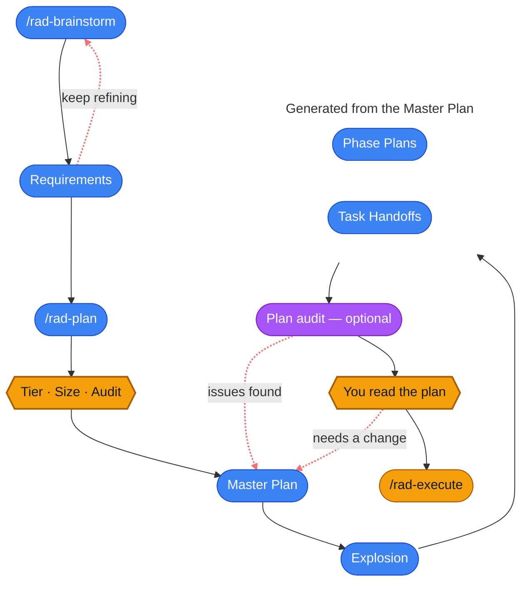

# Planning

Rad Orc is a type of spec driven development system (SDD) and builds plans in a series of markdown 
documents. You and the agent work together to align on requirements, the agent turns that
into an execution plan, and a team of subagents works through the plan one task at a time. Almost
everything that decides whether a project lands well gets settled during brainstorming, before any
code is written.

Two commands do this. `/rad-brainstorm` settles what you're building and why. `/rad-plan` turns
that into an execution plan comprised of phases and tasks.



## Think of a project name
You're going to live with this project name for a while, so make it something memorable.  The project name will follow you throughout the process -- its an identifier.  The naming convention is `PROJECT-NAME`  This name will be used for everything:
- How it's listed in the UI
- How you reference it with various Rad Orc skills
- The worktree folder that is created for it
- The branch name
- The markdown document prefixes

**Good Examples**:
- `USER-CREATE-VIEW`
- `USER-UPDATE-VIEW`
- `USER-CREATE-ENDPOINT`

**Bad examples**:
- `UI-VIEW`
- `ENDPOINT`

If it's part of a series, consider using the convention with a number and a decimal for followups: `USER-VIEW-1`, `USER-VIEW-1.1`, `USER-VIEW-2`

## Brainstorm: Align and create requirements

`/rad-brainstorm` opens a conversation, not a coding session. The agent will try to reach agreement on three things: the problem you're solving, the goals, and which repositories are required to change.  The brainstorm will try to challenge your assumptions and suggest breaking down work into iterations.

>Note: Generally, you only need to invoke `/rad-brainstorm` one time in a session.  You don't have to repeat it like the examples below unless its a fresh session.

### Scribing your first requirements draft

You can start brainstorming with an agent using as little or as much context as you want to provide.  Any context you provide is valid and you should supply as much information as the project needs to succeed. Here are examples of valid context:
- a single sentence
- a disorganized stream of consciousness
- a file reference to another markdown document
- a Jira ticket
- a Github Issue

**Example 1**:
```
/rad-brainstorm create a new feature for our user management application.  We'll need a UI view and CRUD endpoints to manage users.
```
**Example 2**
```
/rad-brainstorm read CIW-1234 from Jira and lets align.
```

The agent will begin to ask you questions with the goal of reaching alignment and offering to scribe a `Requirements` document.  It will also verify with you the repositories it thinks are involved.  So make sure you register your repos for best results.  See: [Repository Registry](repo-registry.md)


### Spend most of your time on requirements

The Requirements document is the most important one in the process and this is by far the cheapest moment to change your mind. The requirements are everything: 
- the execution plan comes from the requirements
- the phases come from the execution plan
- the tasks come from the phases
- and the code comes from the tasks

So read the requirements thoroughly before you plan, and push back on anything that isn't right. If the agent
starts nudging you toward planning before you're ready, say no. You decide when this document is finished.

For example:
```
/rad-brainstorm I noticed you mentioned xyz in R1, this is not correct.  We need to change it so that... 
```

### Skills / MCP Collection
The `Requirements` doc will carry a list of skills and MCPs it detected as relevant to the project.  When the execution plan is created, these skills will be encoded into the tasks.

If you see a skill missing in the `Requirements` document or you want it to leverage an MCP, it doesn't hurt to let the agent know.

#### How skills are applied
Skills are not automatically assigned to subagents.  In fact, in Claude Code, subagents don't automatically inherit skills from the main session unless they're assigned directly to the agent frontmatter.  So instead, the planner encodes the relevant skill knowledge into the task handoff specification itself.

For which skills the subagents *do* carry, see: [Your own skills reach them through the plan](subagents.md#your-own-skills-reach-them-through-the-plan).

MCPs work the same way — a subagent only has the ones assigned to it, so anything an MCP knows has to be resolved at planning time and written into the task.  See: [MCPs are resolved at planning time](subagents.md#mcps-are-resolved-at-planning-time).

#### Multi-repo Skill Application
In multi-repo scenarios, a tool runs that mines all the skills across all the project-relevant repos.  The agent calls this tool and receives the following skill information: `name`, `description`, `absolute path`, and the `repo` it belongs to.  The planner will properly apply the knowledge from that skill to the tasks that touch that repo.

>Note: If you must have a subagent read the skill verbatim, then mention that during brainstorming before you scribe your requirements so the task encodes the reading of the skills.

```
/rad-brainstorm When planning use the Context7 MCP for information on the React Flow library and consider our @component-design skill.
```

### It's safe to compact or clear your session

Once your `Requirements` doc is written to disk, you can walk away. Take a break, close the laptop, come back tomorrow. The document is the comprehensive state of your alignment. Make sure you read it before you abandon the session. 

When you're ready you can start a new session and pick up where you left off:

```
/rad-brainstorm Let's continue planning SEARCH-FILTERS. The date range should also accept relative values like "last 30 days".
```

### Reference Past Projects
If you're working on this project as part of a larger series or initiative, it's a good idea to reference related projects. You'll align much more efficiently with the agent.

**Example**
```
/rad-brainstorm we just finished working on the project ORDER-SERVICE-OBSERVABILITY-1 and added tracing.  Read the requirements to understand what we built. Let's start another project to add metrics to the same API endpoints. 
```
When you refer to past or current projects, the `/rad-project` skill will get triggered to locate the project docs or related linked projects. Iterating on larger projects is a good idea.  It gives the agent focus and context of where you're
at which will better inform where you're going.  For more information on linking together projects and the `/rad-project` skill, see: [Projects](projects.md) and [The ones you type](skills.md#the-ones-you-type).

### Visual Brainstorming
Sometimes a well-placed visual is all it takes to get on the same page with your agent or your team.  Your agent will often offer one, but if it doesn't, ask for one and it'll store in your project folder automatically.  It's trained in visual brainstorming docs, UI wireframes and technical docs.  For more information, see: [Real-time Visual Docs](visual-docs.md).

### Open Questions
Anything you couldn't settle goes into an `Open Questions` section of the `Requirements` document. Work through those before you move on if you can. Whatever's still open when planning starts gets answered by the agent on its own during `/rad-plan` stage.

### Consider splitting
The agent will sometimes let you know that you have a very large plan and encourage you to split the plan.  If it doesn't, think about it before you create an execution plan.  Rad Orc can handle very large plans that can span thousands of lines of code.  So if you're working on a team, or working on a high risk project, or the plan is too large for you to plan properly, consider a split.

### Follow-up projects
Most real work turns into a series.  You ship something, you learn something, and the next project builds on what you learned.  That's a good thing and Rad Orc is built for it.

**First, check that it's actually a follow-up.**  If the last project just didn't finish what it set out to do, that's an [amendment](amendments.md) -- it extends the finished project in place, on the same branch and the same PR, and reruns its final review over the whole thing.  A follow-up project is for the *next* piece of work: a new capability, a different problem, something that wants its own requirements and its own review intensity.  It's not a question of size -- it's whether the change belongs to the old project or a new one.

A follow-up is just a new project that references an old one.  Name what came before and the agent will go read it:

```
/rad-brainstorm We just finished USER-VIEW-1.  Read its requirements and its final review, then let's plan USER-VIEW-2 to add saved views on top of it.
```

Use the naming convention so the shape is obvious at a glance -- `USER-VIEW-1`, `USER-VIEW-1.1`, `USER-VIEW-2`.  And say yes when the agent offers to link the projects together.  It's cheap while the work is fresh and annoying to reconstruct a month later.  See: [Linking projects together](projects.md#linking-projects-together).

**Split up front, or follow up later?**  Both are valid, and it mostly comes down to whether you already know what the second half looks like.  If you do, split it -- you'll get better phases out of a plan that knows where it's going.  If you don't, ship the first project and let what you learn shape the next one.  Guessing at a second plan you haven't earned yet is worse than writing it later.

There's one more thing to decide before you run a follow-up: whether it should run in the same worktree as the project before it -- same branch, same PR -- or get its own.  See: [Running a follow-up in the same workspace](pipeline.md#running-a-follow-up-in-the-same-workspace).

## Master Plan: Creating an execution plan
Once you've aligned on your requirements, your agent will usually ask you if you want to proceed to the next step of creating an execution plan.  In this stage your requirements will be built into a new execution plan document known as the `Master Plan` comprised of phases which are comprised of tasks.  Each task is executed by an individual subagent.  See [Execution Pipeline](pipeline.md#from-requirements-to-a-task-handoff) for more details.

### Choose the right model for planning
Before you begin `/rad-plan`, consider the appropriately sized model.  The final execution plan is ultimately built by a single agent in a single context window.  The larger and or more complex the project, the stronger the model (and reasoning level) you should choose.  So using Sonnet when you should have used Opus is something to consider carefully.

### To compact or not to compact?
Consider compacting or clearing your session before `/rad-plan` starts.  Creating an execution plan can be a rather intense process and you don't want to carry more baggage than necessary.  Especially if you had a long and indecisive conversation.  However, if your conversation was efficient, throwing it away can end up costing you twice to rebuild the context you already had.  Use your best judgement.

### Start the planning
Usually the brainstorming phase will lead you straight into the planning phase.  But if you're coming back to a new session, you can simply type:
```
/rad-plan SEARCH-FILTERS
```

### The execution plan interview

This stage asks you three questions, then writes the `Master Plan`.

**Review intensity. (Recommended: Medium)** 

This determines the amount of code review you want done across the course of the project run.  If you're planning something small and simple, selecting `Low` is often sufficient.  If you're writing mission critical code that has a very high risk factor, you could go all in with `Extra High` for defense in depth.  In my experience, `Medium` is a good middle ground.    

While safety is definitely important, so is cost and performance.  The higher the code review intensity, the higher the token cost and the slower the run.  So choose wisely.

For more details on code review intensity levels, see: [Review intensity](pipeline.md#review-intensity).

**Phase and task size. (Recommended: Medium - Large)** 

The size of the phase and the size of the task will determine how much work a single subagent performs for a given task. 

The right answer on the size is a good question and I offer this option to help you experiment with that.  Every subagent is stateless.  So every tool call (file read) counts.  If you do too much work, you risk carrying too much dead weight in a subagents context window which will have a higher token cost.  Carry too little, and you're re-deriving the same context over and over across each subagent, also leading to higher token cost.

This phase / task size is also a lever for how much code review will be performed across the run.  For example, the smaller, more numerous, tasks will also get the same number of additional task code reviews.  For more details on code review mechanics, see: [Task size changes how much review you get](pipeline.md#task-size-changes-how-much-review-you-get).

**Plan audit. (Recommended: Do it)**

An agent reviewing its own plan is already biased by its own reasoning.  So the plan audit is performed by an independent subagent that never sat in on your conversation.  This ensures you're getting a fresh pair of eyes. 

It reads the `Requirements` and the `Master Plan` and checks for cohesion, coherence, and task / requirement alignment problems. It also grounds in the the reality of the code:
- Do the files a task says it will touch exist? 
- Are the signatures and endpoints it pins down real? 
- Does the pattern it tells a coder to copy actually do what the plan claims?

The audit doesn't always stop at one pass.  If a pass turns up enough that the agent has to rework a good chunk of the plan, the agent will ask whether to run another — three passes is the ceiling.  Findings the agent considered and decided against are carried forward with the reasoning, so a later pass doesn't spend its time re-arguing a point that's already settled.

The tighter the plan, the better the final result.  But like everything, there is a token cost.  So I've given you a choice here.

| | When it fits |
|---|---|
| **Yes** | Most of the time. On a real plan an audit routinely turns up five to ten genuine problems — an invented file path, a contract agreed on one side of a seam and not the other, a task missing something it needs to do its job. |
| **No** | Very small projects or throwaway experiments. |
| **Auto** | You'd rather not think about it. The agent decides based on the plan's complexity and its confidence level. |

## Final Plan Review!
Once your execution plan has been delivered, the agent will offer to run `/rad-execute <PROJECT-NAME>`.  Stop here.  If you have not reviewed your plan, now is your last chance before execution.  An unchecked mistake will become more expensive later.

Here's roughly where to spend your attention:

**Requirements**: 
If you haven't read them yet, you should.  Checking for accurate requirements is the bare minimum on a large body of work as everything downstreams hands off of it.  It's the first doc you create and a mistake here will trickle into your other docs.  And its the last doc that is checked.  Your final code review will be checking for conformance to the `Requirements` document.

**Phase Plans**: 
Do the phases divide the work where you'd have divided it? Does
the order make sense? Would you want something delivered earlier? The `Phase Plans` are the best
return on your reading time after the `Requirements`: they're short, and each one states what "done" means for that slice of work.  The phase reviewer will do a conformance check against it later.

**Task Handoffs**: 
Skim the task handoffs list for shape and coverage. The tasks will contain a lot of implementation details and be harder to follow.  A quick spot check on critical task detail is probably the most you need to do.

### You can still change it

This is your last chance to revise before code starts getting written. If there are issues, tell
the agent what's wrong and it will correct the `Requirements` or `Master Plan`. That might be
resequencing a couple of phases, adding a task that got missed, or fixing a requirement that
turned out to be wrong once you saw it broken down.

It's still more expensive than fixing the same thing during brainstorming, since the plan has to
be re-authored around your change. But it's dramatically cheaper than discovering it mid-run,
and much cheaper than discovering it in the pull request.

Once the run starts, the plan stops being freely editable -- work that has already executed can't be
rewritten out from under the commits and reviews that reference it. Changing the plan from that
point on is an [amendment](amendments.md), which adds, revises, or drops the phases and tasks that
haven't run yet and leaves everything already finished exactly as it is. Amendments are a real
escape hatch and they work long after the project completes, but an amendment costs more than
reading the plan properly right now.

### Run the Plan
```
/clear
/rad-execute <PROJECT-NAME>
```
There's no separate approval button. When you're happy with the plan, you run it, and choosing
to run it is the approval.

If you decide to wait and think about the plan before you run it, that is fine.  The plan is saved to disk and a fresh
session picks it up with `/rad-execute SEARCH-FILTERS` whenever you're ready. At this point, your context window has served its purpose, so clear it to save tokens.

---

**Read Next:** [Execution Pipeline](pipeline.md) · [Document Types](document-types.md) ·
[Subagents](subagents.md) · [Projects](projects.md) · [Amendments](amendments.md) ·
[Repository Registry](repo-registry.md) · [Visual Docs](visual-docs.md) ·
[Docs Viewer](docs-viewer.md)