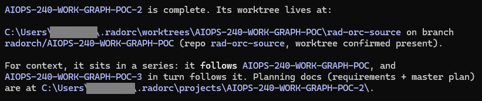
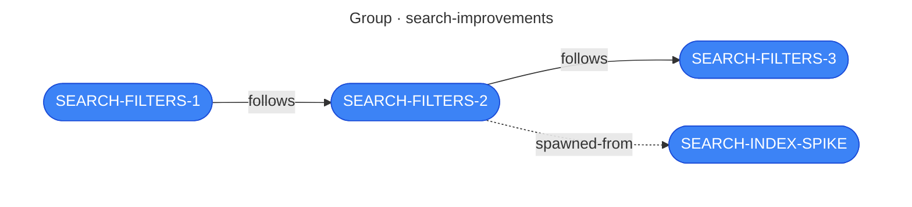

# Projects

A project is the unit of work in Rad Orc. It's the thing you name, plan, run, review, and come
back to three weeks later. Everything the system knows about a body of work belongs to a
project — what you agreed to build, how it got broken down, what the reviewers said, and which
repositories it touched.

This page is about the project itself. [Planning](planning.md) covers the conversation that
creates one; [Execution Pipeline](pipeline.md) covers what happens when you run it.

## A project is a folder

There's no database and no registration step. A project is a directory:

```text
~/.radorc/projects/SEARCH-FILTERS/
```

When Rad Orc lists your projects, it reads that directory. When you say a project name to an
agent, that's the name of a folder. The folder is the record — you can open it, read it, back it
up, or copy it to another machine, and nothing else has to be told.

This is worth internalizing early, because it explains a lot of the system's behavior. Your
planning documents are plain markdown on your own disk, so you're never locked out of them.
Nothing is hidden in a service you can't inspect. And if you want to know what a project
actually decided, you read the same file the agent read.

## The name follows the work

[Planning](planning.md) tells you to pick a project name you can live with. This is why: the
name isn't a label, it's an identifier, and it propagates into five places.

| Where the name lands | Example |
|---|---|
| The project folder | `~/.radorc/projects/SEARCH-FILTERS/` |
| Every document inside it | `SEARCH-FILTERS-REQUIREMENTS.md` |
| The workspace the code is written in | `~/.radorc/worktrees/SEARCH-FILTERS/` |
| The git branch, in every repo the project touches | `radorch/SEARCH-FILTERS` |
| How you refer to it | `/rad-execute SEARCH-FILTERS`, `/rad-plan SEARCH-FILTERS`, `/rad-brainstorm let's continue discussing SEARCH-FILTERS` |

That fourth row is the one people don't expect. A project gets **one branch name, used in every
repository it spans** — a change across three repos is three branches that all read
`radorch/SEARCH-FILTERS`. That's what makes a multi-repo change legible: you can look at any of
those repos and know which project put that branch there.

Renaming a project after the fact means moving a folder, renaming documents, and leaving a branch
behind that no longer matches. It's not impossible, but it's tedious enough that it's worth
spending an extra thirty seconds on the name up front.

## What accumulates in a project folder

A project starts with one document and grows as it moves through the pipeline. By the time a
run finishes, a typical folder looks like this:

```text
~/.radorc/projects/SEARCH-FILTERS/
├── SEARCH-FILTERS-REQUIREMENTS.md
├── SEARCH-FILTERS-MASTER-PLAN.md
├── SEARCH-FILTERS-BRAINSTORM.html
├── SEARCH-FILTERS-ERROR-LOG.md
├── phases/
│   ├── SEARCH-FILTERS-PHASE-01-DATE-RANGE.md
│   └── SEARCH-FILTERS-PHASE-02-SAVED-VIEWS.md
├── tasks/
│   ├── SEARCH-FILTERS-TASK-P01-T01-PARSE-RELATIVE-DATES.md
│   └── SEARCH-FILTERS-TASK-P01-T02-DATE-RANGE-PICKER.md
├── reports/
│   ├── SEARCH-FILTERS-CODE-REVIEW-P01-T01-PARSE-RELATIVE-DATES.md
│   ├── SEARCH-FILTERS-PHASE-REVIEW-P01-DATE-RANGE.md
│   └── SEARCH-FILTERS-FINAL-REVIEW.md
├── template.yml
└── state.json
```

Here's what each one is, and — just as usefully — who writes it:

| Document | Written by | What it's for |
|---|---|---|
| [`{NAME}-REQUIREMENTS.md`](document-types.md#requirements) | You and the agent, during `/rad-brainstorm` | What you're building and why. The most important document in the folder. |
| [`{NAME}-MASTER-PLAN.md`](document-types.md#master-plan) | The agent, during `/rad-plan` | The whole execution plan in one document — every phase, every task. |
| [`{NAME}-AMENDMENT-{NN}.md`](document-types.md#amendment) | The agent, during `/rad-amend` | What a later change added to the plan, or took out of the plan. Only appears if the plan changed after the run started, and amendments accumulate — `-01`, `-02`. |
| [`phases/`](document-types.md#phase-plan) | Generated from the Master Plan | One document per phase, stating what "done" means for that slice of work. |
| [`tasks/`](document-types.md#task-handoff) | Generated from the Master Plan | One document per task. The **only** document a coding agent reads. |
| [`reports/`](document-types.md#review-reports) | The reviewer agents, during the run | Code reviews, phase reviews, and the final review — each with a verdict. |
| [`{NAME}-ERROR-LOG.md`](document-types.md#the-error-log) | The pipeline | Append-only. Only appears if something went wrong. |
| `template.yml` | Snapshotted when you plan | The review-intensity tier you picked, frozen for this project so a later change to the shipped templates can't alter a run in flight. |
| `state.json` | The pipeline | The live state of the run. Machine-written — don't edit it by hand. |
| `.project-sessions.json` | The pipeline's own capture points, and `/rad-session` on request | Every session that's touched this project and what happened in it — its [journey](sessions.md). Machine-written — don't edit it by hand. |

Two things follow from that table.

**The `phases/` and `tasks/` documents are generated, not authored.** They're produced from the
Master Plan, and they're regenerated from scratch every time the plan changes. So if you spot a
problem in a task, fix it in the **Master Plan** — an edit to a file under `tasks/` will be
overwritten. [The explosion](pipeline.md#the-explosion) covers how that generation step works.

**A task document is deliberately self-sufficient.** A coding agent reads its task and nothing
else: not the `Requirements`, not the `Master Plan`, not the `Phase Plan`. That's why
task documents are long and specific, and it's why planning time is where the quality gets
decided. See [Why it has to be self-contained](document-types.md#why-it-has-to-be-self-contained)
for what goes into making that work.

### Documents you add yourself

Anything else you drop in the project folder is picked up and shown alongside the generated
documents. A design doc, a spec you were handed, a diagram, notes from a meeting — the folder is
yours as much as the system's, and giving the agent a real place to look is usually better than
pasting the same context into every session.

Mention what you've dropped in and the agent will link it from the `## Companion Documents`
section of the Requirements, which is where supplemental material — yours or the agent's — gets
gathered so a later session can find it without you remembering it exists.

### Visuals land here too

When your agent draws you something — a brainstorming summary, a UI wireframe, an architecture
diagram — it doesn't hand you a throwaway. `/rad-visual-docs` writes the file into the project
folder next to the planning documents, so the picture travels with the project instead of
scrolling out of a conversation. Come back in a month and the diagram is still sitting beside the
requirements it was drawn to explain.

While you could directly invoke it, your agent offers a visual when the conversation
reaches something worth seeing, and if it doesn't offer, just ask. What you get back is named by
what it is:

| Filename | What it is |
|---|---|
| `{NAME}-BRAINSTORM.html` | The brainstorming summary. This exact name fills the project's **Brainstorm Visual** slot in the dashboard — any other name lands as a generic visual instead. One per project. |
| `{NAME}-WIREFRAME-{SLUG}.html` | A UI wireframe / mockup. |
| `{NAME}-TECH-DIAGRAM-{SLUG}.html` | An architecture, data-flow, or sequence diagram. |

Regenerating a visual under the same filename replaces it, which is deliberate. A diagram that
disagrees with the requirements is worse than no diagram at all, so when the plan changes, ask for
the visual to be refreshed in the same pass. [Visual Docs](visual-docs.md) has the full story.

### A note on frontmatter

Every generated document opens with a small YAML block. You don't have to maintain it, and
recognizing a handful of the fields makes the documents much easier to skim — every one names its
`project` and the date it was `created`, and most carry a `type` and a `status` too.

What's worth knowing is that the block isn't inert. The CLI reads it and makes decisions from it,
which is why you shouldn't hand-edit a field even when a value looks wrong. For the fields worth
recognizing and what depends on them, see:
[Frontmatter is load-bearing](document-types.md#frontmatter-is-load-bearing).

### The dashboard is this folder, rendered

The `/projects` page in the dashboard is the project folder made visual. The sidebar is your
list of project directories; selecting one shows its documents, its phases and tasks as a
timeline, and its review reports — each opening in a viewer so you can read the document the
agent read, without leaving the browser.  The dashboard should make finding your docs a much more pleasant experience than simply using an IDE or file explorer.

Every project also has an **Overview**, reachable whether or not it has a pipeline running: its
documents alongside its [Session Journey](sessions.md) — every session that's touched it, with a
button to step straight back into any of them.

Start it with `/rad-ui-start` and see [Dashboard](dashboard.md) for more details.

## Projects and worktrees

The project folder holds the *thinking*. It does not hold the code.

Code is written in a **worktree** — a second working directory on the same repository, cut on
the project's branch. Worktrees live under the project's own name:

```text
~/.radorc/worktrees/SEARCH-FILTERS/
├── search-api/      # one worktree, on branch radorch/SEARCH-FILTERS
└── search-ui/       # another worktree, same branch name
```

Two things are worth noticing. First, the parent folder is named after the **project**, and each
repository the project touches gets a subfolder inside it. That's what lets an agent working on a
multi-repo change see every repository it needs side by side, as though they were one workspace.

Second, your original clones are untouched. A worktree is not a copy of the repository — it's an
additional checkout sharing the same underlying git objects, which is why they're cheap to create
and why several projects can run at once without stepping on each other.

You generally don't need to construct these paths yourself. Ask, and the agent resolves them:

```
/rad-project where is SEARCH-FILTERS?
```

**Example response:**



Details on creating worktrees, cleaning them up, running a project against a branch you already have, and
how commits and pull requests can be found here:
[Source Control](source-control.md).

## Project states

A project reports one state, and it's derived from the run rather than stored as a label you
maintain. It's what the dashboard badges show and what `/rad-project` tells you when you ask
what's going on.

| State | What it means |
|---|---|
| **Not Initialized** | Documents but no run. This is where a project sits after you've brainstormed it and before you've planned it, so it's a perfectly healthy place to leave one — and it's the state you'll see most often on a list of projects you've been thinking about. |
| **Not Started** | A run has been set up and hasn't begun. A brief window rather than a resting place. |
| **Planning** | `/rad-plan` is working — requirements approved, the Master Plan being authored. |
| **Planned** | Planning finished. The plan is on disk and waiting for you to run it. This is the state a project sits in while you review the plan. |
| **Executing** | Phases and tasks are running, or code review is underway. |
| **Pending Review** | The pipeline has stopped and is waiting on you at the final approval gate after the run has executed all the tasks and reviews. |
| **Halted** | The run stopped on a problem it won't work around: a rejected final review, or a task that used up its retries. It's waiting for you to decide what happens next. |
| **Complete** | Finished and approved. Not a locked door — see below. |

**Pending Review is worth respecting.** A project left there stays visible to your agents in
future sessions, which is deliberate — it's how the system keeps unfinished business in front of
you rather than letting it evaporate when you close the terminal. See
[Unfinished work stays in view](ambient-awareness.md#unfinished-work-stays-in-view).

**Neither of the last two states is final.** A **Complete** project can be reopened and extended if
it turns out the project didn't finish what it owed, and a **Halted** project can come back if the
halt happened at the final gate. Both routes are [amendments](amendments.md) — work that already
finished is left exactly as it is, and only the phases and tasks that never ran are open to change.

[Execution Pipeline](pipeline.md#when-a-run-halts) covers what moves a project between these states, including
what a halt actually means and how to get out of one.

## Linking projects together

This is the part of Rad Orc that most rewards a little deliberate effort, and it's the part
people most often leave on the table.

Real work rarely fits in one project. You ship an API, then instrument it, then build a UI on
top of it. Each of those is its own project with its own plan — and each of them was informed by
the ones before it. The **work graph** is how the system records that, so a fresh agent in a fresh
session can find the reasoning instead of asking you to repeat it.

Every step in that example is the *next* thing rather than a repair of the last one. Going back to
fix what a project got wrong is an [amendment](amendments.md) instead — it extends that project
rather than adding another one to the graph.

The graph holds two things: **groups**, which bundle related projects into a named initiative, and
**edges**, which say how two projects relate.



Three iterations in a series and one investigation that spun out of the middle of it, all under a
group that says what the initiative is. Each edge is labeled with its type. Note that the spike
sits *inside* the group — an offshoot is part of the initiative that produced it, and leaving it
out is how work gets orphaned.

There are four edge types:

| Edge | What it says |
|---|---|
| `follows` | This project comes after that one in a series. The ordinary case: iteration 2 follows iteration 1. |
| `depends-on` | This project is blocked by that one. |
| `spawned-from` | This project branched off from that one — a spike, an investigation, a fix pulled out of a run in flight. It records where the work came from, not an order. |
| `contains` | A group contains a project or a sub-group. |

A group's **description is required, and it's load-bearing.** It isn't decoration — it's the
sentence that tells an agent what this initiative covers and why it would look here. A group
called `search` with no description is a folder; a group described as *"the staged effort to
replace the legacy search backend — filters first, then relevance, then the admin tooling"* is
context an agent can act on. Write it like you're briefing someone on their first day.

### How to actually use this

Two habits get you most of the value.

**Name your series so the shape is obvious to you.** `SEARCH-FILTERS-1`, `SEARCH-FILTERS-2`,
`SEARCH-FILTERS-1.1` for a follow-up. That's the human-readable signal — it's for your eyes,
scanning a project list. The `follows` edge is the machine-readable one, and it's what an agent
traverses. You want both, and they cost you almost nothing if you set them at the start.

**Mention related projects when you brainstorm.** This is the payoff, and it's the moment where
linking stops being bookkeeping. When you name a project in conversation, the `/rad-project`
skill goes and finds it — its documents, its state, and everything it's connected to:

```
/rad-brainstorm We just finished SEARCH-FILTERS-1 and shipped date-range filtering.
Read its requirements, then let's plan SEARCH-FILTERS-2 to add saved views on top of it.
```

The agent now starts from what you actually built rather than from your summary of it. On a long
initiative, that difference compounds — the fifth project can read the first four, and you stop
re-explaining decisions you made a month ago.

Your agent will usually offer to link a new project to an existing one when it senses a
continuation. Say yes. If it doesn't offer, ask:

```
/rad-project link SEARCH-FILTERS-2 as following SEARCH-FILTERS-1, and put both in the
search-improvements group.
```

Grouping and linking are cheap while the work is fresh and annoying to reconstruct later, which
is the whole argument for doing it as you go.

### Seeing the graph

The dashboard has a **Work Graph** view that draws all of this: your projects laid out oldest to
newest, colored by state, scoped to a group, filtered by keyword. Filtering pulls in one hop of
relationship context, so searching for one project shows you its neighbors rather than a lone
node with no story around it. By default it draws `follows` edges only, and you can switch the
other types on from the toolbar.

It's currently labeled a proof of concept in the navigation, so expect it to change shape. It's
already the fastest way to see whether the graph you *think* you have is the graph you actually
have.

One thing it will tell you: if you delete a project folder, edges pointing at it become
**dangling**, and the toolbar shows a count. Ask `/rad-project` to prune them when it does.

The graph itself is a single file at `~/.radorc/work-graph.yml`. It stores only groups and
relationships — the projects are still just folders, discovered by reading the directory. See
[The ones you type](skills.md#the-ones-you-type) for what else `/rad-project` can answer.

## Standard projects and side projects

Every project has a type, and there are two.

A **standard** project targets one or more repositories from your
[Repository Registry](repo-registry.md). That's almost everything you'll do, and it's what the rest of
this documentation assumes.

A **side project** is a self-contained effort that doesn't belong to a registered repository — a
script, an experiment, something you're trying out before deciding whether it deserves a home.
It lives in its own folder at `~/.radorc/side-projects/<project-name>/`, and the session working
on it runs there rather than in a worktree.

Side projects are **deliberately invisible to the Repository Registry.** They're never written to
it, and they never appear in the session-start summary your agents see, which means they stay
personal and local — they don't show up as team-shared context. That's the point of them. If a
side project grows into something real, register a repository for it and plan the next iteration
as a standard project.

One distinction that trips people up: `side-project` is a project *type*, while `spawned-from` is
a *relationship*. A spike that branched off a live project is usually a standard project with a
`spawned-from` edge, not a side project. The two are independent — you can have either, both, or
neither.

---

**Read Next:** [Planning](planning.md) · [Execution Pipeline](pipeline.md) ·
[Document Types](document-types.md) · [Amendments](amendments.md) ·
[Source Control](source-control.md) · [Repository Registry](repo-registry.md) ·
[Sessions](sessions.md) · [Dashboard](dashboard.md) · [Docs Viewer](docs-viewer.md)
