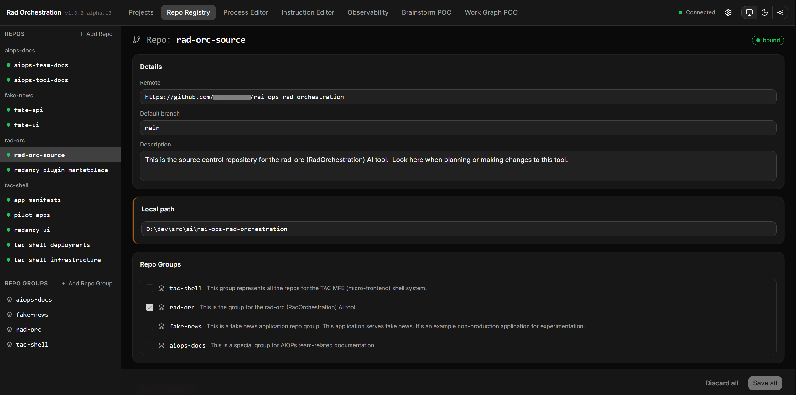

# Repository Registry

The repository registry is Rad Orc's map of the repositories you work in — what each one is
called, where it lives on your disk, and what it's for. It's what lets an agent work on code
outside the folder it was started in.

An agent in a terminal can only see the directory you launched it from, which is fine until a
change spans two repositories. The registry gives it peripheral vision: what code exists
elsewhere, what each repository is for, and which ones belong together. Register a repository
once and every session after that starts already aware of it.

## Two ways to work with the registry

Everything on this page can be done from either of two surfaces, and both write to the same
registry.

**`/rad-repo`** is the conversational route. Ask in plain language — register this repo, what do I
have registered, bind this one, group these three — and the agent handles the mechanics while
confirming the parts that need your judgement. Reach for it mid-conversation, when sorting out a
repository is a detour from whatever you were actually doing. If you're not sure what to ask for,
`/rad-repo help` will get the agent to explain what it can do.

**The Repo Registry page in the dashboard** is the visual route, and it **spends no tokens.**
It's the better surface for seeing everything at once — every repository, its description, its
bind state, its groups — and for getting through several registrations in one sitting. Start the
dashboard with `/rad-ui-start`. See [Dashboard](dashboard.md).



The rest of this page points at whichever one fits the job.

## What the registry records

Four fields per repository, and only one of them is really yours to write — point Rad Orc at a
repository and it works out the rest.

| Field | What it is |
|---|---|
| **Slug** | The short, lowercase-with-hyphens name you'll use to refer to the repository — `search-api`, `search-ui`. |
| **Remote** | The repository's git remote URL. Read automatically. |
| **Default branch** | The branch new work is cut from, usually `main`. Read automatically. |
| **Description** | A sentence saying what this repository is and why someone would look in it. Yours to write, and required. |

Spend a moment on the slug, because **it can't be renamed later.** It defaults to the name of the
remote repository rather than your local folder — `RadOrchestration` becomes `rad-orchestration` —
since a folder name is incidental and the remote identity is the same for everyone on your team.

>Slugs get written into every document including: Requirements, Master Plans, Phase Plans, Task Handoffs, and the run's own state.json.  So changing the slug is load bearing and you should consider that docs will drift if you change the slug.

## Identity is recorded separately from location

The registry is built to be shared with your team, which is why a repository's identity and its
location on disk live in two different files under `~/.radorc/`.

| File | Holds | Shareable |
|---|---|---|
| `repo-registry.yml` | Identity — slug, remote, default branch, description, and all repo-group definitions. No paths. | Yes |
| `repo-registry.local.yml` | The map from each slug to the folder it's cloned into **on this machine**. | No — gitignored automatically |

Identity is the same for everyone; where a repository is cloned on your disk is not. So the shared half
travels and your local paths stay yours.

A repository with identity but no local path on this
machine is **unbound** — not an error.  But if you share a registry file with a teammate, they'll need to make sure they **bind** the repo to the location they cloned it to.

## Descriptions: why agents care

An agent will use the description of a repo or repo-group to determine if they should further investigate them.  Functionally, it's similar to the progressive disclosure mechanism that skills use to encourage an agent to reach for them.

At session start an agent is handed your repository **names** so it's aware that they exist — see [What else is out there](ambient-awareness.md#what-else-is-out-there). When brainstorming or planning, the agent will use these names to look up additional information with the `/rad-repo` skill.  Which repos it goes on to research comes down to the descriptions you've written.

Spend some time making a good description.  Like skills, the better the descriptions, the more likely they'll trigger for the right reasons.

## Registering and binding

Registration is a one-time step per repository.

```
/rad-repo register the repo at D:\dev\src\search-api
```

Point it at the repository and it reads the remote and default branch itself. You supply the
description, and it confirms the slug with you before saving. Point it at a worktree by mistake
and it resolves upward to the repository's main clone, which is the durable home.

In the dashboard it's the **Add Repo** button on the Repo Registry page — also where you'll go to
bind a repository that's currently unbound.

## Repo groups

Where descriptions give your agent a reason to look somewhere, groups give it a reason to skip
everything else. A **repo group** is a named set of repositories with its own required
description saying what domain it covers.

Grouping does two things: it makes a phrase like "the search repos" something you can say and
have resolved instead of listing four slugs, and it scopes attention so a project doesn't drag
the agent through unrelated code. A repository can sit in more than one group, and deleting a
group removes only the grouping — the repositories stay registered.

## Every session starts with your repo list

Your agent never has to be told your repositories exist. Every session opens with the registry
already in its context: your repository names, your repo group names, your active projects, and a
warning listing anything registered but unbound on this machine.

That's what makes *"which repo handles password resets?"* answerable in your first message — the
agent has the full list of candidates and can pull the descriptions to narrow it down, instead of
asking you to point at a folder. How much of that briefing *you* see is a separate choice,
including one where the agent still gets all of it and you're shown nothing.
[How much of it you see](ambient-awareness.md#how-much-of-it-you-see) covers the levels.

## A run won't start on a repository it can't see

A project run depends on the registry, not just an agent's curiosity. Start a run with
`/rad-execute` and before it provisions any workspace, it checks every repository the project
targets and stops if one is missing from the registry or unbound on this machine. The stop names
the repository and which of the two it is.

So register your repositories before you plan work in them, not after.
[Side projects](projects.md#standard-projects-and-side-projects) are the deliberate exception —
they aren't backed by a registered repository at all, so the check skips them.

## Projects that span repositories

A single project can change several repositories at once, and the registry is what makes that
possible. During brainstorming you and the agent settle which repositories are in scope, split
into the ones the project will **change** and the ones it only **reads for reference**, so the
planner knows which code it may touch. See
[How `repos` narrows down the chain](document-types.md#how-repos-narrows-down-the-chain) for the
way that scope tightens from the project down to the individual task.

Each repository the project changes then gets its own workspace folder, all on one branch named
after the project — see [Projects and worktrees](projects.md#projects-and-worktrees) for the
layout and [Source Control](source-control.md) for what happens as work lands.

---

**Read Next:** [Projects](projects.md) · [Source Control](source-control.md) ·
[Ambient Awareness](ambient-awareness.md) · [Planning](planning.md) · [Dashboard](dashboard.md) ·
[Docs Viewer](docs-viewer.md)
