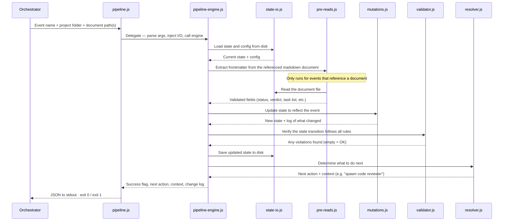

# Pipeline Script

The orchestration system uses a single unified pipeline script (`pipeline.js`) for all deterministic pipeline operations: routing, mutation, and validation. Every pipeline event flows through one entry point that applies mutations to `state.json`, runs validation, and returns a JSON result.

## Why Scripts?

Without these scripts, LLM-based agents must re-derive routing decisions from natural language on every invocation. This produces inconsistent results for identical inputs — the same `state.json` could lead to different next actions depending on how the agent interprets its instructions.  

The pipeline script encodes these decisions as tested, deterministic code:
- **Routing** — which agent to spawn next, given the current pipeline state
- **Mutation** — how `state.json` changes in response to each event
- **Validation** — whether a state transition violates any invariants

>Agents are good at judgement, but struggle with mechanical consistency.  LLMs still handle all judgment-requiring work: coding, reviewing, designing, architecting. The script handles the mechanical decisions — same input always produces the same output.

## CLI Interface
All pipeline interactions go through `pipeline.js` — there are no other scripts that mutate state or determine routing. The CLI accepts structured arguments and returns structured JSON results:
```bash
node .github/orchestration/scripts/pipeline.js \
  --event <event_name> \
  --project-dir <path> \
  [--config <path>] \
  [--context '<json>']
```

| Flag | Required | Description |
|------|----------|-------------|
| `--event` | Yes | One of the 17 pipeline events (see event vocabulary below) |
| `--project-dir` | Yes | Absolute path to the project directory containing `state.json` |
| `--config` | No | Path to `orchestration.yml`; built-in defaults used if omitted |
| `--context` | No | JSON string with event-specific context (e.g., `report_path`, `doc_path`) |

## Module Architecture

The system uses a 4-layer architecture with strict dependency direction (higher layers import from lower layers, never the reverse):

```
.github/orchestration/scripts/
├── pipeline.js                    # CLI entry point — I/O, arg parsing, exit codes
├── lib/
│   ├── pipeline-engine.js         # Orchestration engine — load → pre-read → mutate → validate → write → resolve → return
│   ├── mutations.js               # Pure mutation handlers — one per event, lookup table pattern
│   ├── state-io.js                # I/O isolation — read/write state, config, documents
│   ├── pre-reads.js               # Artifact extraction and validation for 5 event types
│   ├── resolver.js                # Action resolver — pure function, ~18-action event-to-action routing
│   ├── validator.js               # State Transition Validator — ~11 invariants
│   └── constants.js               # Shared enums — frozen, zero dependencies
└── tests/
    ├── pipeline.test.js           # CLI end-to-end tests
    ├── pipeline-engine.test.js    # Engine integration tests
    ├── pipeline-behavioral.test.js # End-to-end behavioral scenarios
    ├── mutations.test.js          # Mutation handler unit tests
    ├── state-io.test.js           # I/O module tests
    ├── pre-reads.test.js          # Artifact extraction tests
    ├── resolver.test.js           # Routing resolver tests
    ├── validator.test.js          # Invariant validation tests
    └── constants.test.js          # Enum integrity tests
```

### Layer 1: CLI Entry Point

`pipeline.js` handles all I/O: reading files, writing stdout, and setting exit codes. Uses a `require.main === module` guard for dual CLI/programmatic use. Constructs the `PipelineIO` dependency injection object and delegates all logic to the engine.

### Layer 2: Pipeline Engine

`pipeline-engine.js` is the orchestration core. It executes a linear recipe: load → pre-read → mutate → validate → write → resolve → return.

### Layer 3: Domain Modules

`mutations.js`, `resolver.js`, `validator.js`, and `pre-reads.js` are pure functions with no filesystem access. Each has a single responsibility:

- **`mutations.js`** — one handler per event, lookup table pattern
- **`resolver.js`** — maps post-mutation state to one of ~18 external actions
- **`validator.js`** — checks ~11 invariants against state transitions
- **`pre-reads.js`** — artifact extraction and validation for 5 event types

### Layer 4: Constants & I/O

`constants.js` is the leaf module — zero internal dependencies, all enums frozen with `Object.freeze()`. `state-io.js` encapsulates all filesystem operations behind the `PipelineIO` interface.

---

## Script Flow

How the scripts call each other on every pipeline event:



> `constants.js` is a static dependency imported by `mutations.js`, `validator.js`, `resolver.js`, and `pipeline-engine.js` — it holds all frozen enum values and is never called at runtime.

---

## Event Vocabulary

The pipeline accepts exactly 17 events. Each event maps to a mutation handler.

| # | Event | Tier | Description |
|---|-------|------|-------------|
| 1 | `research_completed` | Planning | Research agent finished; sets `planning.steps.research` to complete |
| 2 | `prd_completed` | Planning | PRD created; sets `planning.steps.prd` to complete |
| 3 | `design_completed` | Planning | Design doc created; sets `planning.steps.design` to complete |
| 4 | `architecture_completed` | Planning | Architecture doc created; sets `planning.steps.architecture` to complete |
| 5 | `master_plan_completed` | Planning | Master plan created; sets `planning.steps.master_plan` to complete, `planning.status` to complete |
| 6 | `plan_approved` | Planning | Human approved the plan; sets `planning.human_approved`, transitions to execution tier |
| 7 | `phase_plan_created` | Execution | Phase plan document saved; sets `phase.phase_plan_doc`, `phase.status` to in_progress |
| 8 | `task_handoff_created` | Execution | Task handoff document saved; sets `task.handoff_doc` |
| 9 | `task_completed` | Execution | Coder finished task; sets `task.report_doc` |
| 10 | `code_review_completed` | Execution | Reviewer finished review; sets `task.review_doc` |
| 11 | `phase_report_created` | Execution | Phase report saved; sets `phase.phase_report_doc` |
| 12 | `phase_review_completed` | Execution | Phase reviewer finished; sets `phase.phase_review_doc` |
| 13 | `task_approved` | Execution | Human approved task gate; advances task |
| 14 | `phase_approved` | Execution | Human approved phase gate; advances phase |
| 15 | `final_review_completed` | Review | Final comprehensive review saved; sets `final_review.report_doc` |
| 16 | `final_approved` | Review | Human approved final review; transitions to complete tier |
| 17 | `halt` | Any | Halt the pipeline with a reason |

---

## Action Vocabulary

The resolver is a pure function that returns one of 18 values from a closed enum based solely on the current `state.json` contents and config. All actions are external — returned to the Orchestrator for agent routing.

### Planning Tier (6 actions)

| Action | Meaning |
|--------|--------|
| `spawn_research` | Spawn Research agent |
| `spawn_prd` | Spawn Product Manager |
| `spawn_design` | Spawn UX Designer |
| `spawn_architecture` | Spawn Architect for architecture |
| `spawn_master_plan` | Spawn Architect for master plan |
| `request_plan_approval` | Planning complete — request human approval |

### Execution Tier — Task Lifecycle (4 actions)

| Action | Meaning |
|--------|--------|
| `create_phase_plan` | Phase needs a plan |
| `create_task_handoff` | Task needs a handoff document (fresh or corrective, distinguished by `context.is_correction`) |
| `execute_task` | Task has handoff, ready to execute |
| `spawn_code_reviewer` | Task needs code review |

### Execution Tier — Phase Lifecycle (2 actions)

| Action | Meaning |
|--------|--------|
| `generate_phase_report` | All tasks complete — generate phase report |
| `spawn_phase_reviewer` | Phase needs review |

### Gate Actions (2 actions)

| Action | Meaning |
|--------|--------|
| `gate_task` | Task gate — request human approval |
| `gate_phase` | Phase gate — request human approval |

### Review Tier (2 actions)

| Action | Meaning |
|--------|--------|
| `spawn_final_reviewer` | Spawn final comprehensive review |
| `request_final_approval` | Final review complete — request human approval |

### Terminal (2 actions)

| Action | Meaning |
|--------|--------|
| `display_halted` | Project is halted — display status |
| `display_complete` | Project is complete — display status |

---

## Result Shapes

### Success

```json
{
  "success": true,
  "action": "execute_task",
  "context": {
    "tier": "execution",
    "phase_index": 0,
    "task_index": 2,
    "phase_id": "P01",
    "task_id": "P01-T03",
    "reason": "Task P01-T03 has handoff but status is not_started"
  },
  "mutations_applied": [
    "task.status → in_progress"
  ]
}
```

### Error

```json
{
  "success": false,
  "error": "Validation failed: [V6] Only one task may be in_progress",
  "event": "task_handoff_created",
  "state_snapshot": { "current_phase": 0 },
  "mutations_applied": []
}
```

---

## Pipeline Internals

### Mutation Lookup Table

The `MUTATIONS` object in `mutations.js` maps each of the 17 events to a pure handler function. Each handler receives `(state, context, config)` and returns `{ state, mutations_applied }`. Functions mutate the state object in place and return a list of human-readable mutation descriptions.

```javascript
const MUTATIONS = Object.freeze({
  // Planning events
  research_completed:       handleResearchCompleted,
  prd_completed:            handlePrdCompleted,
  design_completed:         handleDesignCompleted,
  architecture_completed:   handleArchitectureCompleted,
  master_plan_completed:    handleMasterPlanCompleted,
  plan_approved:            handlePlanApproved,
  // Execution events
  phase_plan_created:       handlePhasePlanCreated,
  task_handoff_created:     handleTaskHandoffCreated,
  task_completed:           handleTaskCompleted,
  code_review_completed:    handleCodeReviewCompleted,
  phase_report_created:     handlePhaseReportCreated,
  phase_review_completed:   handlePhaseReviewCompleted,
  // Gate events
  task_approved:            handleTaskApproved,
  phase_approved:           handlePhaseApproved,
  // Review events
  final_review_completed:   handleFinalReviewCompleted,
  final_approved:           handleFinalApproved,
  // Halt
  halt:                     handleHalt,
});
```

### Decision Tables

Review verdicts are resolved by decision tables inside mutation handlers. The `code_review_completed` mutation uses `resolveTaskOutcome` to determine the task's next state and action (advance, corrective retry, or halt). The `phase_review_completed` mutation uses `resolvePhaseOutcome` similarly. Pointer advances and tier transitions happen within the mutation — there are no internal actions or post-mutation loops.

### I/O Isolation via `PipelineIO`

The pipeline engine receives all I/O functions via dependency injection. This makes the engine fully testable with in-memory stubs.

```javascript
const io = {
  readState:         (projectDir) => Object | null,
  writeState:        (projectDir, state) => void,
  readConfig:        (configPath) => Object,
  readDocument:      (docPath) => { frontmatter: Object, content: string } | null,
  ensureDirectories: (projectDir) => void
};
```

---

## Shared Constants

`.github/orchestration/scripts/lib/constants.js` is the single source of truth for all enum values. Every other module imports from it. All enums are `Object.freeze()`-d to prevent runtime mutation.

### Enum Reference

| Enum | Values | Purpose |
|------|--------|---------|
| `PIPELINE_TIERS` | `planning`, `execution`, `review`, `complete`, `halted` | Pipeline tier progression |
| `PLANNING_STATUSES` | `not_started`, `in_progress`, `complete` | Overall planning tier status |
| `PLANNING_STEP_STATUSES` | `not_started`, `in_progress`, `complete`, `failed`, `skipped` | Individual planning step status |
| `PHASE_STATUSES` | `not_started`, `in_progress`, `complete`, `failed`, `halted` | Phase lifecycle status |
| `TASK_STATUSES` | `not_started`, `in_progress`, `complete`, `failed`, `halted` | Task lifecycle status |
| `REVIEW_VERDICTS` | `approved`, `changes_requested`, `rejected` | Review outcome |
| `REVIEW_ACTIONS` | `advanced`, `corrective_task_issued`, `halted` | Task-level review action (singular) |
| `PHASE_REVIEW_ACTIONS` | `advanced`, `corrective_tasks_issued`, `halted` | Phase-level review action (plural) |
| `SEVERITY_LEVELS` | `minor`, `critical` | Error severity classification |
| `HUMAN_GATE_MODES` | `ask`, `phase`, `task`, `autonomous` | Execution gate behavior |
| `NEXT_ACTIONS` | 18 values (see action vocabulary table) | Complete routing vocabulary |

> **Note:** `REVIEW_ACTIONS` uses singular `corrective_task_issued` while `PHASE_REVIEW_ACTIONS` uses plural `corrective_tasks_issued`. This distinction is intentional.

---

## Testing

All tests use `node:test` (Node.js built-in test runner):

```bash
node .github/orchestration/scripts/tests/constants.test.js
node .github/orchestration/scripts/tests/mutations.test.js
node .github/orchestration/scripts/tests/pipeline-engine.test.js
node .github/orchestration/scripts/tests/pipeline-behavioral.test.js
node .github/orchestration/scripts/tests/pipeline.test.js
node .github/orchestration/scripts/tests/state-io.test.js
node .github/orchestration/scripts/tests/pre-reads.test.js
node .github/orchestration/scripts/tests/resolver.test.js
node .github/orchestration/scripts/tests/validator.test.js
```

Coverage targets:
- Every event has at least one mutation test
- Every resolved action has at least one resolver test
- Every decision table row has a mutation test
- Every invariant (V1–V7, V10–V13) has positive and negative validator tests

---

## CLI Conventions

All scripts follow consistent conventions:

- **CommonJS modules** with `'use strict'`
- **Shebang line:** `#!/usr/bin/env node`
- **`if (require.main === module)` guard** — allows both CLI and programmatic use
- **`parseArgs()` exported** — CLI argument parsing is testable
- **GNU long-option style:** `--event`, `--project-dir`, `--config`, `--context`
- **Exit codes:** `0` = success, `1` = failure
- **stdout** = structured JSON output, **stderr** = diagnostics and crash messages
- **Zero external dependencies** — Node.js built-ins only
