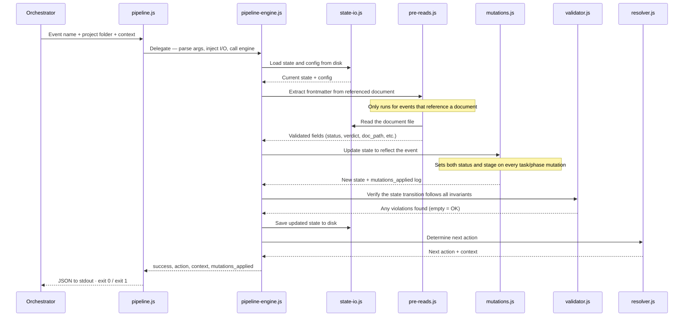

# Pipeline Scripts

The orchestration system uses a single unified pipeline script (`pipeline.js`) for all deterministic pipeline operations: routing, mutation, and validation. Without these scripts, LLM agents must re-derive routing decisions from natural language on every invocation — producing inconsistent results for identical inputs. The script encodes these decisions as tested, deterministic code, so the same `state.json` always produces the same next action. LLMs still handle all judgment-requiring work (coding, reviewing, designing); scripts handle mechanical consistency.

---

## CLI Interface

### pipeline.js

```bash
node .github/orchestration/scripts/pipeline.js \
  --event <event_name> \
  --project-dir <path> \
  [--config <path>] \
  [--context '<json>']
```

| Flag | Required | Description |
|------|----------|-------------|
| `--event` | Yes | One of the 17 pipeline events |
| `--project-dir` | Yes | Absolute path to the project directory containing `state.json` |
| `--config` | No | Path to `orchestration.yml`; built-in defaults used if omitted |
| `--context` | No | JSON string with event-specific context (e.g., `doc_path`, `verdict`) |

### migrate-to-v4.js

```bash
node .github/orchestration/scripts/migrate-to-v4.js <project-dir>
```

| Argument | Required | Description |
|----------|----------|-------------|
| `<project-dir>` | Yes | Absolute path to project directory containing `state.json` |

Behavior:
- Detects schema version from `$schema` field (v1, v2, or v3)
- Transforms state to v4 format: nested field grouping, 1-based indexing, stage inference, `pipeline`/`final_review` promotion
- Backs up the original as `state.{version}.json.bak` (e.g., `state.3.json.bak`)
- Validates migrated output against the v4 JSON Schema via `validator.js`
- Exits 0 on success, 1 on failure with error details to stderr

---

## Module Architecture

Four-layer architecture with strict dependency direction (higher layers import from lower; never the reverse):

```
.github/orchestration/scripts/
├── pipeline.js                    # CLI entry point — I/O, arg parsing, exit codes
├── migrate-to-v4.js              # Migration CLI — converts v1/v2/v3 state to v4
├── lib/
│   ├── pipeline-engine.js         # Orchestration engine — load → pre-read → mutate → validate → write → resolve → return
│   ├── mutations.js               # Pure mutation handlers — one per event, lookup table pattern
│   ├── state-io.js                # I/O isolation — read/write state, config, documents
│   ├── pre-reads.js               # Artifact extraction and validation for event types
│   ├── resolver.js                # Action resolver — pure function, 18-action routing
│   ├── validator.js               # State Transition Validator — 12 active invariants
│   └── constants.js               # Shared enums — frozen, zero dependencies
└── tests/
    ├── pipeline.test.js
    ├── pipeline-engine.test.js
    ├── pipeline-behavioral.test.js
    ├── mutations.test.js
    ├── state-io.test.js
    ├── pre-reads.test.js
    ├── resolver.test.js
    ├── validator.test.js
    ├── constants.test.js
    └── migration.test.js
```

**Layer 1 — CLI Entry Point:** `pipeline.js` handles all I/O, arg parsing, and exit codes. Uses a `require.main === module` guard. Constructs the `PipelineIO` object and delegates all logic to the engine. `migrate-to-v4.js` follows the same pattern for the migration workflow.

**Layer 2 — Pipeline Engine:** `pipeline-engine.js` executes the linear recipe: load → pre-read → mutate → validate → write → resolve → return.

**Layer 3 — Domain Modules:** `mutations.js`, `resolver.js`, `validator.js`, and `pre-reads.js` are pure functions with no filesystem access. Each has a single responsibility.

**Layer 4 — Constants & I/O:** `constants.js` is the leaf module — zero internal dependencies, all enums frozen. Now exports stage enums (`TASK_STAGES`, `PHASE_STAGES`) and stage transition maps (`ALLOWED_TASK_STAGE_TRANSITIONS`, `ALLOWED_PHASE_STAGE_TRANSITIONS`) alongside existing enums. `state-io.js` encapsulates all filesystem operations behind the `PipelineIO` interface.

---

## Script Flow



> `constants.js` is a static dependency imported by `mutations.js`, `validator.js`, `resolver.js`, and `pipeline-engine.js` — never called at runtime.

---

## Event Vocabulary

The pipeline accepts exactly 17 events. Each maps to a mutation handler in the `MUTATIONS` lookup table.

| # | Event | Tier | Description |
|---|-------|------|-------------|
| 1 | `research_completed` | Planning | Research finished; sets `planning.steps[0].status` → complete, `planning.steps[0].doc_path` |
| 2 | `prd_completed` | Planning | PRD created; sets `planning.steps[1].status` → complete |
| 3 | `design_completed` | Planning | Design doc created; sets `planning.steps[2].status` → complete |
| 4 | `architecture_completed` | Planning | Architecture created; sets `planning.steps[3].status` → complete |
| 5 | `master_plan_completed` | Planning | Master plan created; sets `planning.steps[4].status` → complete, `planning.status` → complete |
| 6 | `plan_approved` | Planning | Human approved; sets `planning.human_approved`, transitions `pipeline.current_tier` → execution |
| 7 | `phase_plan_created` | Execution | Phase plan saved; sets `phase.docs.phase_plan`, `phase.status` → in_progress, `phase.stage` → executing |
| 8 | `task_handoff_created` | Execution | Task handoff saved; sets `task.docs.handoff`, `task.status` → in_progress, `task.stage` → coding |
| 9 | `task_completed` | Execution | Coder finished; sets `task.docs.report`, `task.stage` → reviewing (`status` stays in_progress) |
| 10 | `code_review_completed` | Execution | Review finished; sets `task.docs.review`, `task.review.verdict`, `task.review.action`; resolves task outcome |
| 11 | `phase_report_created` | Execution | Phase report saved; sets `phase.docs.phase_report`, `phase.stage` → reviewing |
| 12 | `phase_review_completed` | Execution | Phase review finished; sets `phase.docs.phase_review`, `phase.review.verdict`, `phase.review.action`; resolves phase outcome |
| 13 | `task_approved` | Execution | Human approved task gate |
| 14 | `phase_approved` | Execution | Human approved phase gate |
| 15 | `final_review_completed` | Review | Final review saved; sets `final_review.doc_path`, `final_review.status` → complete |
| 16 | `final_approved` | Review | Human approved final review; sets `final_review.human_approved`, transitions `pipeline.current_tier` → complete |
| 17 | `halt` | Any | Halt the pipeline with a reason |

---

## Action Vocabulary

The resolver is a pure function that returns one of 18 values based solely on the current `state.json` and config. All actions are returned to the Orchestrator for agent routing — the script performs no agent spawning itself.

### Planning Tier (6)

| Action | Meaning |
|--------|---------|
| `spawn_research` | Spawn Research agent |
| `spawn_prd` | Spawn Product Manager |
| `spawn_design` | Spawn UX Designer |
| `spawn_architecture` | Spawn Architect for architecture |
| `spawn_master_plan` | Spawn Architect for master plan |
| `request_plan_approval` | Planning complete — request human approval |

### Execution Tier — Task Lifecycle (4)

| Action | Meaning |
|--------|---------|
| `create_phase_plan` | Phase needs a plan |
| `create_task_handoff` | Task needs a handoff document (fresh or corrective, distinguished by `context.is_correction`) |
| `execute_task` | Task has handoff, ready to execute |
| `spawn_code_reviewer` | Task needs code review |

### Execution Tier — Phase Lifecycle (2)

| Action | Meaning |
|--------|---------|
| `generate_phase_report` | All tasks complete — generate phase report |
| `spawn_phase_reviewer` | Phase needs review |

### Gate Actions (2)

| Action | Meaning |
|--------|---------|
| `gate_task` | Task gate — request human approval |
| `gate_phase` | Phase gate — request human approval |

### Review Tier (2)

| Action | Meaning |
|--------|---------|
| `spawn_final_reviewer` | Spawn final comprehensive review |
| `request_final_approval` | Final review complete — request human approval |

### Terminal (2)

| Action | Meaning |
|--------|---------|
| `display_halted` | Project is halted — display status |
| `display_complete` | Project is complete — display status |

---

## Pipeline Internals

### Mutation Lookup Table

`mutations.js` maps each of the 17 events to a pure handler function. Every handler receives `(state, context, config)` and returns `{ state, mutations_applied }`.

Every task and phase mutation sets `stage` alongside `status`. Task `status` remains `in_progress` until code review completes — making `complete` truly terminal.

```javascript
const MUTATIONS = Object.freeze({
  research_completed:       handleResearchCompleted,
  prd_completed:            handlePrdCompleted,
  design_completed:         handleDesignCompleted,
  architecture_completed:   handleArchitectureCompleted,
  master_plan_completed:    handleMasterPlanCompleted,
  plan_approved:            handlePlanApproved,
  phase_plan_created:       handlePhasePlanCreated,
  task_handoff_created:     handleTaskHandoffCreated,
  task_completed:           handleTaskCompleted,
  code_review_completed:    handleCodeReviewCompleted,
  phase_report_created:     handlePhaseReportCreated,
  phase_review_completed:   handlePhaseReviewCompleted,
  task_approved:            handleTaskApproved,
  phase_approved:           handlePhaseApproved,
  final_review_completed:   handleFinalReviewCompleted,
  final_approved:           handleFinalApproved,
  halt:                     handleHalt,
});
```

### Stage-Setting Behavior

**Task stage mutations:**

| Pipeline Event | `status` Transition | `stage` Transition | Rationale |
|---|---|---|---|
| Task scaffolded (in `phase_plan_created`) | → `not_started` | → `planning` | Task exists; handoff not yet created |
| `task_handoff_created` | `not_started` → `in_progress` | `planning` → `coding` | Handoff delivered; coder working |
| `task_completed` | stays `in_progress` | `coding` → `reviewing` | Report submitted; always goes to review |
| `code_review_completed` (approved) | `in_progress` → `complete` | `reviewing` → `complete` | Task fully done |
| `code_review_completed` (changes requested, has retry budget) | `in_progress` → `failed` | `reviewing` → `failed` | Needs corrective re-work |
| `code_review_completed` (rejected / no budget) | `in_progress` → `halted` | `reviewing` → `failed` | Halted; manual intervention required |
| Corrective `task_handoff_created` | `failed` → `in_progress` | `failed` → `coding` | Re-entering with corrective handoff |

**Phase stage mutations:**

| Pipeline Event | `status` Transition | `stage` Transition |
|---|---|---|
| Phase scaffolded (in `plan_approved`) | → `not_started` | → `planning` |
| `phase_plan_created` | `not_started` → `in_progress` | `planning` → `executing` |
| `phase_report_created` | stays `in_progress` | `executing` → `reviewing` |
| `phase_review_completed` (approved) | `in_progress` → `complete` | `reviewing` → `complete` |
| `phase_review_completed` (changes requested) | stays `in_progress` | `reviewing` → `failed` → `executing` |
| `phase_review_completed` (rejected) | `in_progress` → `halted` | `reviewing` → `failed` |

**Allowed stage transition maps** (enforced by V14/V15 invariants):

```javascript
const ALLOWED_TASK_STAGE_TRANSITIONS = Object.freeze({
  'planning':  ['coding'],
  'coding':    ['reviewing'],
  'reviewing': ['complete', 'failed'],
  'complete':  [],
  'failed':    ['coding'],       // corrective re-entry (skips planning)
});

const ALLOWED_PHASE_STAGE_TRANSITIONS = Object.freeze({
  'planning':  ['executing'],
  'executing': ['reviewing'],
  'reviewing': ['complete', 'failed'],
  'complete':  [],
  'failed':    ['executing'],   // corrective tasks re-enter execution
});
```

> `reporting` is a reserved enum value in `TASK_STAGES` and `PHASE_STAGES` but is not set by any current mutation handler.

### Decision Tables

Review verdicts are resolved by decision tables inside mutation handlers. `code_review_completed` uses `resolveTaskOutcome` to determine the task's next state and action (advance, corrective retry, or halt). `phase_review_completed` uses `resolvePhaseOutcome` similarly. Pointer advances and tier transitions happen within the mutation — there are no internal actions or post-mutation loops.

### I/O Isolation via PipelineIO

The engine receives all I/O functions via dependency injection. This makes the engine fully testable with in-memory stubs.

```javascript
const io = {
  readState:         (projectDir) => Object | null,
  writeState:        (projectDir, state) => void,
  readConfig:        (configPath) => Object,
  readDocument:      (docPath) => { frontmatter: Object, body: string } | null,
  ensureDirectories: (projectDir) => void,
};
```

### scaffoldInitialState()

`scaffoldInitialState(projectName)` returns the v4 initial state used when creating a new project:

```json
{
  "$schema": "orchestration-state-v4",
  "project": {
    "name": "PROJECT-NAME",
    "created": "2026-03-15T00:00:00.000Z",
    "updated": "2026-03-15T00:00:00.000Z"
  },
  "pipeline": {
    "current_tier": "planning"
  },
  "planning": {
    "status": "not_started",
    "human_approved": false,
    "steps": [
      { "name": "research",     "status": "not_started", "doc_path": null },
      { "name": "prd",          "status": "not_started", "doc_path": null },
      { "name": "design",       "status": "not_started", "doc_path": null },
      { "name": "architecture", "status": "not_started", "doc_path": null },
      { "name": "master_plan",  "status": "not_started", "doc_path": null }
    ]
  },
  "execution": {
    "status": "not_started",
    "current_phase": 0,
    "phases": []
  },
  "final_review": {
    "status": "not_started",
    "doc_path": null,
    "human_approved": false
  }
}
```

---

## Validator Invariant Catalog

`validator.js` checks 12 active invariants on every state transition.

| ID | Check |
|----|-------|
| V1 | `current_phase` within `[1, phases.length]`; 0 when `phases` empty |
| V2 | `current_task` within `[1, tasks.length]`; 0 when `tasks` empty |
| V5 | Phases and tasks within config limits (`max_phases`, `max_tasks_per_phase`) |
| V6 | Execution tier requires `planning.human_approved === true` |
| V7 | Complete tier with `after_final_review` gate requires `final_review.human_approved` |
| V10 | Phase status consistency with `pipeline.current_tier` |
| V11 | Task retries monotonically non-decreasing |
| V12 | Status transitions follow allowed transition maps |
| V13 | `project.updated` strictly advances |
| V14 | Task stage transitions follow `ALLOWED_TASK_STAGE_TRANSITIONS` |
| V15 | Phase stage transitions follow `ALLOWED_PHASE_STAGE_TRANSITIONS` |
| V16 | JSON Schema structural validation against `state-v4.schema.json` |

For canonical field definitions and required/optional field lists, see the schema file: `.github/orchestration/schemas/state-v4.schema.json`

---

## Result Shapes

### Success

```json
{
  "success": true,
  "action": "execute_task",
  "context": {
    "tier": "execution",
    "phase_index": 1,
    "task_index": 3,
    "phase_id": "P01",
    "task_id": "P01-T03",
    "reason": "Task P01-T03 has handoff but stage is coding"
  },
  "mutations_applied": [
    "task.status → in_progress",
    "task.stage → coding"
  ]
}
```

### Error

```json
{
  "success": false,
  "error": "Validation failed: [V6] Only one task may be in_progress",
  "event": "task_handoff_created",
  "state_snapshot": { "current_phase": 1 },
  "mutations_applied": []
}
```

---

## Shared Constants

`.github/orchestration/scripts/lib/constants.js` is the single source of truth for all enum values. Every module imports from it; all enums are `Object.freeze()`-d.

| Enum | Values |
|------|--------|
| `SCHEMA_VERSION` | `'orchestration-state-v4'` |
| `PIPELINE_TIERS` | `planning`, `execution`, `review`, `complete`, `halted` |
| `PLANNING_STATUSES` | `not_started`, `in_progress`, `complete` |
| `PHASE_STATUSES` | `not_started`, `in_progress`, `complete`, `halted` |
| `TASK_STATUSES` | `not_started`, `in_progress`, `complete`, `failed`, `halted` |
| `TASK_STAGES` | `planning`, `coding`, `reporting`*, `reviewing`, `complete`, `failed` |
| `PHASE_STAGES` | `planning`, `executing`, `reporting`*, `reviewing`, `complete`, `failed` |
| `REVIEW_VERDICTS` | `approved`, `changes_requested`, `rejected` |
| `REVIEW_ACTIONS` | `advanced`, `corrective_task_issued`, `halted` |
| `PHASE_REVIEW_ACTIONS` | `advanced`, `corrective_tasks_issued`, `halted` |
| `NEXT_ACTIONS` | 18 values (see Action Vocabulary) |
| `ALLOWED_TASK_STAGE_TRANSITIONS` | See Stage-Setting Behavior |
| `ALLOWED_PHASE_STAGE_TRANSITIONS` | See Stage-Setting Behavior |
| `ALLOWED_TASK_TRANSITIONS` | `not_started→in_progress→complete\|failed\|halted; failed→in_progress` |
| `ALLOWED_PHASE_TRANSITIONS` | `not_started→in_progress→complete\|halted` |

> \* `reporting` is a reserved enum value but is not set by any current mutation handler.

> **Note:** `REVIEW_ACTIONS` uses singular `corrective_task_issued`; `PHASE_REVIEW_ACTIONS` uses plural `corrective_tasks_issued`. This distinction is intentional.

---

## Testing

All tests use `node:test` (Node.js built-in test runner). Run the full suite from the workspace root:

```bash
node --test .github/orchestration/scripts/tests/
```

Coverage targets:
- Every event has at least one mutation test
- Every resolved action has at least one resolver test
- Every decision table row has a mutation test
- Every invariant (V1, V2, V5–V7, V10–V16) has positive and negative validator tests
- Migration scenarios covered in `migration.test.js`
