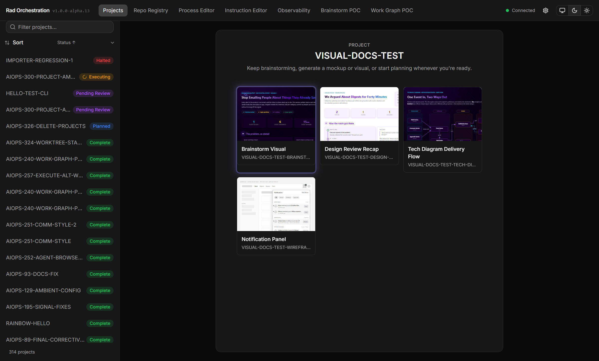
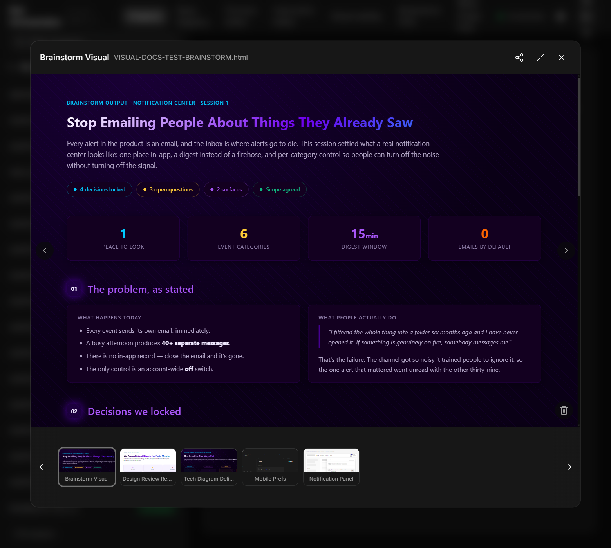
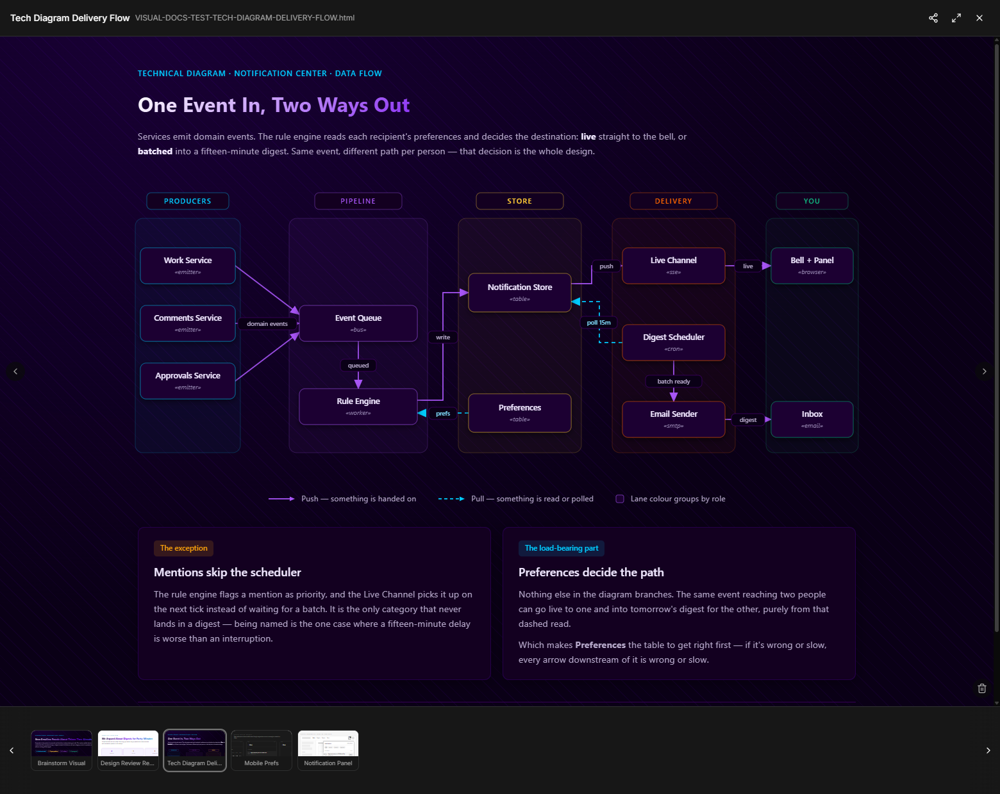
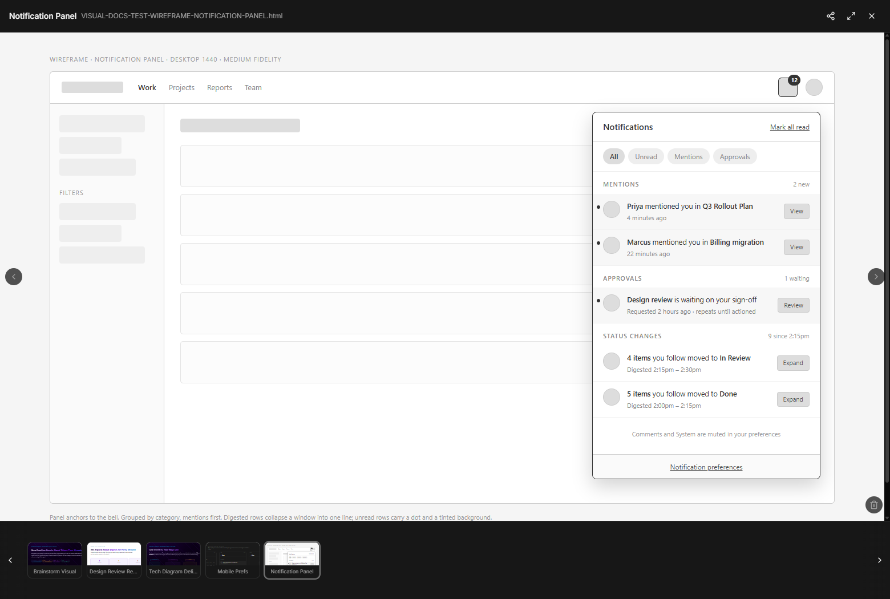
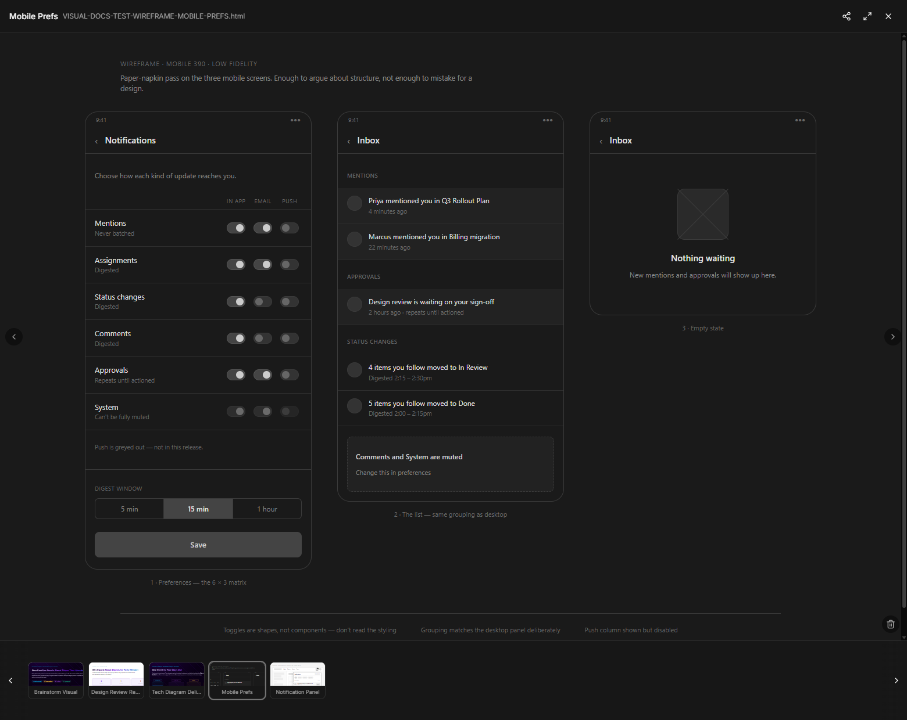
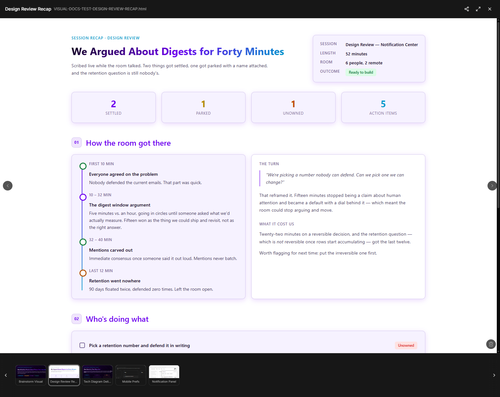

# Visual Docs

You're three paragraphs into describing a UI screen you want to build and you can sense you're not aligned.
The agent is nodding along in text. But you're both using the word "panel" to mean different things.

Stop using words and ask for a visual.

Sometimes a picture is simply better than words, and a well-timed visual will help you get aligned with an
agent (or your team) much more quickly. While in a brainstorming session, an agent will seek opportunities
to create a visual — if it doesn't, ask it.

Visuals are saved and organized alongside the rest of your project documents, and they're easy to get to
from the dashboard. Best of all, they render live — so you watch the document evolve in front of you as you
steer the agent.

<table>
  <tr>
    <td width="33%" align="center" valign="top">
      
      <b>Live</b> — the card glows while it's being written. That one's mid-redraw.
    </td>
    <td width="33%" align="center" valign="top">
      
      <b>Brainstorm visual</b> — what the room actually decided, made readable.
    </td>
    <td width="33%" align="center" valign="top">
      
      <b>Technical diagram</b> — swimlanes, labelled arrows, a legend.
    </td>
  </tr>
  <tr>
    <td width="33%" align="center" valign="top">
      
      <b>Wireframe</b> — medium fidelity, desktop.
    </td>
    <td width="33%" align="center" valign="top">
      
      <b>Same feature, mobile</b> — low fidelity, three screens.
    </td>
    <td width="33%" align="center" valign="top">
      
      <b>Session recap</b> — scribed live, light mode.
    </td>
  </tr>
</table>

## You watch it happen in realtime and steer it

As documents are updated they pulse with a purple glowing effect. If you weren't watching at the moment it
changed, fear not — a marker stays on it until you've looked, so you always know which ones moved.

Take a look at the first screenshot above and you'll notice one is glowing purple. That's a document
signaling that it is changing. As you go through a loop with the agent, aligning visually, the docs don't
jump and scroll out from under you. They anchor to your scroll so you can watch the document update live.
This is particularly handy when designing UI mockups or architectural diagrams:

> **"No, move the checkbox to the left. Also, I'd rather make that a toggle switch."**

> **"Why is the data access layer tightly coupled with the business logic? Decouple those components."**

## They stay with the project

Every visual lands in the project folder next to the requirements, the plans, and the reviews. So they're really
easy to find if you need them later.

- **The UI dashboard is the viewer.** Click any visual to open it. Arrows move between artifacts, the
  filmstrip along the bottom shows live previews of everything in the project, and full screen does what
  you'd hope.
- **Every visual has a URL.** So does every project. Copy the link, paste it in a message, and your
  teammate is looking at the same picture. No export, no attachment, no "which version is this?"
- **They're plain HTML files.** Self-contained, no dependencies. They'll still open in a browser years
  from now.

## Three kinds of visuals — though there are really no limits

| Ask for… | You get | Good for |
|---|---|---|
| **A visual summary** | A polished recap of your thinking — goals, decisions, open questions, meeting notes | Getting a messy conversation into one readable page |
| **A UI mockup** | A wireframe of a screen or a whole flow, one file per screen | Agreeing on a layout before anyone builds it |
| **A technical diagram** | Architecture, data flow, sequence, state machine, ER, deployment, swimlane | Anything you'd otherwise explain in three paragraphs |

The `/rad-visual-docs` skill carries guidance for these three, but you aren't limited to them — the agent
will build you pretty much whatever kind of document you want.

## Mockup fidelity

Mockups come in three tiers, and choosing well matters more than people expect.

| Tier | What it looks like | Reach for it when |
|---|---|---|
| **Low** *(default)* | Dark paper-napkin sketch — rough shapes, minimal labels | Early thinking. You want to argue about structure, not colour |
| **Medium** | Clean grayscale, realistic labels, sensible spacing | You're showing someone who isn't in the conversation |
| **High** | Brand hints, design tokens, polished components | You're close to final and want to see it properly |

> **Watch your tokens on high fidelity.** A high-fidelity mockup is a lot of hand-written HTML and CSS,
> and it costs real money to produce — noticeably more than a low-fidelity one. Don't start there out of
> habit.

If you're starting cold, start low. They're faster and cheaper to render, and often they're all you're
going to need.

Then go high *deliberately*, once the structure is settled and you want to see the thing properly — because
**a good mockup is one of the highest-leverage things you can hand a planner.** Point at one during
planning and the agent builds against a picture instead of a paragraph. UI work that usually takes three
rounds of "not quite" tends to land much closer on the first try. Spending tokens on a high-fidelity
mockup to save a rebuild is a trade worth making; it's arriving there *by accident* that gets expensive.

Two more knobs while you're here: **device** (desktop, tablet, mobile, or a size you name) and **mode**
(dark by default, light if you ask). And you can hand over a screenshot of an existing screen as a
starting point — you'll get a clean interpretation of the structure, not a copy.

## Use them for UI review during execution

If you've spent the tokens on a high-fidelity mockup, get it into the requirements so the build is checked
against it rather than against a description.

**You have to ask for this, and you have to ask while you're still brainstorming.** A mockup sitting in
the project folder isn't picked up on its own — nothing hands it to an agent during execution. Saying so
before the Requirements are written is what puts it in front of the planner and the reviewer.

> **/rad-brainstorm Update the requirements so that the definition of done is to inspect the UI in a
> browser, compare it to our mockups, and correct anything that doesn't match.**

And if the UI still doesn't land right, work with the agent and point at the mockup:

> **/rad-amend We just finished building the UI for the SEARCH-VIEW project. Take a look at the UI mockup
> and you'll see the collapsible panel should be on the right, but you put it on the left — and the colors
> are wrong. Let's fix this.**

## Technical diagrams

Ask for one when a system is easier to point at than to describe.

You'll get swimlanes, labelled connectors, stereotype tags, and a legend — the Visio-looking thing you'd
have spent an afternoon on. And when your project has code, the diagram gets drawn from the code, with
real file and module names on the boxes, so a reviewer can check it rather than take it on faith.

## Other interesting use cases

Beyond the obvious ones:

- **Running a meeting.** Scribe live while the room talks and put it on the screen. Everyone is looking
  at the same summary instead of taking four different sets of notes.
- **Showing your team a feature.** A mockup and a flow diagram beat a demo you have to build first.
- **Getting unstuck with your agent.** When you and the agent have been talking past each other for a
  while, a picture usually ends it in one round. You'd be surprised where a visual earns its keep.
- **Explaining a system to someone new.** Working in an unfamiliar codebase? Ask for a high-level
  architecture diagram drawn from the code.

---

**Credit where it's due:** the house style and much of the taste behind these documents comes from the
`make-it-visual` skill, written by **Drew Hill**. Everything here is built on that foundation.

---

**Read Next:** [Planning](planning.md) · [Dashboard](dashboard.md) ·
[Document Types](document-types.md) · [Docs Viewer](docs-viewer.md)
